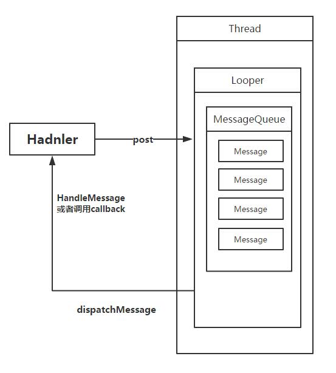

## Android异步消息处理

我们都知道，Android UI是线程不安全的，如果在子线程中尝试进行UI操作，程序就有可能会崩溃。也就是说更新UI必须在主线程进行，否则就会出现异常。

但是有的时候，我们必须在子线程里**执行一些耗时的任务**，然后根据任务的执行结果来更新UI控件。

这时我们就要利用Android的异步消息处理机制来完成这个任务。

Android中的异步消息处理主要由`Message`, `Handler`, `MessageQueue`和`Looper`四部分组成。

### 简单使用
怎么使用Handler呢，简单的来说，便是在主线程中，定义一个Handler类。比如在MainActivity里，有这样一个变量

``` java
private Handler handler = new Handler() {
        @Override
        public void handleMessage(Message msg) {
            if (msg.what == 1) {
                // 更新UI

            }
        }
    };

```

Handler类还是实现了handleMessage方法，实现如何更新UI。

然后我们新开启一个线程，完成耗时操作。

``` java
new Thread(new Runnable() {
            @Override
            public void run() {
                // 执行耗时操作

                // 发送消息
                Message message = Message.obtain();
                message.what = 1;
                message.arg1 = 2;
                handler.sendMessage(message);
            }
        }).start();

```

我们在新线程里new了一个Message对象，封装了一些信息，然后拿到handler把message给send出去了，然后主线程拿到消息之后就会调用handleMessage方法处理消息了。那其实刚才handler把消息send去哪里了呢，实质上是发送去了消息队列。

消息队列又是怎么回事呢？

### 异步处理机制(概况)




如图便是Android的消息分法机制

在Android中的每个线程都会绑定一个Looper。这个Looper是**封装自ThreadLocal**，即是线程的本地局部变量。Android的主线程（UI线程）启动时会**自行绑定(自动)** 一个Looper，而这个Looper里面又会绑定一个消息队列，Looper将会**循环读取这个消息队列里的消息进行执行**。

Handler创建时候要绑定一个消息队列，这个消息队列当然必须**从Looper里取**，而又因为Looper封装在ThreadLocal当中的，所以相当于Handler也和当前线程绑定了，因为必须取得当前线程的Looper，才能取得它的消息队列。Handler的任务就是两个，一是将消息post到消息队列里，二是从消息队列里取出来然后按照指定的方法去处理消息，根据上图就形成了一个循环。

所以就不难理解，当我们新建一个线程的时候，为什么**直接创建Handler会失败**了，因为新建线程没有创建Looper，所以无法从新线程的ThreadLocal里取得。所以要Looper.prepare()以及Looper.loop(),来**启动这个消息循环**。


### 具体分析

以上粗略了解机制以后，再来具体分析一下各个组件。

#### Handler
Handler 必须与一个 Looper 关联才能使用。怎么样关联呢？你可以手动传入一个 Looper 对象，让 Handler 关联你传入的 Handler。也可以什么都不传，这时候 Handler 会自己去找当前线程的 Looper，如果找到就万事大吉，**如果当前线程没有 Looper，那么就会报错**。

``` java
// 不传入 Looper，系统会自己去获取当前线程中的 Looper。
Handler handler = new Handler();
// 传入自定的 Looper。
Handler  handler = new Handler(Looper);
```

由于**主线程（UI 线程）是唯一一个默认自带了 Looper 的线程**，所以在主线程中你可以直接用上面第一种方式创建一个 Handler 对象而不用担心 Looper 的存在性问题。

另外有一点，在创建 Looper 的时候，系统会检查该线程是否已经有 Looper 对象了，如果已经有 Looper 对象了，你再塞一个进去，它就会报错，**因此一个线程中最多只能有一个 Looper**。

##### 在子线程中创建Handler

``` java
// 为异步消息处理框架准备一个线程
class LooperThread extends Thread {
	public Handler mHandler;
	public void run() {
		// 准备一个 Looper
		Looper.prepare();
		// Handler 对象会和该线程的 Looper 关联起来。
		mHandler = new Handler() {
			public void handlerMessage(Message msg) {
				// 在这里处理传入的消息
			}
		};
		// 使用该 Looper，启动一个循环的消息队列。
		Looper.loop();
	}
}
```

只要实现Looper.prepare然后用Looper.loop启动循环，就没问题了。

##### 使用 HandlerThread
可以使用 HandlerThread 来简化在子线程中创建 Handler 的流程。HalderThread 是一个自带了 Looper 的线程类，

HandlerThread 也并不神秘，它只是帮你调用了 Looper.prepare() 方法和 Looper.loop() 方法而已。也就是说如果你一个类继承了 ThreadHandler，你可以像在主线程那样使用 Handler。

``` java
public class MyHandlerThread extends HandlerThread {
	// 你只需要添加一个 Handler
	private Handler handler;
	public MyHandlerThread(String name) {
		super(name)
	}
}
```


#### Message
准备好 Handler 的环境后，就可以使用 Handler 来发送和处理消息了。

处理消息是在 Handler 的 **handleMessage()** 方法中进行 的。

##### 发送 Message 对象

Message 对象可以包含一些简单的数据，并且可以通过 Handler 进行发送和处理。Message 对象可以通过 Message.what(int) 方法中的 int 参数来标志该对象。Message 对象使用两个 int 类型的字段来存储需要发送的信息，也可以使用一个 Object 类型的对象来存储一个简单对象的信息。

 - Message.what：标识一个 Message 对象。
 - Message.arg1：需要传递的 int 类型的数据。
 - Message.arg2：需要传递的 int 类型的数据。
 - Message.obj：存储任意数据类型（Object）的对象。

最好不要使用new来创建Message对象，使用 `Message msg = Message.obtain()` 或 `Handler.obtainMessage()` 来获取一个 Message。这个 Message 对象被 Handler 发送到 MessageQueue 之后，并不会被销毁，可以**重复利用**，因此比使用 new 方法来创建一个 Message 对象效率更高。
