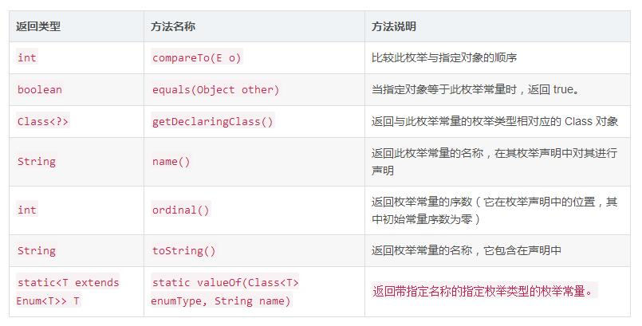

## 深入理解Java枚举类型(enum)
枚举类型是**Java 5中新增特性的一部分**，它是一种特殊的数据类型，之所以特殊是因为它既是一种类(class)类型却又比类类型多了些特殊的约束，但是这些约束的存在也造就了枚举类型的简洁性、安全性以及便捷性。

### 枚举的定义
这是在没有枚举类型时定义常量常见的方式

``` java
public class DayDemo {

    public static final int MONDAY =1;

    public static final int TUESDAY=2;

    public static final int WEDNESDAY=3;

    public static final int THURSDAY=4;

    public static final int FRIDAY=5;

    public static final int SATURDAY=6;

    public static final int SUNDAY=7;

}
```

上述的常量定义常量的方式称为int枚举模式，这样的定义方式并没有什么错，但它存在许多不足，如在类型安全和使用方便性上并没有多少好处，如果存在定义int值相同的变量，混淆的几率还是很大的，编译器也不会提出任何警告，因此**这种方式在枚举出现后并不提倡**，现在我们**利用枚举类型来重新定义上述的常量**，同时也感受一把枚举定义的方式，如下定义周一到周日的常量

``` java
//枚举类型，使用关键字enum
enum Day {
    MONDAY, TUESDAY, WEDNESDAY,
    THURSDAY, FRIDAY, SATURDAY, SUNDAY
}
```

相当简洁，在定义枚举类型时我们使用的关键字是enum，与class关键字类似，只不过前者是定义枚举类型，后者是定义类类型。枚举类型Day中分别定义了从周一到周日的值，这里要注意，值一般是大写的字母，多个值之间以逗号分隔。同时我们应该知道的是枚举类型可以像类(class)类型一样，定义为一个单独的文件，当然也可以定义在其他类内部，更重要的是枚举常量在类型安全性和便捷性都很有保证，如果出现类型问题编译器也会提示我们改进，但务必记住枚举表示的类型其取值是必须有限的，也就是说每个值都是可以枚举出来的，比如上述描述的一周共有七天。那么该如何使用呢？如下：

``` java
public class EnumDemo {

    public static void main(String[] args){
        //直接引用
        Day day =Day.MONDAY;
    }

}
//定义枚举类型
enum Day {
    MONDAY, TUESDAY, WEDNESDAY,
    THURSDAY, FRIDAY, SATURDAY, SUNDAY
}
```

就像上述代码那样，直接引用枚举的值即可，这便是枚举类型的最简单模型。

### 实现原理
大概了解了枚举类型的定义与简单使用后，现在有必要来了解一下枚举类型的基本实现原理。实际上在使用关键字enum创建枚举类型并编译后，编译器会为我们生成一个相关的类，**这个类继承了Java API中的java.lang.Enum类**，也就是说通过关键字enum创建枚举类型在编译后事实上也是一个类类型而且该类继承自java.lang.Enum类。

编译器确实帮助我们生成了一个Day类(注意该类是final类型的，将无法被继承)而且该类继承自java.lang.Enum类，**该类是一个抽象类(稍后我们会分析该类中的主要方法)**，除此之外，**编译器还帮助我们生成了7个Day类型的实例对象** 分别对应枚举中定义的7个日期，这也充分说明了我们前面使用关键字enum定义的Day类型中的每种日期枚举常量也是实实在在的Day实例对象，只不过代表的内容不一样而已。

反编译Day.class文件

``` java
//反编译Day.class
final class Day extends Enum
{
    //编译器为我们添加的静态的values()方法
    public static Day[] values()
    {
        return (Day[])$VALUES.clone();
    }
    //编译器为我们添加的静态的valueOf()方法，注意间接调用了Enum也类的valueOf方法
    public static Day valueOf(String s)
    {
        return (Day)Enum.valueOf(com/zejian/enumdemo/Day, s);
    }
    //私有构造函数
    private Day(String s, int i)
    {
        super(s, i);
    }
     //前面定义的7种枚举实例
    public static final Day MONDAY;
    public static final Day TUESDAY;
    public static final Day WEDNESDAY;
    public static final Day THURSDAY;
    public static final Day FRIDAY;
    public static final Day SATURDAY;
    public static final Day SUNDAY;
    private static final Day $VALUES[];

    static
    {
        //实例化枚举实例
        MONDAY = new Day("MONDAY", 0);
        TUESDAY = new Day("TUESDAY", 1);
        WEDNESDAY = new Day("WEDNESDAY", 2);
        THURSDAY = new Day("THURSDAY", 3);
        FRIDAY = new Day("FRIDAY", 4);
        SATURDAY = new Day("SATURDAY", 5);
        SUNDAY = new Day("SUNDAY", 6);
        $VALUES = (new Day[] {
            MONDAY, TUESDAY, WEDNESDAY, THURSDAY, FRIDAY, SATURDAY, SUNDAY
        });
    }
}
```

### Enum抽象类结构
Enum是所有 Java 语言枚举类型的公共基本类（注意Enum是抽象类），以下是它的**常见方法**：



注意以上方法：

 - ordinal()方法，该方法**获取的是枚举变量在枚举类中声明的顺序**，下标从0开始，如日期中的MONDAY在第一个位置，那么MONDAY的ordinal值就是0
 - compareTo(E o)方法则是比较枚举的大小，注意其内部实现是根据每个枚举的ordinal值大小进行比较的。
 - name()方法与toString()几乎是等同的，都是输出变量的字符串形式。
 - 至于valueOf(Class\<T\> enumType, String name)方法则是根据枚举类的Class对象和枚举名称获取枚举常量，注意该方法是静态的

#### 编译器生成的Values方法与ValueOf方法
values()方法和valueOf(String name)方法是编译器生成的static方法，因此从前面的分析中，在Enum类中并没出现values()方法，但valueOf()方法还是有出现的，只不过**编译器生成的valueOf()方法需传递一个name参数**，而Enum自带的静态方法valueOf()则需要传递两个参数(见上表格)，从前面反编译后的代码可以看出，编译器生成的valueOf方法最终还是调用了Enum类的valueOf方法，下面通过代码来演示这两个方法的作用：

``` java
Day[] days2 = Day.values();
System.out.println("day2:"+Arrays.toString(days2));
Day day = Day.valueOf("MONDAY");
System.out.println("day:"+day);

/**
 输出结果:
 day2:[MONDAY, TUESDAY, WEDNESDAY, THURSDAY, FRIDAY, SATURDAY, SUNDAY]
 day:MONDAY
 */
```

### 枚举类用法

#### switch
JDK1.6之前的switch语句只支持int,char,enum类型，使用枚举，能让我们的代码可读性更强。

``` java
enum Signal {
        GREEN, YELLOW, RED
    }

    public class TrafficLight {
        Signal color = Signal.RED;

        public void change() {
            switch (color) {
            case RED:
                color = Signal.GREEN;
                break;
            case YELLOW:
                color = Signal.RED;
                break;
            case GREEN:
                color = Signal.YELLOW;
                break;
            }
        }
    }
```

#### 向枚举中添加新方法
允许向Enum类定义自己的方法，定义的时候要按照格式先定义实例。

``` java
public enum Color {
    RED("红色", 1), GREEN("绿色", 2), BLANK("白色", 3), YELLO("黄色", 4);
    // 成员变量
    private String name;
    private int index;
    // 构造方法
    private Color(String name, int index) {
        this.name = name;
        this.index = index;
    }
    // 普通方法
    public static String getName(int index) {
        for (Color c : Color.values()) {
            if (c.getIndex() == index) {
                return c.name;
            }
        }
        return null;
    }
    // get set 方法
    public String getName() {
        return name;
    }
    public void setName(String name) {
        this.name = name;
    }
    public int getIndex() {
        return index;
    }
    public void setIndex(int index) {
        this.index = index;
    }
}

```

如上代码，不仅仅定义了枚举实例，还定义了成员变量，并且还有一些get和set方法。

#### enum类与接口
由于Java单继承的原因，enum类并不能再继承其它类，但并不妨碍它实现接口，因此enum类同样是可以实现多接口的，如下：

``` java
interface food{
    void eat();
}

interface sport{
    void run();
}

public enum EnumDemo2 implements food ,sport{
    FOOD,
    SPORT,
    ; //分号分隔

    @Override
    public void eat() {
        System.out.println("eat.....");
    }

    @Override
    public void run() {
        System.out.println("run.....");
    }
}
```

有时候，我们可能需要对一组数据进行分类，比如进行食物菜单分类而且希望这些菜单都属于food类型，appetizer(开胃菜)、mainCourse(主菜)、dessert(点心)、Coffee等，每种分类下有多种具体的菜式或食品，此时可以利用接口来组织，如下(代码引用自Thinking in Java)：


``` java
public interface Food {
  enum Appetizer implements Food {
    SALAD, SOUP, SPRING_ROLLS;
  }
  enum MainCourse implements Food {
    LASAGNE, BURRITO, PAD_THAI,
    LENTILS, HUMMOUS, VINDALOO;
  }
  enum Dessert implements Food {
    TIRAMISU, GELATO, BLACK_FOREST_CAKE,
    FRUIT, CREME_CARAMEL;
  }
  enum Coffee implements Food {
    BLACK_COFFEE, DECAF_COFFEE, ESPRESSO,
    LATTE, CAPPUCCINO, TEA, HERB_TEA;
  }
}

public class TypeOfFood {
  public static void main(String[] args) {
    Food food = Appetizer.SALAD;
    food = MainCourse.LASAGNE;
    food = Dessert.GELATO;
    food = Coffee.CAPPUCCINO;
  }
}
```

通过这种方式可以很方便组织上述的情景，同时确保每种具体类型的食物也属于Food，现在我们利用一个枚举嵌套枚举的方式，把前面定义的菜谱存放到一个Meal菜单中，通过这种方式就可以统一管理菜单的数据了。


``` java
public enum Meal{
  APPETIZER(Food.Appetizer.class),
  MAINCOURSE(Food.MainCourse.class),
  DESSERT(Food.Dessert.class),
  COFFEE(Food.Coffee.class);
  private Food[] values;
  private Meal(Class<? extends Food> kind) {
    //通过class对象获取枚举实例
    values = kind.getEnumConstants();
  }
  public interface Food {
    enum Appetizer implements Food {
      SALAD, SOUP, SPRING_ROLLS;
    }
    enum MainCourse implements Food {
      LASAGNE, BURRITO, PAD_THAI,
      LENTILS, HUMMOUS, VINDALOO;
    }
    enum Dessert implements Food {
      TIRAMISU, GELATO, BLACK_FOREST_CAKE,
      FRUIT, CREME_CARAMEL;
    }
    enum Coffee implements Food {
      BLACK_COFFEE, DECAF_COFFEE, ESPRESSO,
      LATTE, CAPPUCCINO, TEA, HERB_TEA;
    }
  }
}
```
