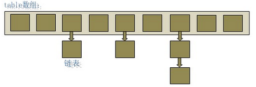

## 源码分析

### hashmap源码
HashMap是基于哈希表的Map接口的非同步实现，它提供所有可选的映射操作，并允许使用null键和null值。此集合不保证映射的顺序，特别不保证其顺序永久不变。

看头部
``` java
public class HashMap<K,V>
    extends AbstractMap<K,V>
    implements Map<K,V>, Cloneable, Serializable
```

在语法层面继承接口Map是多余的，这么做仅仅是为了让阅读代码的人明确知道HashMap是属于Map体系的，起到了文档的作用


注意 HashMap的底层就是一个数组结构，数组中的每一项又是一个链表



这么做一个比较重要的因素便是，可以进行拉链法解决冲突了。注意这个拉链法，是每次把最新更新的元素放到链表头的。

看下源码
``` java
/**
    * The table, resized as necessary. Length MUST Always be a power of two.
    */
transient Entry<K,V>[] table;
static class Entry<K,V> implements Map.Entry<K,V> {
       final K key;
       V value;
       Entry<K,V> next;
       int hash;

       /**
        * Creates new entry.
        */
       Entry(int h, K k, V v, Entry<K,V> n) {
           value = v;
           next = n;
           key = k;
           hash = h;
       }
   ...........
}
```

可以看出的是HashMap里面实现了一个静态内部类Entry(记录)，其重要的属性有key、value、next而HashMap有一个属性是Entry的数组table。Entry就是table数组中的元素，Map.Entry保存一个键值对和这个键值对持有指向下一个键值对的引用，如此就构成了链表了。

接下来看构造函数


``` java
public HashMap(int initialCapacity, float loadFactor) {
    if (initialCapacity < 0)
        throw new IllegalArgumentException("Illegal initial capacity: " +
                                           initialCapacity);
    if (initialCapacity > MAXIMUM_CAPACITY)
        initialCapacity = MAXIMUM_CAPACITY;
    if (loadFactor <= 0 || Float.isNaN(loadFactor))
        throw new IllegalArgumentException("Illegal load factor: " +
                                           loadFactor);
    this.loadFactor = loadFactor;
    threshold = initialCapacity;
    init();
}
public HashMap(int initialCapacity) {
    this(initialCapacity, DEFAULT_LOAD_FACTOR);
}
public HashMap() {
    this(DEFAULT_INITIAL_CAPACITY, DEFAULT_LOAD_FACTOR);
}
```

从代码上(下面两个构造函数)可以看到，容量与平衡因子都有个默认值，并且容量有个最大值

``` java
/**
 * The default initial capacity - MUST be a power of two.
 */
static final int DEFAULT_INITIAL_CAPACITY = 1 << 4; // aka 16
/**
 * The maximum capacity, used if a higher value is implicitly specified
 * by either of the constructors with arguments.
 * MUST be a power of two <= 1<<30.
 */
static final int MAXIMUM_CAPACITY = 1 << 30;
/**
 * The load factor used when none specified in constructor.
 */
static final float DEFAULT_LOAD_FACTOR = 0.75f;
```

可以看到，默认的平衡因子为0.75，这是权衡了时间复杂度与空间复杂度之后的最好取值（JDK说是最好的），过高的因子会降低存储空间但是查找（lookup，包括HashMap中的put与get方法）的时间就会增加。

平衡因子的话，是用来resize整个hash表的，如果条目的数量超过了treshhold=capacity*loadFactor,则整个hash表就会进行扩容，也就是容量翻倍。

这里比较奇怪的是问题：容量必须为**2的指数倍**（默认为16），这是为什么呢？解答这个问题，需要了解HashMap中哈希函数的设计原理。


接下来考虑哈希函数的设计

``` java
/**
  * Retrieve object hash code and applies a supplemental hash function to the
  * result hash, which defends against poor quality hash functions.  This is
  * critical because HashMap uses power-of-two length hash tables, that
  * otherwise encounter collisions for hashCodes that do not differ
  * in lower bits. Note: Null keys always map to hash 0, thus index 0.
  */
 final int hash(Object k) {
     int h = hashSeed;
     if (0 != h && k instanceof String) {
         return sun.misc.Hashing.stringHash32((String) k);
     }
     h ^= k.hashCode();
     // This function ensures that hashCodes that differ only by
     // constant multiples at each bit position have a bounded
     // number of collisions (approximately 8 at default load factor).
     h ^= (h >>> 20) ^ (h >>> 12);
     return h ^ (h >>> 7) ^ (h >>> 4);
 }
 /**
  * Returns index for hash code h.
  */
 static int indexFor(int h, int length) {
     // assert Integer.bitCount(length) == 1 : "length must be a non-zero power of 2";
     return h & (length-1);
 }
```

在哈希表容量（也就是buckets或slots大小）为length的情况下，为了使每个key都能在冲突最小的情况下映射到[0,length)（注意是左闭右开区间）的索引（index）内，一般有两种做法：

1. 让length为素数，然后用hashCode(key) mod length的方法得到索引
2. 让length为2的指数倍，然后用hashCode(key) & (length-1)的方法得到索引

因为length为2的指数倍，所以length-1所对应的二进制位都为1，然后在与hashCode(key)做与运算，即可得到[0,length)内的索引

这里要注意冲突，比如，Java中对象的哈希值都32位整数，而HashMap默认大小为16，那么有两个对象那么的哈希值分别为：0xABAB0000与0xBABA0000，它们的后几位都是一样，那么与16异或后得到结果应该也是一样的，也就是产生了冲突。

造成冲突的原因关键在于16限制了只能用低位来计算，高位直接舍弃了，所以我们需要额外的哈希函数而不只是简单的对象的hashCode方法了。具体来说，就是HashMap中hash函数干的事了。

**hash函数简而言之就是让hashcode得出结果的高位也参与运算(因为直接and容量相当于舍弃高位)，降低冲突的可能性**

首先有个随机的hashSeed，来降低冲突发生的几率

然后如果是字符串，用了sun.misc.Hashing.stringHash32((String) k);来获取索引值

最后，通过一系列无符号右移操作，来把高位与低位进行异或操作，来降低冲突发生的几率

右移的偏移量20，12，7，4是怎么来的呢？因为Java中对象的哈希值都是32位的，所以这几个数应该就是把高位与低位做异或运算，至于这几个数是如何选取的，就不清楚了

put函数的过程暂且不细说，现在来看下resize函数一个很巧妙的地方

当put时，如果发现目前的bucket占用程度已经超过了Load Factor所希望的比例，那么就会发生resize。在resize的过程，简单的说就是把bucket扩充为2倍，之后重新计算index，把节点再放到新的bucket中。

这一点我们要理解，扩容之后，必须要重新计算index值，也就是上文提到的hashcode \&\& (length-1)

因为length变成了两倍，二进制里多出了一个最高位1.这个时候没必要大费周章再去计算一边新的hash值，只需要检查一下hashcode里，对应的那个最高位是1还是0.0的话，index值保持不变，1的话，就用原hash+old_capacity


