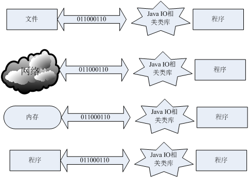

## IO与NIO
IO是Java及众多编程语言很重要的一块，同时很多程序的瓶颈和耗时操作也都在IO这块。所以能够很好的解决IO问题对提高程序性能有很大的帮助。Java对IO的支持是个不断的演变过程，经过了很多的优化，直到JDK1.4以后，才趋于稳定，在JDK1.4中，加入了nio类，解决了很多性能问题。

### 流
流是一系列**有顺序的字节的集合**，是网络传输的载体，流可以包装成基本数据类型或对象，流有输入和输出，输入时是从流从数据源流向程序输出时是流从程序传向数据源.

IO流的流向就如同上图。

### java I/O

我们先来了解java.io.

Java 的 I/O 操作类在包 java.io 下，大概有将近 80 个类.

这些类大概可以分成四组

1. 基于字节操作的 I/O 接口：InputStream 和 OutputStream
2. 基于字符操作的 I/O 接口：Writer 和 Reader
3. 基于磁盘操作的 I/O 接口：File
4. 基于网络操作的 I/O 接口：Socket

#### 基于字节的 I/O 操作接口
基于字节的 I/O 操作接口输入和输出分别是：InputStream 和 OutputStream，InputStream 输入流的类继承层次如下图所示：

输入流根据数据类型和操作方式又被划分成若干个子类，每个子类分别处理不同操作类型，OutputStream 输出流的类层次结构也是类似，如下图所示：

详细类的操作方法，可以查阅JDK手册。

#### 基于字符的 I/O 操作接口
因为我们的程序中通常操作的数据都是以字符形式，为了操作方便当然要提供一个直接写字符的 I/O 接口，如此而已。我们知道字符到字节必须要经过编码转换，而这个编码又非常耗时，而且还会经常出现乱码问题，所以 I/O 的编码问题经常是让人头疼的问题。

下图是写字符的 I/O 操作接口涉及到的类，Writer 类提供了一个抽象方法 write(char cbuf[], int off, int len) 由子类去实现。

下图Reader 类层次结构

读字符的操作接口中也是 int read(char cbuf[], int off, int len)，返回读到的 n 个字节数，不管是 Writer 还是 Reader 类它们都只定义了读取或写入的数据字符的方式，也就是怎么写或读，但是并没有规定数据要写到哪去

#### 字节与字符的转化接口
