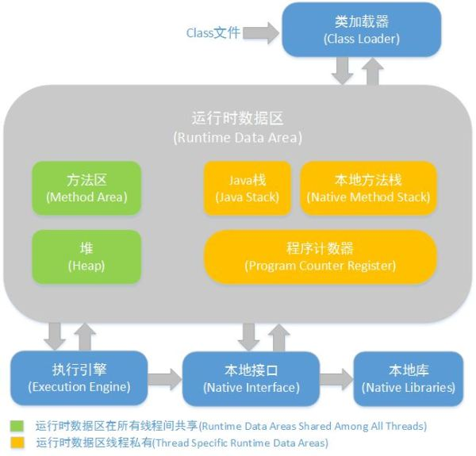

## 类类型

### Class类
首先，存在一个Class类(也叫类型类)，他就是一种类(也就是java.lang.Class)，也继承自Object类，为Object的子类。所有类，里面都拥有这样一个Class类成员对象，这个对象在类被加载后由JVM自动构造。也是由JVM管理的，Class类是**没有公共的构造方法的**。 Class类是所有特定类实例的共有信息的抽象，比如该类实现的接口、对应的加载器、类名等等。一句话，类类型保存了每个类所对应的类型信息。

看以下一段代码
``` java
A a = new A();

if(a.getClass()==A.class)

System.out.println("equal");

else System.out.println("unequal");
```

A这个类型，拥有class类这个(静态)对象实例。而当我们有实例a的时候，可以通过getClass(Object里的方法)，来获得这个class类实例(跟A.class是等同的)，这个class类也就是我们上面提到的这个类型类，用来记载这个大类实现的接口，对应的加载器和构造器，类名之类的，可以用于反射技术。


接下来就要讲述到类加载的过程了(详见虚拟机的类加载笔记)，当一个类需要被加载的时候，JVM首先会检查对应大类的class类对象有没有被加载到JVM内存的方法区当中，如果没有，则进行类加载机制的加载过程，找到对应的class类二进制文件，再把它加载到方法区中成为一个类型类。



一般某个类的Class对象被载入内存，它就用来创建这个类的所有对象

因此类记载流程简单就是归纳为，先把class二进制流加载到内存区域的方法区中。这个方法区中的这个对应Class对象记录着这个大类的各种信息比如构造信息，类名信息。而我们要构造这个大类的实例，就要依赖这个方法区中的Class类来实现。

Class类没有公开构造函数，当JVM加载一个类的时候自动创建的，并且可以用类名.class或者实例.getClass()来获取。