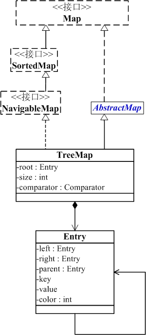

## 集合类的总结
先看看基本集合类

Collection<br>
├List<br>
│├LinkedList<br>
│├ArrayList<br>
│└Vector<br>
│　└Stack<br>
└Set<br>

Map<br>
├Hashtable<br>
├HashMap<br>
├LinkedHashMap(其实extends HashMap)<br>
├TreeMap<br>
└WeakHashMap<br>


### Collection接口
Collection是最基本的集合接口，一个Collection代表一组Object，即Collection的元素（Elements）。Java SDK不提供直接继承自Collection的类，Java SDK提供的类都是继承自Collection的“子接口”如List和Set。

所有实现Collection接口的类都必须提供两个标准的构造函数：无参数的构造函数用于创建一个空的Collection，有一个 Collection参数的构造函数用于创建一个新的Collection，这个新的Collection与传入的Collection有相同的元素。后 一个构造函数允许用户复制一个Collection。

如何遍历Collection中的每一个元素？不论Collection的实际类型如何，它都支持一个iterator()的方法，该方法返回一个迭代子，使用该迭代子即可逐一访问Collection中每一个元素。典型的用法如下：

``` java
Iterator it = collection.iterator(); // 获得一个迭代子
　　　　while(it.hasNext()) {
　　　　　　Object obj = it.next(); // 得到下一个元素
　　　　}
```

#### Collection和Collections的区别
Collection是集合类的上级接口，子接口主要有Set 和List、Map。
Collections是针对集合类的一个帮助类，提供了操作集合的工具方法：一系列静态方法实现对各种集合的搜索、排序、线程安全化等操作。、

Collection是个Java.util下的接口，它是各种集合结构的父接口。
Collections是个java.util下的类，它包含有各种有关集合操作的静态方法。


### List接口
List是**有序**的Collection，使用此接口能够精确的控制每个元素插入的位置。用户能够使用索引（元素在List中的位置，类似于数组下标）来访问List中的元素，这类似于Java的数组。
和下面要提到的Set不同，List允许有相同的元素。
　　除了具有Collection接口必备的iterator()方法外，List还提供一个listIterator()方法，返回一个 ListIterator接口，和标准的Iterator接口相比，ListIterator多了一些add()之类的方法，允许添加，删除，设定元素， 还能向前或向后遍历。
　　实现List接口的常用类有LinkedList，ArrayList，Vector和Stack。

#### LinkedList类
　　LinkedList实现了List接口，允许null元素。此外LinkedList提供额外的get，remove，insert方法在 LinkedList的首部或尾部。这些操作使LinkedList可被用作堆栈（stack），队列（queue）或双向队列（deque）。
　　注意LinkedList没有同步方法。如果多个线程同时访问一个List，则必须自己实现访问同步。一种解决方法是在创建List时构造一个同步的List：
　　　　List list = Collections.synchronizedList(new LinkedList(...));

#### ArrayList类
　　ArrayList实现了可变大小的数组。它允许所有元素，包括null。ArrayList没有同步。
size，isEmpty，get，set方法运行时间为常数。但是add方法开销为分摊的常数，添加n个元素需要O(n)的时间。其他的方法运行时间为线性。
　　每个ArrayList实例都有一个容量（Capacity），即用于存储元素的数组的大小。这个容量可随着不断添加新元素而自动增加，但是增长算法 并没有定义。当需要插入大量元素时，在插入前可以调用ensureCapacity方法来增加ArrayList的容量以提高插入效率。
　　和LinkedList一样，ArrayList也是非同步的（unsynchronized）。

#### Vector类
　　Vector非常类似ArrayList，但是Vector是同步的。由Vector创建的Iterator，虽然和 ArrayList创建的Iterator是同一接口，但是，因为Vector是同步的，当一个Iterator被创建而且正在被使用，另一个线程改变了 Vector的状态（例如，添加或删除了一些元素），这时调用Iterator的方法时将抛出 ConcurrentModificationException，因此必须捕获该异常。


从内部实现机制来讲ArrayList和Vector都是使用数组(Array)来控制集合中的对象。当你向这两种类型中增加元素的时候，如果元素的数目 超出了内部数组目前的长度它们都需要扩展内部数组的长度，Vector缺省情况下自动增长原来一倍的数组长度，ArrayList是原来的50%,所以最 后你获得的这个集合所占的空间总是比你实际需要的要大。所以如果你要在集合中保存大量的数据那么使用Vector有一些优势，因为你可以通过设置集合的初 始化大小来避免不必要的资源开销。


#### Stack 类
　　Stack继承自Vector，实现一个后进先出的堆栈。Stack提供5个额外的方法使得Vector得以被当作堆栈使用。基本的push和pop 方法，还有peek方法得到栈顶的元素，empty方法测试堆栈是否为空，search方法检测一个元素在堆栈中的位置。Stack刚创建后是空栈。


### Set接口
　　Set是一种不包含重复的元素的Collection，即任意的两个元素e1和e2都有e1.equals(e2)=false，Set最多有一个null元素。

　　很明显，Set的构造函数有一个约束条件，传入的Collection参数不能包含重复的元素。

　　请注意：必须小心操作可变对象（Mutable Object）。如果一个Set中的可变元素改变了自身状态导致Object.equals(Object)=true将导致一些问题。

### Map接口
　　请注意，Map没有继承Collection接口，Map提供key到value的映射。一个Map中不能包含相同的key，每个key只能映射一个 value。Map接口提供3种集合的视图，Map的内容可以被当作一组key集合，一组value集合，或者一组key-value映射。

#### Hashtable类
　　Hashtable继承Map接口，实现一个key-value映射的哈希表。任何非空（non-null）的对象都可作为key或者value。
　　添加数据使用put(key, value)，取出数据使用get(key)，这两个基本操作的时间开销为常数。
Hashtable是同步的。

#### HashMap类
　　HashMap和Hashtable类似，不同之处在于HashMap是非同步的，并且允许null，即null value和null key。，但是将HashMap视为Collection时（values()方法可返回Collection），其迭代子操作时间开销和HashMap 的容量成比例。因此，如果迭代操作的性能相当重要的话，不要将HashMap的初始化容量设得过高，或者load factor过低。


#### linkedHashMap
HashMap 是无序的，HashMap 在 put 的时候是根据 key 的 hashcode 进行 hash 然后放入对应的地方。所以在按照一定顺序 put 进 HashMap 中，然后遍历出 HashMap 的顺序跟 put 的顺序不同

JAVA 在 JDK1.4 以后提供了 LinkedHashMap 来帮助我们实现了有序的 HashMap！

LinkedHashMap 是 **HashMap 的一个子类**，它保留插入的顺序，如果需要输出的顺序和输入时的相同，那么就选用 LinkedHashMap。

具体实现上，吧HashMap里的entry对象重写了(参见hashmap源码)，添加了before和after指向上下一个元素，也就是多了一个双向链表。

其实 LinkedHashMap 几乎和 HashMap 一样：从技术上来说，不同的是它定义了一个 Entry<K,V> header，**这个 header 不是放在 Table 里，它是额外独立出来的**。LinkedHashMap 通过继承 hashMap 中的 Entry<K,V>,并添加两个属性 Entry<K,V> before,after。 通过header Entry来组成一个双向链表，来实现按插入顺序或访问顺序排序。


### treemap


treemap和hashmap一个很大的不同在于，treemap可以根据键值来进行排序输出元素。内部是直接用红黑树构造的数据结构，红黑树是根据键值大小来构造的，节点就是hashmap里的entry。相当于底层直接用红黑树实现了，这样的话直接内部就是根据键值排好序的结构。

相对的，增删查的速度都变成了logn量级，由于访问也要遍历树，在随机查找的方面，效率就不如hashmap了。


### 总结
如果涉及到堆栈，队列等操作，应该考虑用List，对于需要快速插入，删除元素，应该使用LinkedList，如果需要快速随机访问元素，应该使用ArrayList。
　　如果程序在单线程环境中，或者访问仅仅在一个线程中进行，考虑非同步的类，其效率较高，如果多个线程可能同时操作一个类，应该使用同步的类。
　　要特别注意对哈希表的操作，作为key的对象要正确复写equals和hashCode方法。
　　尽量返回接口而非实际的类型，如返回List而非ArrayList，这样如果以后需要将ArrayList换成LinkedList时，客户端代码不用改变。这就是针对抽象编程。


### 对比

#### Vector和ArrayList
1. vector是线程同步的，所以它也是线程安全的，而arraylist是线程异步的，是不安全的。如果不考虑到线程的安全因素，一般用arraylist效率比较高。

2. 如果集合中的元素的数目大于目前集合数组的长度时，vector增长率为目前数组长度的100%,而arraylist增长率为目前数组长度的50%.如过在集合中使用数据量比较大的数据，用vector有一定的优势。

#### arraylist和linkedlist
 1. ArrayList是实现了基于动态数组的数据结构，LinkedList基于链表的数据结构。
 2. 对于随机访问get和set，ArrayList觉得优于LinkedList，因为LinkedList要移动指针.
 3. 对于新增和删除操作add和remove，LinedList比较占优势，因为ArrayList要移动数据。这一点要看实际情况的。若只对单条数据插入或删除，ArrayList的速度反而于LinkedList。但若是批量随机的插入删除数 据，LinkedList的速度大大优于ArrayList. 因为ArrayList每插入一条数据，要移动插入点及之后的所有数据。

#### hashtable与hashmap
1. 历史原因:Hashtable是基于陈旧的Dictionary类的，HashMap是Java 1.2引进的Map接口的一个实现

2. 同步性:Hashtable是线程安全的，也就是说是同步的，而HashMap是线程序不安全的，不是同步的

3. 值：只有HashMap可以让你将空值作为一个表的条目的key或value
