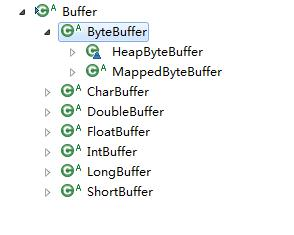

## Buffer
Buffer是一个对象，它包含一些要写入或读出的数据。在NIO中，数据是放入buffer对象的，而在IO中，数据是直接写入或者读到Stream对象的。应用程序不能直接对 Channel 进行读写操作，而必须通过 Buffer 来进行，即 Channel 是通过 Buffer 来读写数据的。

在NIO中，所有的数据都是用Buffer处理的，它是NIO读写数据的中转池。Buffer实质上是一个数组，通常是一个字节数据，但也可以是其他类型的数组。但一个缓冲区不仅仅是一个数组，重要的是它提供了对数据的结构化访问，而且还可以跟踪系统的读写进程。

使用 Buffer 读写数据一般遵循以下四个步骤：

1. 写入数据到 Buffer；
2. 调用 flip() 方法；
3. 从 Buffer 中读取数据；
4. 调用 clear() 方法或者 compact() 方法。

当向 Buffer 写入数据时，Buffer 会记录下写了多少数据。一旦要读取数据，需要通过 flip() 方法将 Buffer 从写模式切换到读模式。在读模式下，可以读取之前写入到 Buffer 的所有数据。

一旦读完了所有的数据，就需要清空缓冲区，让它可以再次被写入。有两种方式能清空缓冲区：调用 clear() 或 compact() 方法。clear() 方法会清空整个缓冲区。compact() 方法只会清除已经读过的数据。任何未读的数据都被移到缓冲区的起始处，新写入的数据将放到缓冲区未读数据的后面。

Buffer有以下类型

buffer缓冲区实质上就是一块内存，用于写入数据，也供后续再次读取数据。这块内存被NIO Buffer管理，并提供一系列的方法用于更简单的操作这块内存。

一个Buffer有三个属性是必须掌握的，分别是：

 - capacity容量
 - position位置
 - limit限制

### capacity
作为一块内存，buffer有一个固定的大小，叫做capacity容量。也就是最多只能写入容量值得字节，整形等数据。一旦buffer写满了就需要清空已读数据以便下次继续写入新的数据。

### position
当写入数据到Buffer的时候需要中一个确定的位置开始，默认初始化时这个位置position为0，一旦写入了数据比如一个字节，整形数据，那么position的值就会指向数据之后的一个单元，position最大可以到capacity-1.

当从Buffer读取数据时，也需要从一个确定的位置开始。**buffer从写入模式变为读取模式时，position会归零，每次读取后，position向后移动**。

### limit
在写模式，**limit的含义是我们所能写入的最大数据量**。它等同于buffer的容量。

一旦切换到读模式，limit则代表我们所能读取的最大数据量，他的值等同于写模式下position的位置。

数据读取的上限时buffer中已有的数据，也就是limit的位置（原position所指的位置）。**所以说读模式下，limit就是最大可读的数据量。**

 position和limit的具体含义取决于当前buffer的模式。capacity在两种模式下都表示容量。

 下面有张示例图，描诉了不同模式下position和limit的含义：

