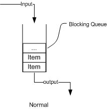

## BlockingQueue
在新增的Concurrent包中，BlockingQueue很好的解决了多线程中，如何高效安全“传输”数据的问题。通过这些高效并且线程安全的队列类，为我们快速搭建高质量的多线程程序带来极大的便利。

阻塞队列，顾名思义，首先它是一个队列，而一个队列在数据结构中所起的作用大致如下图所示：



从上图我们可以很清楚看到，通过一个共享的队列，可以使得数据由队列的一端输入，从另外一端输出；
多线程环境中，通过队列可以很容易实现数据共享，比如**经典的“生产者”和“消费者”模型**中，通过队列可以很便利地实现两者之间的数据共享。

阻塞队列主要用在生产者/消费者的场景，下面这幅图展示了一个线程生产、一个线程消费的场景：


负责生产的线程不断的制造新对象并插入到阻塞队列中，直到达到这个队列的上限值。队列达到上限值之后生产线程将会被阻塞，直到消费的线程对这个队列进行消费。同理，负责消费的线程不断的从队列中消费对象，直到这个队列为空，当队列为空时，消费线程将会被阻塞，除非队列中有新的对象被插入。

### BlockingQueue接口中的方法
在JUC包里，BlockingQueue只是一个接口。

阻塞队列一共有四套方法分别用来进行insert、remove和examine，当每套方法对应的操作不能马上执行时会有不同的反应，下面这个表格就分类列出了这些方法：

<table>
<thead>
<tr>
  <th>-</th>
  <th>Throws Exception</th>
  <th>Special Value</th>
  <th>Blocks</th>
  <th>Times Out</th>
</tr>
</thead>
<tbody><tr>
  <td>Insert</td>
  <td>add(o)</td>
  <td>offer(o)</td>
  <td>put(o)</td>
  <td>offer(o, timeout, timeunit)</td>
</tr>
<tr>
  <td>Remove</td>
  <td>remove(o)</td>
  <td>poll()</td>
  <td>take()</td>
  <td>poll(timeout, timeunit)</td>
</tr>
<tr>
  <td>Examine</td>
  <td>element()</td>
  <td>peek()</td>
  <td></td>
  <td></td>
</tr>
</tbody></table>

这四套方法对应的特点分别是：
1. ThrowsException：如果操作不能马上进行，则抛出异常
2. SpecialValue：如果操作不能马上进行，将会返回一个特殊的值，一般是true或者false
3. Blocks:如果操作不能马上进行，操作会被阻塞
4. TimesOut:如果操作不能马上进行，操作会被阻塞指定的时间，如果指定时间没执行，则返回一个特殊值，一般是true或者false

需要注意的是，我们不能向BlockingQueue中插入null，否则会报NullPointerException。

### 实现类
BlockingQueue只是java.util.concurrent包中的一个接口，而在具体使用时，我们用到的是它的实现类，当然这些实现类也位于java.util.concurrent包中。在Java6中，BlockingQueue的实现类主要有以下几种：
1. ArrayBlockingQueue
2. DelayQueue
3. LinkedBlockingQueue
4. PriorityBlockingQueue
5. SynchronousQueue

#### ArrayBlockingQueue
ArrayBlockingQueue是一个**有边界的阻塞队列**，它的内部实现是一个数组。有边界的意思是它的容量是有限的，我们必须在其初始化的时候**指定它的容量大小**，容量大小一旦指定就不可改变。

下面是一个例子
``` java
BlockingQueue queue = new ArrayBlockingQueue(1024);
queue.put("1");
Object object = queue.take();
```

#### DelayQueue
DelayQueue阻塞的是其内部元素，DelayQueue中的元素必须实现 java.util.concurrent.Delayed接口，这个接口的定义非常简单：
