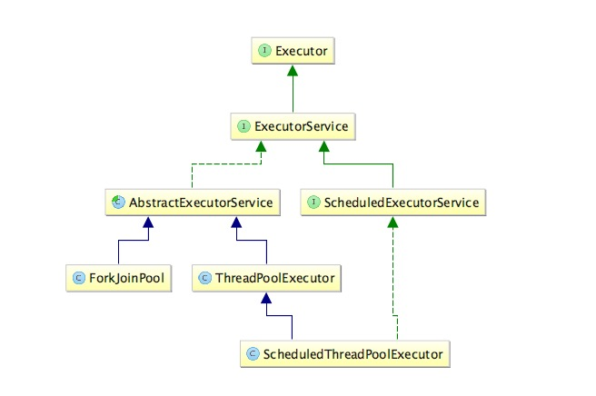

## ThreadPool
回顾一下线程的五个生命周期先


那么什么时候应该应用线程池呢？

假设一个服务器完成一项任务所需时间为：T1 创建线程时间，T2 在线程中执行任务的时间，T3 销毁线程时间。

如果：**T1 + T3 远大于 T2**，则可以采用线程池，以提高服务器性能。

### 线程池的优点
合理利用线程池能够带来三个好处。
1. 降低资源消耗。通过重复利用已创建的线程降低线程创建和销毁造成的消耗。
2. 提高响应速度。当任务到达时，任务可以不需要等到线程创建就能立即执行。
3. 提高线程的可管理性。线程是稀缺资源，如果无限制的创建，不仅会消耗系统资源，还会降低系统的稳定性，使用线程池可以进行统一的分配，调优和监控。但是要做到合理的利用线程池，必须对其原理了如指掌。


那么线程池，从何说起呢？

在Executor框架的笔记中，我们知道了JUC包下，有Executors这个工具类。

并且我们也知道了线程池基本上都是要实现ExecutorService这个接口。

然后我们可以回顾下Executor接口继承关系的图


因此我们便知道了，可以通过Executors这个工具类，来返回几种不同类型的线程池(实现了ExecutorService接口)

**有四种创建方法**

#### newCachedThreadPool
 - 缓存型池子，先查看池中有没有以前建立的线程，如果有，就 reuse 如果没有，就建一个新的线程加入池中
 - 缓存型池子通常用于执行一些生存期很短的异步型任务 因此在一些面向连接的 daemon 型 SERVER 中用得不多。但对于生存期短的异步任务，它是 Executor 的首选。
 - 能 reuse 的线程，必须是 timeout IDLE 内的池中线程，缺省 timeout 是 60s,超过这个 IDLE 时长，线程实例将被终止及移出池

#### newFixedThreadPool
 - newFixedThreadPool 与 cacheThreadPool 差不多，也是能 reuse 就用，但不能随时建新的线程。
其独特之处:**任意时间点，最多只能有固定数目的活动线程存在**，此时如果有新的线程要建立，只能放在另外的队列中等待，直到当前的线程中某个线程终止直接被移出池子。
 - 和 cacheThreadPool 不同，FixedThreadPool 没有 IDLE 机制（可能也有，但既然文档没提，肯定非常长，类似依赖上层的 TCP 或 UDP IDLE 机制之类的），所以 FixedThreadPool 多数针对一些很稳定很固定的正规并发线程，多用于服务器。
 - 从方法的源代码看，cache池和fixed 池调用的是同一个底层 池，只不过参数不同:
   - fixed 池线程数固定，并且是0秒IDLE（无IDLE）。
   - cache 池线程数支持 0-Integer.MAX_VALUE(显然完全没考虑主机的资源承受能力），60 秒 IDLE 。

#### newScheduledThreadPool
创建一个定长线程池，支持定时及周期性任务执行。延迟执行示例代码如下：
 - 调度型线程池
 - 这个池子里的线程可以按 schedule 依次 delay 执行，或周期执行

#### SingleThreadExecutor
单例线程，任意时间池中只能有一个线程
用的是和 cache 池和 fixed 池相同的底层池，但线程数目是 1-1,0 秒 IDLE（无 IDLE）

**一般来说，CachedTheadPool 在程序执行过程中通常会创建与所需数量相同的线程，然后在它回收旧线程时停止创建新线程，因此它是合理的 Executor 的首选**，只有当这种方式会引发问题时（比如需要大量长时间面向连接的线程时），才需要考虑用 FixedThreadPool。（该段话摘自《Thinking in Java》第四版）

java1.8的源码中还发现有WorkingStealingPool，这个暂且留着以后再探究。

以上四种方法都能很好的帮助我们创建线程池，但是通过源码，我们可以发现这四个方法都是return一个**ThreadPoolExecutor类**，只是传入的参数不同。所以我们可以知道，线程池就是创建一个ThreadPoolExecutor类(根据上面的继承图可以知道是实现了ExecutorService)

所以真正意义上的线程池就是：ThreadPoolExecutor类，它实现了ExecutorService接口，并封装了一系列的api使得它具有线程池的特性，其中包括工作队列、核心线程数、最大线程数等。

### ThreadPoolExecutor
我们观察一下它的构造方法

``` java
public ThreadPoolExecutor(int corePoolSize,
                              int maximumPoolSize,
                              long keepAliveTime,
                              TimeUnit unit,
                              BlockingQueue<Runnable> workQueue,
                              ThreadFactory threadFactory,
                              RejectedExecutionHandler handler) {...}
```

官方也不推荐使用这种方法来创建线程池，而是推荐使用Executors的工厂方法来创建线程池，Executors类是官方提供的一个工厂类，它里面封装好了众多功能不一样的线程池(就是上面说出的几种)，从而使得我们创建线程池非常的简便

现在我们来了解一下ThreadPoolExecutor构造方法的各个参数含义
 1. corePoolSize：线程池的核心线程数，一般情况下不管有没有任务都会一直在线程池中一直存活，只有在 ThreadPoolExecutor 中的方法 allowCoreThreadTimeOut(boolean value) 设置为 true 时，闲置的核心线程会存在超时机制，如果在指定时间没有新任务来时，核心线程也会被终止，而这个时间间隔由第3个属性 keepAliveTime 指定。
 2. maximumPoolSize：线程池所能容纳的最大线程数，当活动的线程数达到这个值后，后续的新任务将会被阻塞。
 3. keepAliveTime：控制线程闲置时的超时时长，超过则终止该线程。一般情况下用于非核心线程，只有在 ThreadPoolExecutor 中的方法 allowCoreThreadTimeOut(boolean value) 设置为 true时，也作用于核心线程。
 4. unit：用于指定 keepAliveTime 参数的时间单位，TimeUnit 是个 enum 枚举类型，常用的有：TimeUnit.HOURS(小时)、TimeUnit.MINUTES(分钟)、TimeUnit.SECONDS(秒) 和 TimeUnit.MILLISECONDS(毫秒)等。
 5. workQueue：线程池的任务队列，通过线程池的 execute(Runnable command) 方法会将任务 Runnable 存储在队列中。
 6. threadFactory：线程工厂，它是一个接口，用来为线程池创建新线程的。

了解这一点之后，我们回顾一下上面各种线程池的创建方法。
``` java
public static ExecutorService newFixedThreadPool(int nThreads) {
    return new ThreadPoolExecutor(nThreads, nThreads,
                                  0L, TimeUnit.MILLISECONDS,
                                  new LinkedBlockingQueue<Runnable>());
}
public static ExecutorService newSingleThreadExecutor() {
    return new FinalizableDelegatedExecutorService
        (new ThreadPoolExecutor(1, 1,
                                0L, TimeUnit.MILLISECONDS,
                                new LinkedBlockingQueue<Runnable>()));
}
public static ExecutorService newCachedThreadPool() {
    return new ThreadPoolExecutor(0, Integer.MAX_VALUE,
                                  60L, TimeUnit.SECONDS,
                                  new SynchronousQueue<Runnable>());
}
```

根据代码中参数的配置，我们可以看到各种创建池的区别。

这里我们又发现一件事了，几种方法参数传入的workQueue，很不一样。

workQueue这个任务队列却要再次说明一下，它是一个BlockingQueue对象，而泛型则限定它是用来存放Runnable对象的，刚刚上面讲了，不同的线程池它的任务队列实现肯定是不一样的，所以，**保证不同线程池有着不同的功能的核心就是这个workQueue的实现了**

总的来说就是这样：
1. newFixedThreadPool()—>LinkedBlockingQueue
2. newSingleThreadExecutor()—>LinkedBlockingQueue
3. newCachedThreadPool()—>SynchronousQueue
4. newScheduledThreadPool()—>DelayedWorkQueue
5. newSingleThreadScheduledExecutor()—>DelayedWorkQueue
