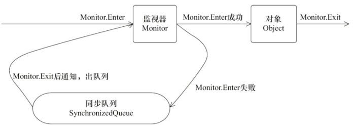

## synchronize关键字
采用 synchronized 修饰符实现的同步机制叫做互斥锁机制，它所获得的锁叫做**互斥锁**。每个对象都有一个 **monitor (锁标记)**，当线程拥有这个锁标记时才能访问这个资源，没有锁标记便进入锁池。

也就是说synchronize锁的就是某个对象里的这个monitor(**好像也叫管程**)

### 用法
它的修饰对象有几种：
1. 修饰一个类，其作用的范围是synchronized后面括号括起来的部分， 作用的对象是这个类的所有对象。
2. 修饰一个方法，被修饰的方法称为同步方法，其作用的范围是整个方法， 作用的对象是调用这个方法的对象；
3. 修改一个静态的方法，其作用的范围是整个静态方法， 作用的对象是这个类的所有对象；
4. 修饰一个代码块，被修饰的代码块称为同步语句块，其作用的范围是大括号{}括起来的代码， 作用的对象是调用这个代码块的对象；

以上说明synchronize关键字可以锁住整个类，也可以锁着某个具体的对象实例。然而，锁住整个类其实也是锁住实例，只不过锁住的这个实例，实在Class类这个在方法区里的这个对象。
``` java
class ClassName {
   public void method() {
      synchronized(ClassName.class) {
         // todo
      }
   }
}
```

可知道这种方法锁住类，其实只是锁住了class对象，从而控制了你静态方法的同步。

简而言之，**类锁实际上用对象锁来实现**。当虚拟机装载一个class文件的时候，它就会创建一个java.lang.Class类的实例。当锁住一个对象的时候，实际上锁住的是那个类的Class对象。

synchronized修饰非静态方法、同步代码块的synchronized (this)用法和synchronized (非this对象)的用法锁的是对象，线程想要执行对应同步代码，需要获得对象锁。

synchronized修饰静态方法以及同步代码块的synchronized (类.class)用法锁的是类，线程想要执行对应同步代码，需要获得类锁。


另外，有几点需要注意：
 - 在定义接口方法时不能使用synchronized关键字。
 - 构造方法不能使用synchronized关键字，但可以使用synchronized代码块来进行同步。
 - synchronized 关键字不能被继承 。如果子类覆盖了父类的 被 synchronized 关键字修饰的方法，那么子类的该方法只要没有 synchronized 关键字，那么就默认没有同步，也就是说，不能继承父类的 synchronized。


### 有关monitor(Java中也可以翻译成管程)
任意一个对象都拥有自己的监视器，当这个对象由同步块或者这个对象的同步方法调用时，执行方法的线程必须先获取该对象的监视器才能进入同步块和同步方法，如果没有获取到监视器的线程将会被阻塞在同步块和同步方法的入口处，进入到BLOCKED状态



该图可以看出，任意线程对Object的访问，首先要获得Object的监视器，如果获取失败，该线程就进入同步状态，线程状态变为BLOCKED，当Object的监视器占有者释放后，在同步队列中得线程就会有机会重新获取该监视器。

更详细可以去看jvm对象分布中对象头的笔记，和锁与并发的笔记。

### wait,notify和sleep方法
**在 Java 中可以用 wait、notify 和 notifyAll 来实现线程间的通信**

wait() 与  notify/notifyAll() 经常与synchronized搭配使用，即在synchronized修饰的同步代码块或方法里面调用wait() 与  notify/notifyAll()方法。

由于 wait() 与  notify/notifyAll() 是放在同步代码块中的，因此线程在执行它们时，肯定是进入了临界区中的，即该线程肯定是获得了锁的。

**当线程执行wait()时，会把当前的锁释放，然后让出CPU，进入等待状态。**

**当执行notify/notifyAll方法时，会唤醒一个处于等待该 对象锁 的线程，然后继续往下执行，直到执行完退出对象锁锁住的区域（synchronized修饰的代码块）后再释放锁**。

从这里可以看出，notify/notifyAll()执行后，并不立即释放锁，而是要等到执行完临界区中代码后，再释放。故，在实际编程中，我们应该尽量在线程调用notify/notifyAll()后，立即退出临界区。即不要在notify/notifyAll()后面再写一些耗时的代码。

自我总结一下，也就是说线程有等待状态，还有等待运行的状态，当notify选中一个线程之后，这个线程会进入等待运行的队列里，直到获得锁了才运行，而等待队列里的线程必须被唤醒才有获得锁的机会。

sleep方法属于Thread类中方法，表示让一个线程进入睡眠状态，等待一定的时间之后，自动醒来进入到可运行状态，不会马上进入运行状态，因为线程调度机制恢复线程的运行也需要时间，一个线程对象调用了sleep方法之后，并不会释放他所持有的所有对象锁，所以也就不会影响其他进程对象的运行。但在sleep的过程中过程中有可能被其他对象调用它的interrupt(),产生InterruptedException异常，如果你的程序不捕获这个异常，线程就会异常终止，进入TERMINATED状态，如果你的程序捕获了这个异常，那么程序就会继续执行catch语句块(可能还有finally语句块)以及以后的代码。

#### wait和notify用法注意点
**永远在循环（loop）里调用 wait 和 notify，不是在 If 语句**

因为线程是在某些条件下等待的，if语句存在一些微妙的小问题，导致即使条件没被满足，你的线程你也有可能被错误地唤醒。所以如果你不在线程被唤 醒后再次使用while循环检查唤醒条件是否被满足，你的程序就有可能会出错。

基于以上认知，下面这个是使用wait和notify函数的规范代码模板：

``` java
// The standard idiom for calling the wait method in Java
synchronized (sharedObject) {
    while (condition) {
sharedObject.wait();
        // (Releases lock, and reacquires on wakeup)
    }
    // do action based upon condition e.g. take or put into queue
}
```
