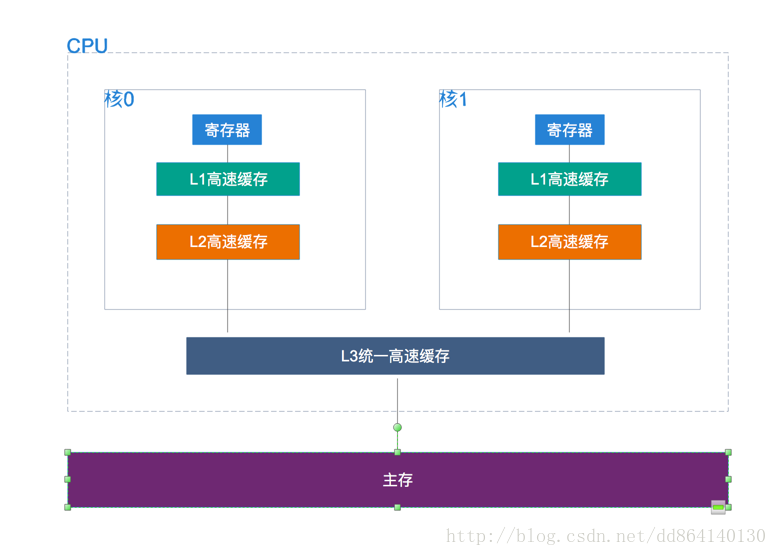
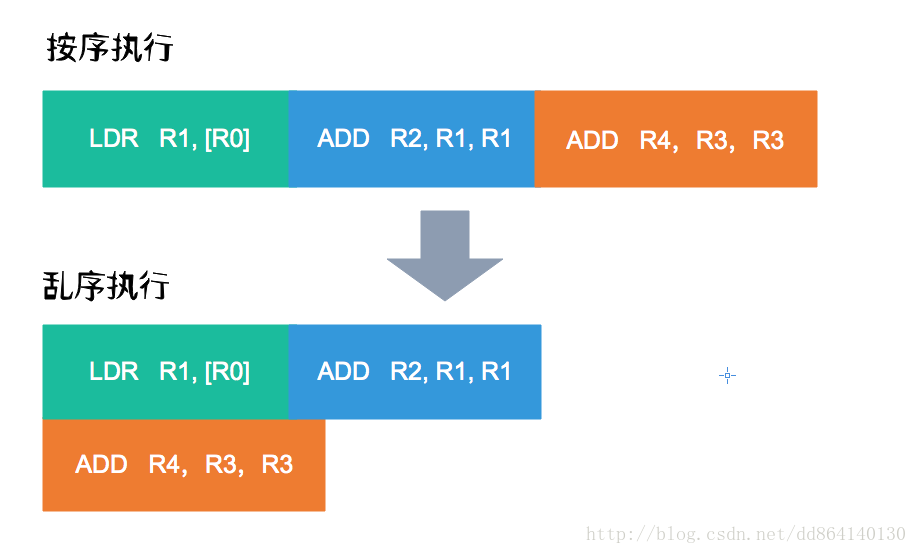

## 乱序执行和内存屏障

### 处理器乱序执行
随着处理器流水线技术和多核技术的发展,目前的高级处理器通过提高内部逻辑元件的利用率来提高运行速度,通常会采用乱序执行技术.



处理器从L1 Cache中取出一批指令,分析找出那些不存在相互依赖的指令,同时将其发射到多个逻辑单元执行,比如现在有以下几条指令:

```
LDR   R1, [R0]；
ADD   R2, R1, R1；
ADD   R4，R3，R3;
```

通过分析发现第二条指令和第一条指令存在依赖关系,但是和第3条指令无关,那么处理器就可能将其发送到两个逻辑单元去执行,因此上述的指令执行流程可能如下:



可以说乱序执行技术是处理器为提高运算速度而做出违背代码原有顺序的优化.在单核时代,处理器保证做出的优化不会导致执行结果远离预期目标,但在多核环境下却并非如此.

首先多核时代,同时会有多个核执行指令,每个核的指令都可能被乱序;另外,处理器还引入了L1,L2等缓存机制,每个核都有自己的缓存,这就导致逻辑次序上后写入内存的数据未必真的最后写入.最终带来了这么一个问题:如果我们不做任何防护措施,处理器最终得出的结果和我们逻辑得出的结果大不相同.比如我们在一个核上执行数据的写入操作,并在最后写一个标记用来表示之前的数据已经准备好,然后从另一个核上通过判断这个标志来判定所需要的数据已经就绪,这种做法存在风险:标记位先被写入,但是之前的数据操作却并未完成(可能是未计算完成,也可能是数据没有从处理器缓存刷新到主存当中),最终导致另一个核中使用了错误的数据.

### 编译器指令重排
除了上述由处理器和缓存引起的乱序之外,现代编译器同样提供了乱序优化.之所以出现编译器乱序优化其根本原因在于处理器每次只能分析一小块指令,但编译器却能在很大范围内进行代码分析,从而做出更优的策略,充分利用处理器的乱序执行功能.

现在来总结下所有可能发生乱序执行的情况:

 - 现代处理器采用指令并行技术,在不存在数据依赖性的前提下,处理器可以改变语句对应的机器指令的执行顺序来提高处理器执行速度
 - 现代处理器采用内部缓存技术,导致数据的变化不能及时反映在主存所带来的乱序.
 - 现代编译器为优化而重新安排语句的执行顺序

 尽管我们看到乱序执行初始目的是为了提高效率,但是它看来其好像在这多核时代不尽人意,其中的某些"自作聪明"的优化导致多线程程序产生各种各样的意外.因此有必要存在一种机制来消除乱序执行带来的坏影响,也就是说应该允许程序员显式的告诉处理器对某些地方禁止乱序执行.这种机制就是所谓内存屏障.不同架构的处理器在其指令集中提供了不同的指令来发起内存屏障,对应在编程语言当中就是提供特殊的关键字来调用处理器相关的指令.


### 内存屏障

#### 处理器乱序规则
上面我们说了处理器会发生指令重排,现在来简单的看看常见处理器允许的重排规则,换言之就是处理器可以对那些指令进行顺序调整:

表格中的Y表示前后两个操作允许重排,N则表示不允许重排.与这些规则对应是的禁止重排的内存屏障.

注意:处理器和编译都会遵循数据依赖性,不会改变存在数据依赖关系的两个操作的顺序.所谓的数据依赖性就是如果两个操作访问同一个变量,且这两个操作中有一个是写操作,那么久可以称这两个操作存在数据依赖性.举个简单例子:
