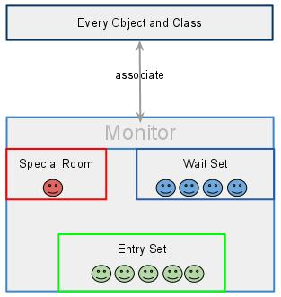

## 管程
管程(monitor)是操作系统中的一个重要概念。它也可用于Java同步中。这篇文章使用了一个比喻来解释“管程”的基本思想。

### 比喻
管程可以被认为是一个建筑物，其中包含一个特殊的房间(下图的special room)。该特殊的房间在同一时间只能由一个客户（线程）占用，通常包含一些数据和代码。

如果一个客户想要占据这个特殊房间，他必须先进入走廊（在上图是Hallway，在java中是Entry Set）等待。调度器将根据某些标准（例如FIFO先进先出）来选择一个客户。如果他出于某种原因中止，那么他将被送到等待室(上图wait room)，并且在一段时间之后被安排重新进入特殊房间。正如上图所示，这座大楼里包含3间房间。

简单来说，管程是用来监视线程对这个特殊房间的访问。它确保只有一个线程能够访问受保护的数据或代码。

说白了，管程就是一个专门为并发编程提出的概念，它表示**一个对象自己维护自己的状态，并且能够根据自身状态来同步并发的线程操作，而不是把这种同步的手段交给调用者来处理**。

如果一个线程拥有一些数据的锁，那么没有其他线程可以获取这个锁，直到拥有锁的线程释放它。当我们做多线程编程时，如果任何时候都需要编写一个信号量，这将是不方便。幸运的是，我们并不需要，因为JVM自动为我们实现了。

声明一个管程区域，这意味着数据不能被超过一个线程访问，java提供同步代码块和同步方法。一旦代码被嵌入synchronized关键字，它就是一个管程区域。**该锁在后台通过JVM自动实现**。

Java为每一个拥有synchronized方法的对象实例提供了一个唯一的管程。为了完成分配资源的功能,线程必须调用管程入口。管程入口就是synchronized方法入口。当调用同步(synchronized)方法时,该线程就获得了该管程。

一个管程包含:

 - 多个彼此可以交互并共用资源的线程
 - 多个与资源使用有关的变量
 - 一个互斥锁
 - 一个用来避免竞态条件的不变量

**zwlj：管程其实就是多线程并发获取某种资源的一种整体结构，是一种整体结构(看上面的四个成分)。**
