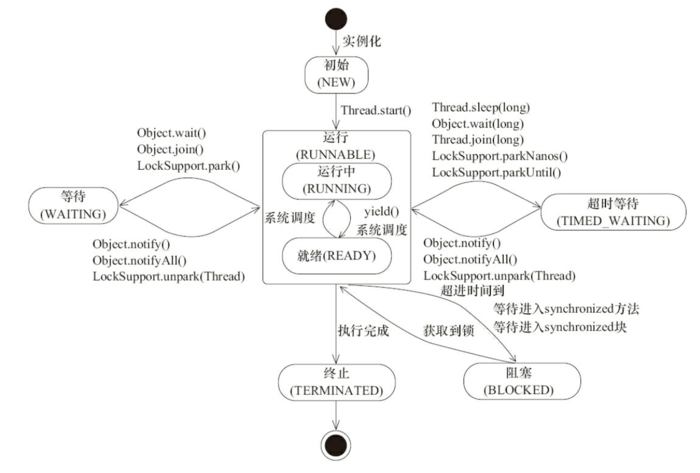

## 线程基础



此图来源于《JAVA并发编程的艺术》一书中，线程是会在不同的状态间进行转换的，java线程线程转换图如上图所示。

 - 线程创建之后调用start()方法开始运行
 - 当调用wait(),join(),LockSupport.lock()方法线程会进入到**WAITING状态**
 - 而同样的wait(long timeout)，sleep(long),join(long),LockSupport.parkNanos(),LockSupport.parkUtil()增加了超时等待的功能，也就是调用这些方法后线程会进入TIMED_WAITING状态，
 - 当超时等待时间到达后，线程会切换到Runable的状态，另外当WAITING和TIMED _WAITING状态时可以通过Object.notify(),Object.notifyAll()方法使线程转换到Runable状态。
 - 当线程出现资源竞争时，即等待获取锁的时候，线程会进入到BLOCKED阻塞状态，当线程获取锁时，线程进入到Runable状态。
线程运行结束后，线程进入到TERMINATED状态

状态转换可以说是线程的生命周期。

#### interrupted
中断可以理解为线程的一个标志位，它表示了一个运行中的线程是否被其他线程进行了中断操作。中断好比其他线程对该线程打了一个招呼。其他线程可以调用该线程的interrupt()方法对其进行中断操作，同时该线程可以调用isInterrupted（）来感知其他线程对其自身的中断操作，从而做出响应。

另外，同样可以调用Thread的静态方法interrupted（）对当前线程进行中断操作，该方法会清除中断标志位。需要注意的是，当抛出InterruptedException时候，会清除中断标志位，也就是说在调用isInterrupted会返回false。

zwlj:也就是Thread类里有一个标志变量，用来指示这个线程有没有中断。

``` java
sleepThread.interrupt();
busyThread.interrupt();
```

#### join
如果一个线程实例A执行了threadB.join(),其含义是：当前线程A会等待threadB线程终止后threadA才会继续执行

#### sleep
sleep(long millis)方法显然是Thread的静态方法，很显然它是让当前线程按照指定的时间休眠，其休眠时间的精度取决于处理器的计时器和调度器。需要注意的是如果当前线程获得了锁，sleep方法**并不会失去锁**。

 - sleep()方法是Thread的静态方法，而wait是Object实例方法
 - wait()方法必须要在同步方法或者同步块中调用，也就是必须已经获得对象锁。而sleep()方法没有这个限制可以在任何地方种使用。另外，wait()方法会释放占有的对象锁，使得该线程进入等待池中，等待下一次获取资源。而**sleep()方法只是会让出CPU并不会释放掉对象锁**；
 - sleep()方法在休眠时间达到后如果再次获得CPU时间片就会继续执行，而wait()方法必须等待Object.notift/Object.notifyAll通知后，才会离开等待池，并且再次获得CPU时间片才会继续执行。

#### yield
这是一个静态方法，一旦执行，它会是当前线程让出CPU，但是，需要注意的是，让出的CPU并不是代表当前线程不再运行了，如果在下一次竞争中，又获得了CPU时间片当前线程依然会继续运行。另外，让出的时间片只会分配给当前线程相同优先级的线程。


现代操作系统基本采用时分的形式调度运行的线程，操作系统会分出一个个时间片，线程会分配到若干时间片，当前时间片用完后就会发生线程调度，并等待这下次分配。线程分配到的时间多少也就决定了线程使用处理器资源的多少，而线程优先级就是决定线程需要或多或少分配一些处理器资源的线程属性

在Java程序中，通过一个整型成员变量Priority来控制优先级，优先级的范围从1~10.在构建线程的时候可以通过setPriority(int)方法进行设置，默认优先级为5，优先级高的线程相较于优先级低的线程优先获得处理器时间片。需要注意的是在不同JVM以及操作系统上，线程规划存在差异，有些操作系统甚至会忽略线程优先级的设定

另外需要注意的是，sleep()和yield()方法，同样都是当前线程会交出处理器资源，而它们不同的是，sleep()交出来的时间片其他线程都可以去竞争，也就是说都有机会获得当前线程让出的时间片。而**yield()方法只允许与当前线程具有相同优先级的线程能够获得释放出来的CPU时间片**

### 守护线程Daemon
守护线程是一种特殊的线程，就和它的名字一样，它是系统的守护者，在**后台默默地守护一些系统服务**，比如垃圾回收线程，JIT线程就可以理解守护线程。与之对应的就是用户线程，用户线程就可以认为是系统的工作线程，它会完成整个系统的业务操作。用户线程完全结束后就意味着整个系统的业务任务全部结束了，因此系统就没有对象需要守护的了，守护线程自然而然就会退。当一个Java应用，只有守护线程的时候，虚拟机就会自然退出.

线程可以通过setDaemon(true)的方法将线程设置为守护线程。并且需要注意的是设置守护线程要先于start()方法，否则会报异常
