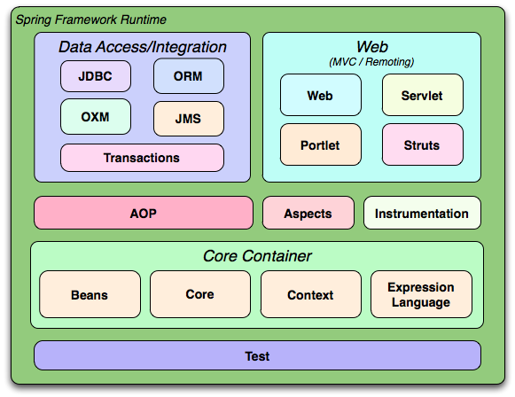

## Spring
Spring 是一个开源的轻量级 Java SE（ Java 标准版本）/Java EE（ Java 企业版本）开发应用框架，其目的是用于简化企业级应用程序开发.

在传统应用程序开发中，一个完整的应用是由一组相互协作的对象组成的。所以开发一个应用除了要开发业务逻辑之外，最多的是关注使这些对象协作来完成所需功能的同时，实现**低耦合、高内聚**。所以，业务逻辑开发是不可避免的。如果有个框架可以帮我们来**创建对象及管理这些对象之间的依赖关系**，能**通过配置方式**来创建对象，管理对象之间依赖关系，我们不需要通过工厂和生成器来创建及管理对象之间的依赖关系，这样我们必然会减少许多工作量，加快开发。Spring 框架问世之初主要就是来完成这个功能。

简而言之，Spring可以帮助我们：

 - 根据配置文件创建及组装对象之间的依赖关系
 - Spring 面向切面编程能帮助我们无耦合的实现日志记录、性能统计、安全控制
 -  Spring能非常简单的帮我们管理数据库事务
 - 与第三方库集成完成各种功能(Hibernate JPA SpringMVC等)

### Spring优点

 - 非常轻量级，使应用更容易测试和管理。核心JAR包很小。
 - 可以实现AOP特性。面向切面编程，所谓面向编程，即 **可以通过在编译期间、装载期间或运行期间实现在不修改源代码的情况下给程序动态添加功能的一种技术(重)**
 - Spring支持事务管理
 - Spring支持JDBC抽象和ORM框架映射
 - 灵活的支持第三方库

### Spring架构

**核心容器CoreContainer：包括 Core 、 Beans 、 Context 、 EL 模块**

#### Core模块

Core 模块：封装了框架依赖的最底层部分，包括资源访问、类型转换及一些常用工具类。

#### Bean模块
提供了框架的基础部分，包括控制反转（ IOC ）和依赖注入（ DI ）。其中 **BeanFactory 是容器核心** ，本质是“工厂设计模式”的实现，而且无需编程实现“单例设计模式”，单例完全由容器控制，而且提倡面向接口编程，而非面向实现编程；所有应用程序对象及对象间关系由框架管理，从而真正从程序逻辑中把维护对象之间的依赖关系提取出来，所有这些依赖关系都由 BeanFactory 来维护。

#### Context模块
以 Core 和 Beans 为基础，集成 Beans 模块功能并添加资源绑定、数据验证、国际化、 Java EE 支持、容器生命周期、事件传播等；核心接口是 **ApplicationContext**

#### EL模块
提供强大的 **表达式语言支持**，支持访问和修改属性值，方法调用，支持访问及修改数组、容器和索引器，命名变量，支持算数和逻辑运算，支持从 Spring 容器获取 Bean， 它也支持列表投影、选择和一般的列表聚合等。
