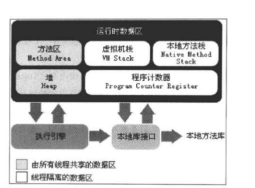
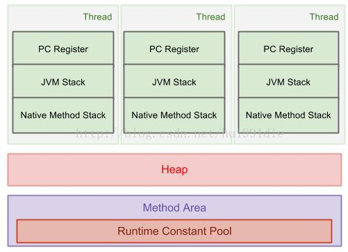

## 运行时数据区域

java虚拟机在执行java程序的过程中会把它所管理的内存划分为若干个不同的数据区域。




### 程序计数器
程序计数器是一个较小的内存空间，当前线程的字节码指示器，工作时通过改变这个计数器的值选取下一条需要执行的字节码指令

每个线程都需要一个独立的程序计数器，各线程互不影响，这块内存为**线程私有内存**

此区域是唯一一在java虚拟机规范中没有规定任何OOM情况的区域

### java虚拟机栈
线程私有，生命周期与线程相同。每个方法在执行时都会创建一个栈帧(Stack Frame),用于存储局部变量表，操作数栈，动态链接，方法出口等信息。每个方法调用到执行完成的过程对应这一个栈帧在虚拟机栈中入栈到出栈。

局部变量表里存放了编译期可知的各种基本数据类型(boolean byte char short int float double long)还有对象引用(reference)

当进入一个方法时，这个方法需要在帧中分配多大的局部空间是完全确定的，在方法运行期间不会改变局部变量表的大小。

在java虚拟机规范中，如果线程请求栈深度大于虚拟机允许的深度，将抛出StackOverFlow(递归太深？)异常，无法申请到足够内存，将会抛出OutOfMemory异常。

#### 局部变量表(补充)
局部变量表是存在于栈帧中的数据结构

局部变量表是一组变量值存储空间，用于存放方法参数和方法内部定义的局部变量，其中存放的数据的类型是编译期可知的各种基本数据类型、对象引用（**reference**）和 **returnAddress** 类型（它指向了一条字节码指令的地址）。局部变量表所需的内存空间在编译期间完成分配，即在 Java 程序被编译成 Class 文件时，就确定了所需分配的最大局部变量表的容量。当进入一个方法时，这个方法需要在栈中分配多大的局部变量空间是完全确定的，在方法运行期间不会改变局部变量表的大小。

局部变量表的容量以变量槽（Slot）为最小单位。在虚拟机规范中并没有明确指明一个 Slot 应占用的内存空间大小（允许其随着处理器、操作系统或虚拟机的不同而发生变化），一个 Slot 可以存放一个32位以内的数据类型：boolean、byte、char、short、int、float、reference 和 returnAddresss。reference 是对象的引用类型，returnAddress 是为字节指令服务的，它执行了一条字节码指令的地址。对于 64 位的数据类型（long和double），虚拟机会以**高位在前**的方式为其分配两个连续的 Slot 空间。

虚拟机通过索引定位的方式使用局部变量表，索引值的范围是从 0 开始到局部变量表最大的 Slot 数量，对于 32 位数据类型的变量，索引 n 代表第 n 个 Slot，对于 64 位的，索引 n 代表第 n 和第 n+1 两个 Slot。

如果是实例方法（非static），则局部变量表中的第 0 位索引的 Slot 默认是用于传递方法所属对象实例的引用，在方法中可以通过关键字“this”来访问这个隐含的参数。

其余参数则按照参数表的顺序来排列，占用从1开始的局部变量 Slot，参数表分配完毕后，再根据方法体内部定义的变量顺序和作用域分配其余的 Slot。

局部变量表中的 Slot 是可重用的，方法体中定义的变量，作用域并不一定会覆盖整个方法体，如果当前字节码PC计数器的值已经超过了某个变量的作用域，那么这个变量对应的 Slot 就可以交给其他变量使用

#### 栈帧缓存机制的坑
经典的一个表达式场景

``` java
int i = 0;
i = i++;
```

上面的代码，值是多少呢？答案是0，并不是1。

因为当计算这个i时，首先是分配了一个缓存区域进行计算(局部变量表中)，首先是会先计算出表达式的结果为0，再执行i++,但是要注意i++这个操作会直接在内存上操作，所以真实i会被先赋值为1，此时i++运行完，表达式执行完时，才会将缓存中的i值再返回，这时候0覆盖了1.


### 本地方法栈
和虚拟机栈功能十分相似，虚拟机栈为执行java方法服务，本地方法栈则为虚拟机使用到的native方法服务。与虚拟机栈一样，会抛出栈溢出和OOM错误。

### java堆
java虚拟机中管理内存最大的一块，被所有线程共享。此区唯一的目的就是存放对象实例，几乎所有实例对象和数组都在这里分配内存。

java堆是垃圾收集器管理的主要区域。从内存分配的角度看，还可能分出线程私有的分配缓冲区。java堆可以分配在物理上不连续的内存空间中，但逻辑上是连续的。当堆再也无法扩展时，抛出OOM异常。

### 方法区
和堆一样是**各个线程共享内存区域**。用以存储虚拟机加载的类信息，常量，静态变量，即时编译器编译后的代码数据。有个别名为Non-Heap

方法区无法满足内存分配时也会抛出OOM

方法区中有一部分为运行时常量池，用于存放编译器生成的各种字面量和符号引用。

在HotSpot虚拟机实现中中，经常会看到一个错误：java.lang.OutOfMemoryError: PermGen space。

上面这个 **PermGen space(永久代)** 其实就是方法区。区别在于，方法区这个概念是jvm的规范，而HotSpot的具体实现是这个永久代。对于其他类型的虚拟机，如 JRockit（Oracle）、J9（IBM） 并没有“PermGen space”。

还要非常注意！**方法区物理上还是在堆中**，只不过是在堆的**持久代PermGen**里面。

**对这块区域进行垃圾回收的主要目标是对常量池的回收和对类的卸载**，但是一般比较难实现，HotSpot 虚拟机把它当成永久代来进行垃圾回收。


在 JDK 1.8 中， **HotSpot 已经没有 “PermGen space”这个区间了**，取而代之是一个叫做 **Metaspace（元空间）** 的东西

元空间的本质和永久代类似，都是对JVM规范中方法区的实现。不过元空间与永久代之间最大的区别在于：**元空间并不在虚拟机中，而是使用本地内存**。因此，默认情况下，元空间的大小仅受本地内存限制，但可以通过参数来指定元空间的大小


### 直接内存
这里还需要注意的是，直接内存(Direct Memory),它并不是虚拟机运行时数据区的一部分，也不是规范中定义的内存区域。但是这里也频繁被使用，而且可能会出现OOM。

在JDK1.4的NIO中新加入的Channel/Buffer的IO方式，允许使用Native函数库来直接分配堆外内存，然后通过Java堆里的DirectByteBuffer对象作为这个直接内存的引用进行操作。

虽然直接内存的分配不会受到Java堆内存的限制，但是既然是内存，还是会受到本机总内存的限制，可以根据JVM内存设置来调整，但是动态扩展时还是可能出现OOM异常。
