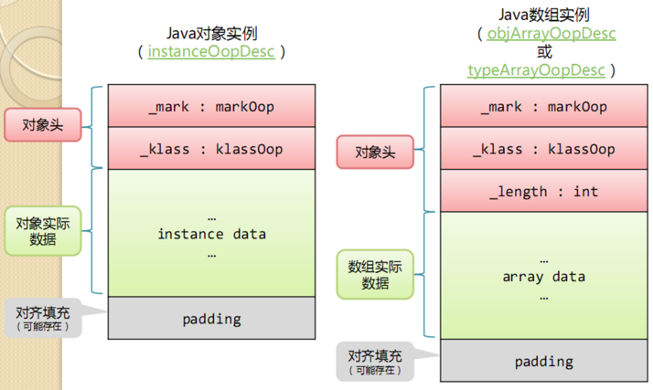
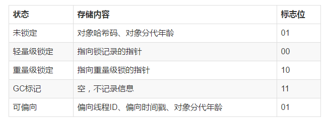
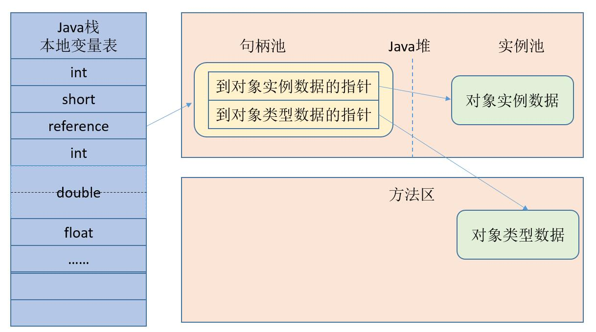
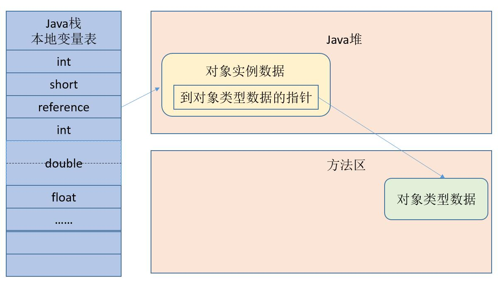

## 对象的创建、内存布局、访问定位

### 对象的创建
在语言层面上，创建对象（例如克隆、反序列化）通常仅仅是一个new关键字而已，而在虚拟机中，对象（文中探讨的对象限于普通对象，不包括数组和Class对象等）的创建又是怎样一个过程呢？

#### 检查对象对应的类是否加载
虚拟机遇到一个new指令时，首先去检查这个指令的参数是否能在常量池中定位到一个类的符号引用，并检查这个符号引用代表的类是否已经被加载、解析和初始化过。如果没有，需要先执行相应的类加载过程--也就是加载和连接。(参阅类加载机制)

#### 为新生对象分配内存
对象所需要的内存大小在类加载完成后便可以完全确定，此时需要从运行时数据区域中的堆中将特定大小的内存划分出来，给该对象。

内存划分（两种方式）：
 - **指针碰撞**，假设堆中内存绝对规整，用过的内存放一边，没用过的放一边，中间用一个指针作为分界点的指示器。**分配内存仅仅是将指针向空闲空间那边挪动一段与对象大小相等的距离**。
 - **空闲列表**，假设堆中内存不规整，已使用的和空闲的内存相互交错，此时，**虚拟机维护一个列表**，用来记录哪些内存可用。在分配内存时，从列表中找到一块足够大的空间划分给该对象实例，并更新列表上的记录。
到底使用哪种分配方式，与Java堆是否规整有关，而Java堆是否规整与所选用的垃圾收集器是否带有压缩整理功能决定。如果使用Serial、ParNew等带有Compact过程的收集器时，系统采用指针碰撞方式。如果使用CMS这种基于Mark-Sweep算法的收集器时，采用空闲列表方式。

##### 并发处理

除如何划分可用空间外，还有另外一个需要考虑的问题是对象创建在虚拟机中是非常频繁的操作，即使是**仅仅修改一个指针所指向的位置，在并发情况下是线程不安全的**，可能出现正在给对象A分配内存，指针还没有来得及修改，对象B又同时使用了原来的指针来分配内存的情况。

划分时保证线程安全（两种方式）：
 - **对分配内存空间的动作进行同步处理**，虚拟机实际上采用**CAS+失败重试**的方式保证更新操作的原子性。
 - **把内存分配的动作按照线程划分在不同的空间上**。即**每个线程在堆中预先分配一小块内存区域**，称为本地线程分配缓冲（Thread Local Allocation Buffer，TLAB）。哪个线程要分配内存，就在哪个线程的TLAB上分配，只有当TLAB用完并分配新的TLAB时，才需要同步锁定。虚拟机是否使用TLAB，可以通过-XX:+/-UseTLAB参数设定。

#### 内存空间初始化
将分配到的内存空间都初始化为零值（不包括对象头），这一步操作保证了对象的**实例字段**在Java代码中可以不赋初值就可以直接使用【零值被初始化为null和0之类的】，程序能够访问到这些字段的数据类型所对应的零值。

注意这个实例字段，属于一个类实例的成员对象。

``` java
public class ObjectInit {
    private String s;
    private int a;

    @org.junit.Test
    public void test(){
        int b;
        String s1;
        System.out.println(s);  ---1
        System.out.println(a);-----2
        //System.out.println(b);----3
        //System.out.println(s1);---4
    }
}

```

就像如上所示，s和a是实例字段，会被输出0或null。但是如果想输出b和s1，可能就会被提示没有初始化。

#### 对象设置
例如该对象是哪个类的实例、如何才能找到类的元数据信息、对象的Hash码、对象的GC分代年龄信息等。这些信息存放在对象的对象头之中。

#### 对象初始化
上面的工作完成之后，一个新的对象已经产生了，但是所有的字段都还为零。一般在执行new指令之后，会接着执行\<init\>方法，把对象按照程序员的设定进行初始化。此时，一个真正可用的对象完全产生。

这一步是类加载步骤中的初始化。

### 对象的内存布局（HotSpot虚拟机）
对象在内存中存储的布局可以分为3块区域：对象头、实例数据、对齐填充。




#### 对象头Header
对象头包括两部分信息：Mark Word和类型指针

##### Mark Word
用于存储对象自身的运行时数据，如哈希码、GC分代年龄、锁状态标志、线程持有的锁、偏向线程ID、偏向时间戳等。这些信息是与对象自身定义的数据无关的额外的存储成本，在32位和64位的虚拟机中，该部分数据长度分别为**32bit和64bit**。
根据对象的不同的状态，Mark Word中存储的内容分别如下所示：



##### 类型指针
即对象指向它的类元数据的指针，虚拟机通过这个指针来确定对象是哪个类的实例(去方法区找Class)。（并不是所有的虚拟机实现都必须在对象数据上保留类型指针，即查找对象实例的元数据信息并不一定要经过其本身，可参考对象的访问定位）

#### 实例数据
实例数据部分是对象真正存储的有效信息，也是在**程序代码中所定义的各种类型的字段内容**。无论是从父类继承下来的，还是在子类中定义的，都需要记录起来。

#### 对齐填充
HotSpot虚拟机要求对象的起始地址必须是8字节的整数倍，也就是对象的大小必须是8字节的整数倍。而对象头部分正好是8字节的倍数（1倍或者2倍），因此，**当对象实例数据部分没有对齐的时候，就需要通过对齐填充来补全**。


### 对象访问定位
Java程序需要通过栈上的引用数据来操作堆上的具体对象。对象的访问方式取决于虚拟机实现，目前主流的访问方式有使用句柄和直接指针两种。

句柄，可以理解为指向指针的指针，维护指向对象的指针变化，而对象的句柄本身不发生变化；指针，指向对象，代表对象的内存地址。

#### 句柄

Java堆中划分出一块内存来作为句柄池.那么对象的引用中存储的是对象的句柄地址，而**句柄中包含了对象实例数据与类型数据各自的具体地址信息**(注意这里包含两个地址，一个在堆得实例数据地址，一个在方法区的类型数据地址)。



**优势：引用中存储的是稳定的句柄地址，在对象被移动(垃圾收集时移动对象是非常普遍的行为)时只会改变句柄中的实例数据指针，而引用本身不需要修改。**

#### 直接指针
如果使用直接指针访问，那么Java堆对象的布局中就必须考虑如何放置访问类型数据的相关信息，而引用中存储的直接就是对象地址。也就是说，直接指针直接指向实例数据地址，而类型数据地址就放在对象的header的类型指针中。



**优势：速度更快，节省了一次指针定位的时间开销。由于对象的访问在Java中非常频繁，因此这类开销积少成多后也是非常可观的执行成本。（例如HotSpot）**
