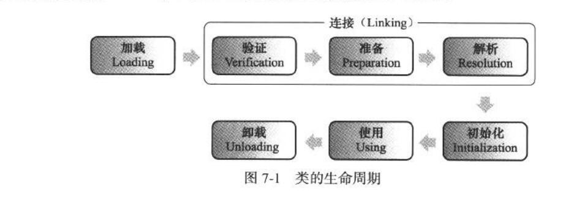
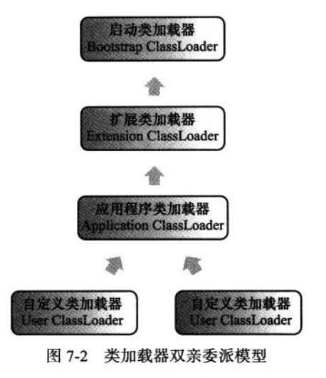

## 概述

java虚拟机程序可以实现“一次编写，到处运行”。不同平台的虚拟机可以载入和执行一种平台无关的字节码。虚拟机定义规范时分成了java语言规范和虚拟机规范。jvm不和任何包括java文件在内的任何语言绑定，它只是解释执行class文件这种特定的二进制字节流。虚拟机有定义读取和解释class文件的规范，不仅仅java其他语言类似Groovy，JRuby，Jython都可以被解释成class字节码

## 类加载时机

类从被加载到虚拟机内存，到卸载出去为止，整个生命周期包括：加载，验证，准备，解析，初始化，使用和卸载。其中验证，准备，解析3个部分统称为连接。如图

## 类的初始化时机

严格规定，有且有且仅有五种情况立即开始**初始化**，自然前三个步骤要在更早进行，但虚拟机没有明确规范。

1. 遇到new，getstatic，putstatic，invokestatic四条指令时，如果类没有进行过初始化则先触发使其初始化。
2. 反射调用的时候，未初始化要初始化
3. 初始化一个类时，先触发其父类的初始化
4. main方法的类率先初始化
5. jdk1.7动态语言支持，如果一个java.lang.invoke.MethodHandle实例最后解析的结果REF_getstatic,REF_putstatic,REF_invokeStatic的方法句柄

其他情况，引用类都不会进行初始化，称为被动引用。
比如，类加载时会先把一些类常量进行类传播优化存储到常量池中，所以调用每个类的静态常量未必会加载那个类。

## 虚拟机加载过程

### 加载
加载阶段，虚拟机完成三件事
1. 通过类全名来获得类的二进制流
2. 将这个字节流代表的静态存储结构转化为方法区的运行时数据结构
3. 在内存中生成一个java.lang.Class对象，作为方法区这个类的各种数据访问入口

加载和验证顺序可能是交叉运行

### 验证
连接阶段第一步，确保字节流包含的信息符合虚拟机要求，不会危害虚拟机自身安全。

### 准备

这个阶段正式为类变量分配内存和设置初始值。这些变量所使用的内存都在方法区分配。注意，这个阶段进行的内存分配仅仅包括类变量（static修饰的变量），而不是实例变量，实例变量在对象实例化时随着堆一起分配在java堆中。而初始化只是初始化数据类型的0值，而不是定义的值。

### 解析

解析过程将虚拟机常量池内的符号引用替换为直接引用。

符号引用是一组符号描述引用的目标的，与虚拟机内存布局无关，引用目标也不一定已加载到内存中。直接引用是直接指向目标的指针，相对偏移量，或者句柄，与内存布局直接相关。有了这个，引用目标必定已经存在。

### 初始化
类加载过程的最后一步，到了初始化阶段才真正执行java程序代码。在准备阶段已经赋过系统初始值，而这个阶段将会根据程序员制定的主观计划去初始化变量。

初始化阶段是执行类构造器<clinit>方法的过程。<clinit>方法是由编译器自动收集类中的所有类变量赋值动作和静态语句块(static块)合并产生的，**顺序是由语句在源文件中的出现顺序所决定的**。且父类的<clinit>方法必定先于子类

## 类加载器
对于任何一个类，都由加载它的类加载器，和这个类本身两者一起确定它在虚拟机中的唯一性。否则，就算两个类来自同一个class文件，类加载器不同，两个类也不相等。(instanceof的值为false)

### 双亲委派模型

从虚拟机角度讲只有两种不同的类加载器，启动类加载器和其他类加载器。前者是虚拟机内部，后者是外部独立的。后者都继承自抽象类java.lang.ClassLoader

从Java程序员角度来看，则会使用到三种类加载器。
1. 启动类加载器，这个类负责将存放在<JAVA_HOME>\lib目录中的并且被虚拟机识别的类库加载到虚拟机内存中。
2. 扩展类加载器，负责加载<JAVA_HOME>\lib\ext目录里的类，开发者可以直接使用扩展类加载器。
3. 应用程序类加载器，由于是由ClassLoader中的getSystemClassLoader()方法的返回值，所以也称为系统加载器，负责加载用户路径指定的类库，开发者可以直接使用，如果程序中没有自定义类加载器，一般情况下这就是程序中默认的类加载器。

如图就是双亲委派模型

类加载器之间不会用继承的关系来实现，都是以组合的方式。

如果一个类加载器收到了类加载请求，他首先不会自己尝试加载这个类，而是把这个请求委派个父类加载器去完成，每一个层次类加载器都是如此。因此所有的加载请求最终都应该传送到底层的启动类加载器里，只有父类无法完成这个请求时，子加载器才会尝试自己去加载

这种优先级层次关系很好的避免了一些，加载出的类不同的情况
