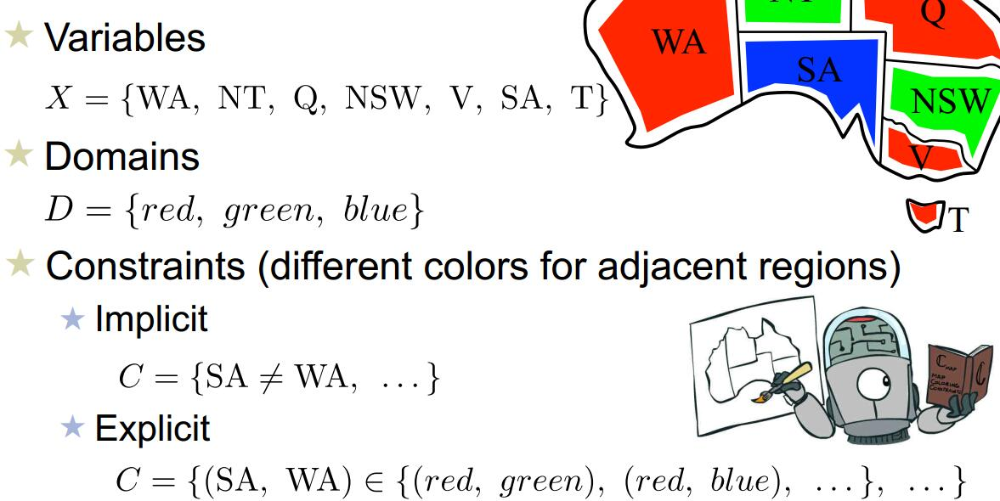
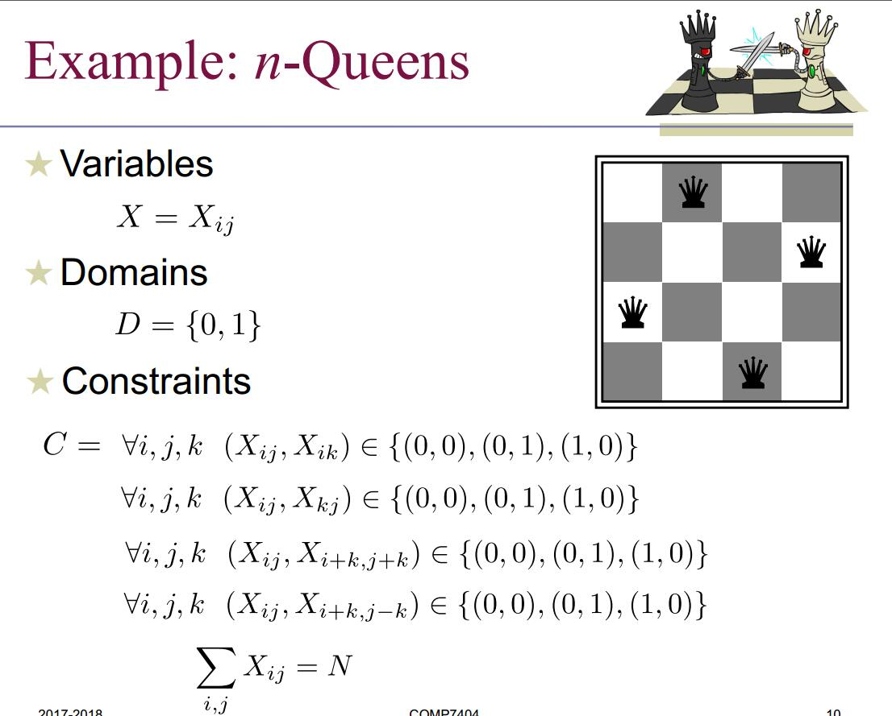
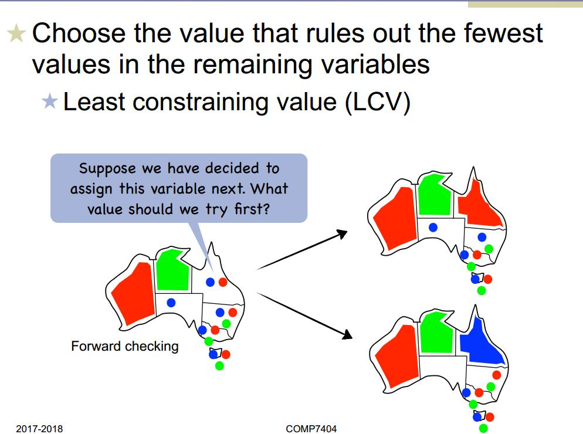
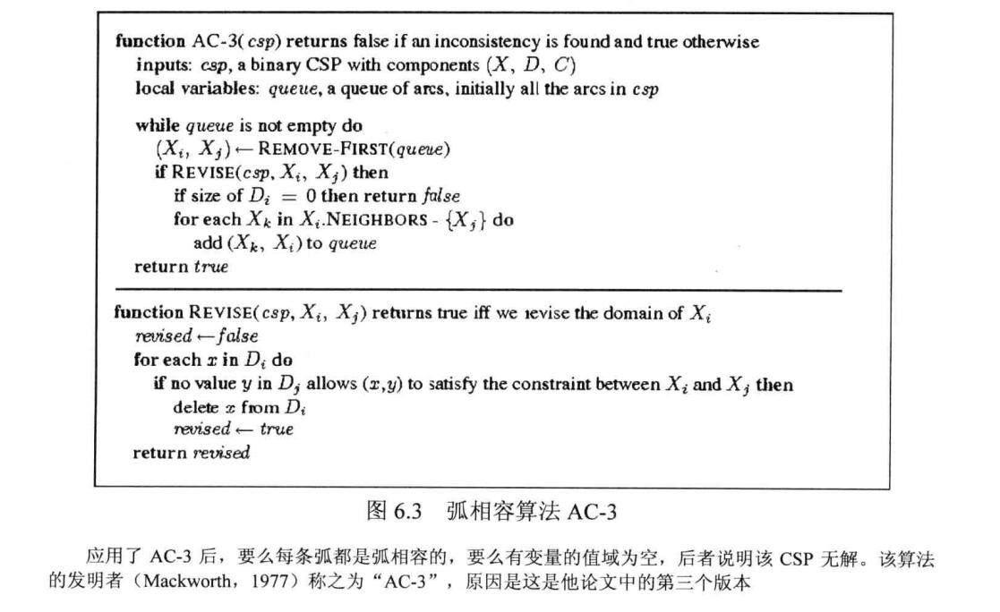
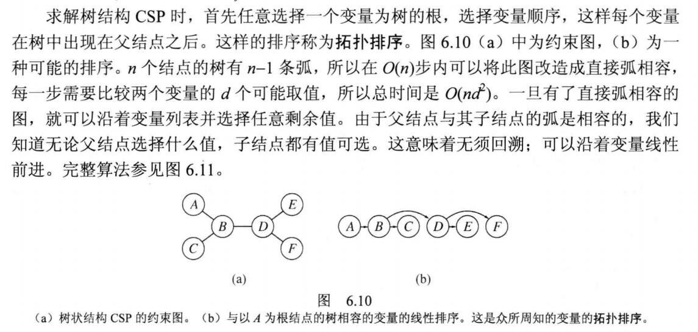
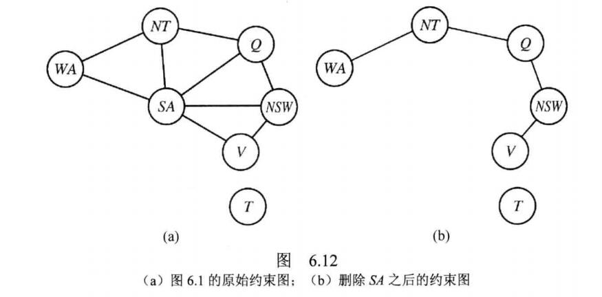

## CSP约束满足问题
CSP问题，Constraint Satisfaction Problems，可以理解为是对实际问题的一种形式化建模。

约束满足问题（CSP）是一类数学问题，它的定义为一组状态必须满足于若干约束或限制的对象(object)。
CSPs表示的是问题中的实体，有限数量、同类型的约束加之于变量之上, 这类问题通过 约束满足 方法解决。

我们先来看看CSP问题的定义，CSP问题定义了一个三元组：

X是一些变量，D对应的是X中每个变量的取值范围，C是约束，约束变量的取值。**一个不违反任何条件的对变量赋值，我们称之为相容的**。

我们可以把现实中的一些问题形式化为CSP问题的形式，这样我们可以用CSP问题求解的方式求解，可以大大减少搜索空间。

zwlj：其实CSP问题就是我们在搜索算法中常用的剪枝。我们在深入到某些状态的时候，经常会检测某些状态下变量赋值相容性，然后不满足就停止搜索，所以CSP问题也不是很新鲜的事物。他经常用于我们在搜索中剪枝来减少搜索空间。

### 实例：地图着色问题
经典的地图着色问题可以用CSP问题进行建模。

着色问题是，有红绿蓝三色，给地图着色，相邻地方不能同色。

那么我们就可以用CSP问题来描述这个问题，

如上图，我们X变量为每个区域的名字，取值可以是三种颜色。限制条件是C，相邻变量不相等，也就是

着色问题就是为了找出一个这个CSP问题的完整赋值情况。可以把这个CSP问题形式形式化为图6.1中的b图，称之为**约束图constraint graph**。相连的节点说明取值不能相同。

**使用CSP求解系统可以大大减少搜索空间，提高效率**

### 实例：n皇后
同理，我们也可以对n皇后问题进行CSP建模。

上图是第一种建模方式，X每个棋盘方块的取值(有i*j个)，每个棋盘位置可以放或者不放，取0或者1.那么就可以表示成上面约束形式。

还有第二种建模方式：

先默认了每一行只有一个皇后，然后X就是每一行的皇后摆在哪一列。Qi代表第i行的皇后排在哪一列，那么约束也可以写成如上形式。

### CSP优化回溯搜索
核心就是filtering和ordering

filtering意在检测出变量相容失败。核心过程有forward checking(回溯以前节点检测相容性)，constraint propagation(修改值域传播约束)

Ordering无非就是检测还没有赋值的节点进行下一步赋值(赋值顺序的问题)

下面看看几种变量取值顺序问题

#### 最少剩余值MRV(Minimum remaining values)
在搜索下一步的时候，我们最简单的策略就是按顺序取下一个还没赋值的变量进行赋值，然后搜索。

但是我们有更好的选择方案，那就是选择可选值(合法取值)最少的变量进行下一步赋值。

比如在着色问题中，很有可能出现在着色到一半的途中，发现有个国家只能涂一种颜色了，所以优先选择这些来扩展。

这种选法就是最少剩余值启发式MRV。

#### 度启发式Degree Heuristic
优先选择和其他变量约束最多的节点进行扩展。

回到这幅图，我们关注CSP图，明显可以看到SA节点跟其他5个节点都相连，约束最多，我们优先选择他来进行着色扩展。

#### LCV最少约束值(Least constraining value)
假定此时我们已经选定一个节点进行赋值了，那么从值域里选值得时候以什么顺序比较好呢？

一般认为我们要为接下来的节点留下更多的选择比较好，所以优先选择的值是为邻居留下最多选择的那个值。

如上图，右面那块区域选了红色，那么下面那块区域还有蓝色可以选，如果选了蓝色，那么下面那块区域在无值可选。根据LCV最少约束值原则，我们此时优先选红色来扩展这个版图。

#### 最少冲突Min-Conflicts(local search)

在local search中，我们可以在CSP问题中用最少冲突启发式来扩展节点。就是说，在一个完备的赋值状态(不相容的)下，我们改变某个变量的值，让冲突的数量尽可能的减少。

比如八皇后问题，我们可以计算邻近状态，打破了多少条CSP约束，以此来作为下一步扩展。

### 约束传播(CSP推理)
我们可以用CSP推理，来减少X变量的值域。

#### 节点相容
很简单，就是对于某个变量X的所有取值，都符合约束。

#### 弧相容
CSP中，某变量的所有取值，都满足它的二元约束。则称此变量是弧相容的。比如，考虑到有两个变量X，Y，它们的值域都会整数{0..9}，有约束Y=X\*X。

所以我们知道X和Y都不是弧相容的，因为假如X取4,，Y就会无值可取。

所以我们可以缩小值域，让它们相容：

缩小之后X={0,1,2,3} Y={0,1,4,9}

这样X,Y都是弧相容的了。

#### 弧相容算法缩小值域
我们可以用AC-3算法，缩小变量的值域，且不会改变CSP的求解。

如上描述，AC-3算法先维护了一个队列，这个队列里有所有弧(变量对),如果一对弧是相容的，则出队列。如果不是，则缩小值域让他们相容，若是某节点值域被改变了，那有关于这个节点的所有弧都要重新进队列进行相容性检测再处理。

如上是代码形式。

假设CSP每个变量值域最多可能有d个元素，那么每次值域缩小，最少减去一个元素。那么显然可知，每条弧最多会进队d次(再多就值域为空了),因为最多也就d个值可删。检测一条弧的相容性可以在O(d^2)的时间内完成，所以假设有c条弧。那么AC-3算法的复杂度就是O(c*d^3)

#### k相容
之前提到两个节点相容，是弧相容的。那么k个节点相容，那就是k相容的了。

如果确定了一个CSP问题是强K相容的，那问题就简单了，由于值域已经完全被缩小到最合适的情况，我们只需从第一个变量开始便利，然后从第2个变量里找相容量，直到所有变量被扩展完。

但是建立n相容算法却要消耗指数级别的时间，天下没有免费的午餐。

### 问题结构

#### 树状CSP问题
如果我们惊喜的发现CSP图是一棵树，那么就开心了，我们可以在线性时间内求解。

首先我们明确一下**直接弧相容DAC的概念**：假设CSP变量顺序是(x1....xn),直接弧相容就是对于所有j>i,xi和xj是弧相容的。

所以我们现在无需对所有变量pair进行弧相容调整，我们只需对变量排个序，然后有序的进行弧相容。

如上图，我们对a图的树进行拓扑排序，然后在O(nd^2)时间求出直接弧相容，然后线性遍历取值即可，因为无论父节点如何取值，子节点都有值可取，所有无需回溯，这是线性的。

#### 近树处理
假如我们的CSP图结构不是树，有没有办法转成树结构处理呢？当然是有的

还是上图的着色问题，假如把SA节点割掉。就变成一棵树了，然后就可以用上面的树形求解问题进行处理。

我们只需要做的就是先固定给SA分配一个固定值，然后修改其他节点值域使他们相容。接下来采用树形CSP求解，然后和SA取值一起返回。

更一般的有以下步骤：

找到一个cutset(割集)，对割集处理，然后剩余的用树形求解，然后一起返回。
