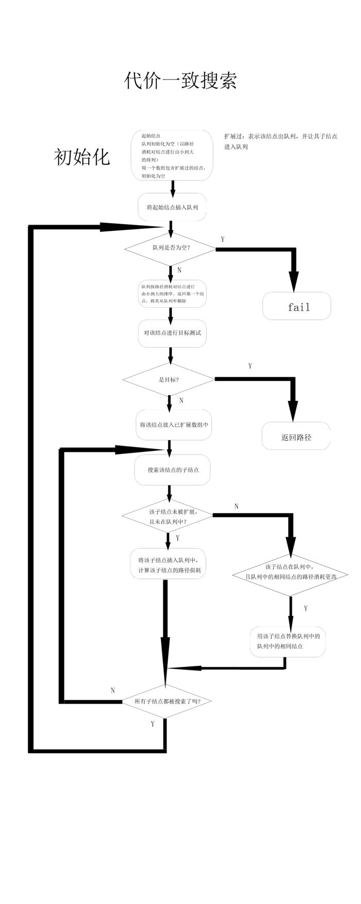
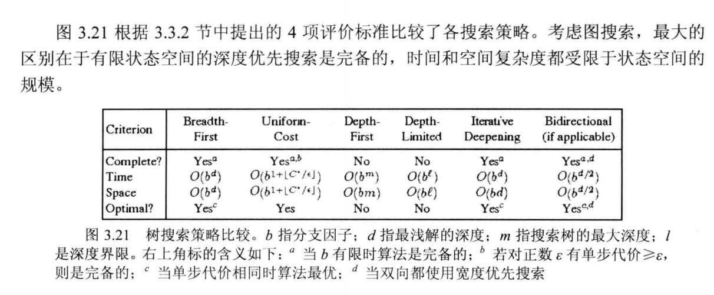

# 一般搜索算法
人工智能领域当然离不开搜索算法来解决问题。

人工智能中的搜索策略大体分为**两种**：**无信息搜索和有信息搜索**。无信息搜索是指我们不知道接下来要搜索的状态哪一个更加接近目标的搜索策略，因此也常被成为盲目搜索；而有信息搜索则是用 **启发函数f（n）** 来衡量哪一个状态更加接近目标状态，并优先对该状态进行搜索，因此与无信息搜索相比往往能够更加高效得解决问题。

## 所谓的树搜索和图搜索
在介绍算法前，还要说说树搜索和图搜索。

简单的可以理解为，树搜索在扩展节点时，不记录节点的状态，也就是说，遍历过得节点可以再走，所以很容易产生死循环(环路)。

图搜索，就是把走过的状态记录下来，一旦再次走到这个状态就不走了，相当于对树搜索的一个优化。

## 无信息搜索

### 宽度优先搜索（BFS）
先扩展根节点，然后扩展根节点的所有后继，接着再扩展它们的后继，从而一层一层的对节点进行扩展。BFS是一个简单的搜索策略，在搜索过程中会对**所有状态**进行遍历，因此它是完备的；假设搜索树每个节点有b个后继，深度为d，则 **时间复杂度和空间复杂度均为O(b^d)**；最后考虑最优性，因为我们总会在最浅那一层找到目标状态，因此**当且仅当每一步的代价都一致的时候，BFS可以得到最优解**。

### 一致代价搜索(uniform-cost search)
在BFS的基础上，一致代价搜索不在扩展深度最浅的节点，而是通过比较路径消耗g（n），并选择当前代价最小的节点进行扩展，因此可以保证无论每一步代价是否一致，都能够找到最优解。

基于一种类贪心的搜索，比如说经典的dij最短路算法就是差不多这样。

### 深度优先搜索（DFS）
DFS扩展根节点的一个后继，然后扩展它的一个后继，直到到达搜索树的最深层，那里的节点没有后继，于是DFS回溯到上一层，扩展另外一个未被扩展的节点。**在有限状态空间中，DFS是完备的**，因为它可以把所有空间遍历一遍；**而在无限空间中，DFS则有可能会进入深度无限的分支，因此是不完备的**。**DFS的时间复杂度为为O(b^d)，而空间复杂度仅为O（d）**，因为我们只需要保存当前分支的状态，因此空间复杂度远远好于BFS。然而DFS并不能保证找到最优解。

### 深度受限搜索
深度受限搜索设定一个最大深度dmax，当搜索深度大于dmax的时候立即回溯，从而避免了在无穷状态空间中陷入深度无限的分支。

### 迭代加深的深度有限搜索
迭代加深的深度有限搜索也设定一个最大深度dmax，开始我们把dmax设为1，然后进行深度受限搜索，如果没有找到答案，则让dmax加一，并再次进行深度有限搜索，以此类推直到找到目标。**这样既可以避免陷入深度无限的分支，同时还可以找到深度最浅的目标解**，从而在每一步代价一致的时候找到最优解，再加上其优越的空间复杂度，因此常常作为首选的无信息搜索策略。

zwlj：意思就是慢慢增加这个最大深度，**即在k层深度没有得到解，将k+1继续进行深度优先搜索**。

### 双向搜索
一个从前往后搜，一个从后往前搜。

这么做的理由是

b^(d/2)+b^(d/2) << b^d

只要两边的搜索能找到一个交集，即为一个解。

### zwlj总结

bfs是完备的，dfs在有限状态下是完备的，否则不完备。dfs在空间上比bfs有优势。

## 有信息搜索(infromed search)
启发式搜索(Heuristically Search)又称为有信息搜索(Informed Search)，它是利用问题拥有的启发信息来引导搜索，达到减少搜索范围、降低问题复杂度的目的，这种利用启发信息的搜索过程称为启发式搜索。

**启发式策略可以通过指导搜索向最有希望的方向前进，降低了复杂性**。通过删除某些状态及其延伸，启发式算法可以消除组合爆炸，**并得到令人能接受的解(通常并不一定是最佳解)**。

在解决问题的过程中启发仅仅是下一步将要采取措施的一个猜想，常常根据经验和直觉来判断。由于启发式搜索只有有限的信息(比如当前状态的描述)，要想预测进一步搜索过程中状态空间的具体行为则很难。一个启发式搜索可能得到一个次最佳解，也可能一无所获。

**因此，在实际应用中，最好能引入降低搜索工作量的启发信息而不牺牲找到最佳路径的保证。**

### 估价函数

用于评价节点重要性的函数称为估价函数，其一般形式为：

`f(x) = g(x) + h(x)`

式中：g(x)为从初始节点到节点x付出的实际代价；h(x)为从节点x到目标节点的最优路径的估计代价。启发性信息主要体现在h(x)中，其形式要根据问题的特性来确定。

虽然启发式搜索有望能够很快到达目标节点，但需要花费一些时间来对新生节点进行评价。因此，在启发式搜索中，估计函数的定义是十分重要的。如定义不当，则上述搜索算法不一定能找到问题的解，即使找到解，也不一定是最优的。

### 有序搜索算法(A算法)

在启发式搜索算法中，根据估价函数值，按由小到大的次序对扩展表中的节点进行重新排序，这就是有序搜索法。因此，此时的Open表是一个按节点的启发估价函数值的大小为序排列的一个优先队。

zwlj：也就是在广度优先搜索当中，对扩展出的每个节点，使用估值函数估计它到目标节点的距离，然后从小到大进行据欧战，假如估值函数为0，则退化为普通广度优先算法。

### 贪婪最佳优先算法(Greedy best-first search)
贪婪最佳优先搜索总是扩展距离目标最近的节点，其启发函数f（n）=h（n）

这个算法一般和深度优先算法相结合，每次都试图找到一个离目标节点最近的节点。Example：在找最短路的实际问题里，h(x)计算x到目的节点的直线距离，用这个估值函数来扩展节点。

贪婪最佳优先搜索的最大问题是它往往不能找到最优解。

zwlj:这里直接让g(x)为0了，直接取h(x)，到目标节点的估计距离，当做估价函数。

### A*算法
在A\*算法中，启发性信息用一个特别的估价函数f\*来表示：

`f*(x)=g*(x)+h*(x)`

式中：g\*(x)为从初始节点到节点x的最佳路径所付出的代价；h\*(x)是从x到目标节点的最佳路径所付出的代价；f\*(x)是从初始节点出发通过节点x到达目标节点的最佳路径的总代价。

基于上述g\*(x)和h\*(x)的定义，对启发式搜索算法中的g(x)和h(x)做如下限制：

1. g(x)是对g\*(x)的估计，且g(x)>0；
2. h(x)是h\*(x)的下界，即对任意节点x均有h(x)≤h\*(x)。

在满足上述条件情况下的有序搜索算法称为A*算法。

对于某一搜索算法，当最佳路径存在时，就一定能找到它，则称此算法是可纳的。可以证明，A\*算法是可纳算法。也就是说，**对于有序搜索算法(A算法)，当满足h(x)≤h\*(x)条件时，只要最佳路径存在，就一定能找出这条路径**

#### zwlj
A\*算法就像是一致代价搜索(uniform-cost search)算法和贪婪最佳优先算法的结合。还是运用了

`f(x) = g(x) + h(x)`

g(x)是到达现节点x的开销(一致代价搜索重视的)，h(x)是x到目标的估计(贪婪最佳算法的结合)。所以两者结合，就是A算法的思想，同时，如果h(x)函数被证明是满足在一个下界内的，则这个A算法必能找到最优解，也就是A\*算法。**由于A\*算法是能快速找到一个最优解，并且基于A算法，所以A\*算法是基于广度优先搜索的**

因此可以这样感性地解释：**最佳优先搜索是为了快速找到一个解，而 A* 是为了快速找到一个最优解**。
