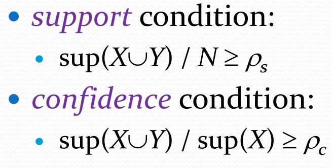
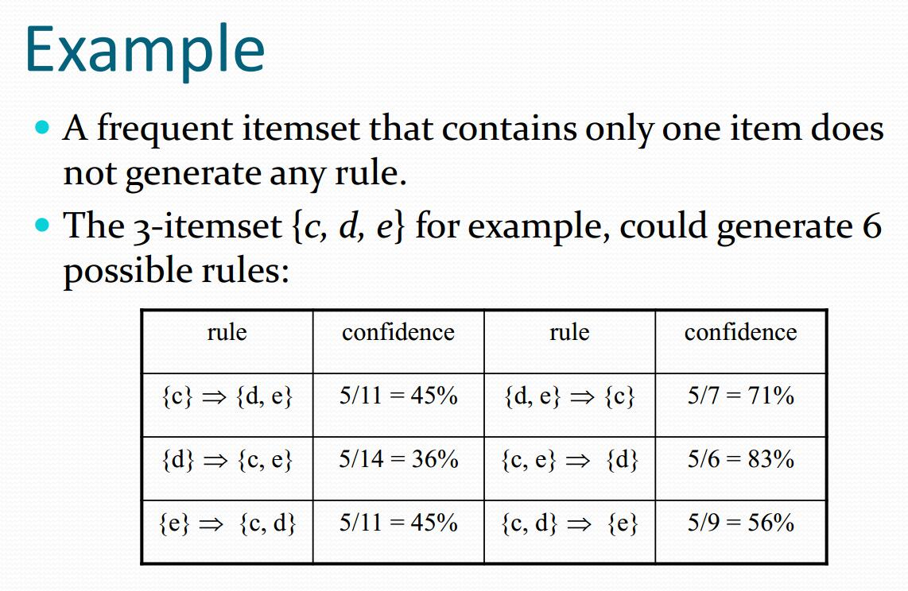
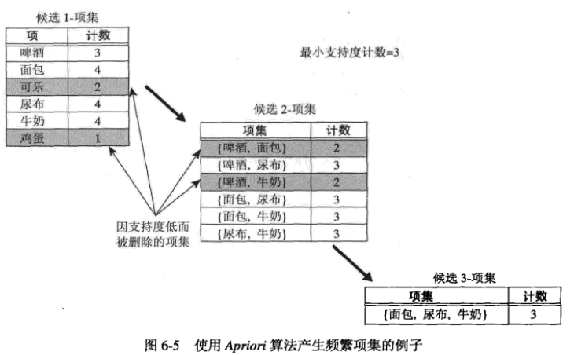

# 关联分析
关联分析是一种发现隐藏在大型数据集中有意义的数据联系的方法。

关联分析的一个典型例子是**购物篮分析**。该过程通过发现顾客放人其购物篮中的不同商品之间的联系，分析顾客的购买习惯。通过了解哪些商品频繁地被顾客同时购买，这种关联的发现可以帮助零售商制定营销策略。

## 问题定义

### 二元表示

如图1所示，购物车数据可以用二元形式来表示，其中每行对应一个**事务Transaction T**，每列对应一个**项Item I**。项用二元变量表示，如果在事务中出现，值为1，否则为0。

令I={i1,i2,⋯,id}是购物车数据中所有项的集合，而T={t1,t2,⋯,tN}是所有事务的集合。每个事务ti包含的项集都是I的子集。在关联分析中，包含0个或者多个项的集合被称为**项集itemset**。如果一个项集包含k个项，就称为k−项集。例如,{啤酒，尿布，牛奶}是一个3-项集。

项集的一个重要性质是**支持度计数sup**，即**包含特定项集的事务个数**。数学上，项集XX的支持度计数σ(X)可以表示为：

例如在图1中，项集{啤酒，尿布，牛奶}的支持度计数为2，因为只有2个事务包含这3 个项。σ(X)也可以写作sup(X)

### 关联规则
关联规则是形如**X→Y**的表达式，其中X和Y是不相交的项集，即X∩Y=∅X∩Y=∅。关联规则的强度可以用**支持度和置信度confidence衡量**。

支持度确定规则可以用于给定数据集的频繁程度，而置信度确定Y在包含X的事务中出现的频繁程度。支持度(s)和置信度(c)的形式定义如下：

支持度是一种重要度量，因为支持度低的规则可能只是偶然出现。另一方面，置信度通过规则推理具有可靠性。

通过设置threshold可以找到关联关系

因为计算**每个可能规则**的支持度和置信度方法的代价很高，所以大多数关联挖掘算法采取的策略是将任务分解为**如下两个主要子任务**:

1. **频繁项集产生**：其目标是发现满足最小支持度阈值的所有项集，这些项集称做**频繁项集**（frequent itemset)。

2. **规则的产生**：其目标是从上一步发现的频繁项集中**提取所有高置信度的规则**，这些规则称做强规则(strong rule)。

找频繁项集的时候，先找一个项支持度高的，然后再慢慢往上找多项的支持度。

### 产生频繁项集
格结构(lattice structure)常常被用来枚举所有可能的项集。图2显示I={a,b,c,d,e}的项集格。

发现频繁项集的原始方法是确定格结构中每个候选项集的支持度计数。为了完成这一任务，必须将每个候选项集与每个事务作比较，这种方法的开销非常大。

可以使用apriori算法进行优化。

#### Apriori算法
Apriori算法是第一个关联规则挖掘算法，它开创性地使用基于支持度的剪枝技术。支持度的剪枝是基于一个先验原理:**如果项集是频繁的，那么它的所有子集也是频繁的**。

Apriori算法初始时每个项都被看做候选1-项集。对它们的支持度计数并筛选后，利用产生的频繁1-项集来产生候选2-项集，以此类推。图3给出了Apriori算法的例子。

Apriori算法有2个重要的特点。 1.逐层算法，从频繁1-项集到最长的频繁项集，每次遍历项集格中的一层。 2.每次迭代之后，新的候选项集都有前一次迭代的频繁项集产生。

**apriori-gen函数** 采用的方法是Fk−1×Fk−1。由前k−2个项相同的一对k−1项集**合并产生**

所以是逐层迭代，每次找到每层只有一个不同项的，将其合并。

#### 支持度计数

支持数计数过程确定在候选项剪枝步骤保留每个候选项集出现的频繁程度。原始的做法是，**将每个事务与所有的候选项集比较**，并跟更新包含在事务中的候选项集支持度计数，这样的计算**代价太昂贵**。现在使用的方法是枚举每个事务包含的项集，并利用它们更新对应的候选项集支持度。

zwlj:原本是对每个事务都去扫一遍候选集更新，现在则不去扫，是分解事务的项，然后分解完以后直接去更新对应计数。

比如已经迭代到第三层了，要找到候选三项集的支持度计数，则对每个事务分解三项集。

