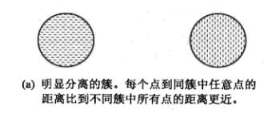
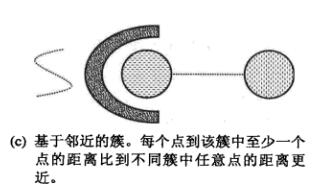
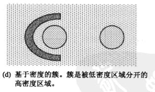

# 聚类分析
聚类分析是没有给定划分类别的情况下，根据样本相似度进行样本分组的一种方法，是一种非监督的学习算法。聚类的输入是一组未被标记的样本，聚类根据数据自身的距离或相似度划分为若干组，**划分的原则是组内距离最小化而组间距离最大化**

Types of Clusters(不同的簇类型):

 - Well-separated clusters
 - Center-based clusters
 - Contiguity-based clusters
 - Density-based clusters

## 不同的簇类型

### 明显分离的簇Well-separated clusters



组内距离和组外距离分明。这种簇什么形状都有可能。

### 基于中心的簇Center-based clusters


簇的原型(中心)一般是**质心centroid**，即是簇中所有点的平均值。质心没有意义时，原型(中心)则是那些最具有代表性的点**medoid**。这种簇趋向于呈球状。

### 基于邻近的簇Contiguity-Based



也就是说最近的点，一定跟他在同一个簇里。这种簇对不规则定义的图形是有效的。这个簇其实也趋向于呈球型。

### 基于密度的簇Density-Based



A cluster is a dense region of points, which is separated
by low-density regions, from other regions of high
density.

## 聚类算法


### k-means聚类算法
k-means是划分方法中较经典的聚类算法之一。由于该算法的效率高，所以在对大规模数据进行聚类时被广泛应用。目前，许多算法均围绕着该算法进行扩展和改进。

k-means算法以k为参数，把n个对象分成k个簇，使簇内具有较高的相似度，而簇间的相似度较低。

优点：易于实现
缺点：可能收敛于局部最小值，在大规模数据收敛慢

算法思想较为简单如下所示：

```
选择K个点作为初始质心
repeat
    将每个点指派到最近的质心，形成K个簇
    重新计算每个簇的质心
until 簇不发生变化或达到最大迭代次数
```

由算法我们可知道选中初始的点很重要。当初始质心是随机的进行初始化的时候，K均值的每次运行将会产生不同的SSE,而且随机的选择初始质心结果可能很糟糕，可能只能得到局部的最优解，而无法得到全局的最优解。

这里的重新计算每个簇的质心，如何计算的是根据目标函数得来的，因此在开始时我们要考虑**距离度量和目标函数**。

#### SSE

考虑欧几里得距离的数据，使用误差平方和（Sum of the Squared Error,SSE）作为聚类的目标函数，两次运行K均值产生的两个不同的簇集，我们更喜欢SSE最小的那个。


k表示k个聚类中心，ci表示第几个中心，dist表示的是欧几里得距离。**簇的最小化SSE的最佳质心是簇中各点的均值**

#### 处理空簇


策略有选择一个对SSE贡献最大的点作为新centroid质心，或者选择一个SSE最大的cluster作为centroid质心。

#### 二分K-均值(bisecting K-means)
为了克服K-Means算法收敛于局部最小值的问题，提出了一种二分K-均值(bisecting K-means)

```
将所有的点看成是一个簇
当簇小于数目k时
    对于每一个簇
        计算总误差
        在给定的簇上进行K-均值聚类,k值为2
        计算将该簇划分成两个簇后总误差
    选择使得误差最小的那个簇进行划分
```

简而言之就是每次贪心选择一个簇进行二分，每次都选择那个划分之后使得簇SSE最小的进行划分。

#### K-Means算法的缺陷
k均值算法非常简单且使用广泛，但是其有主要的两个缺陷：

1. **K值需要预先给定，属于预先知识**，很多情况下K值的估计是非常困难的，对于像计算全部微信用户的交往圈这样的场景就完全的没办法用K-Means进行。对于可以确定K值不会太大但不明确精确的K值的场景，可以进行迭代运算，然后找出Cost Function最小时所对应的K值，这个值往往能较好的描述有多少个簇类。

2. K-Means算法对**初始选取的聚类中心点是敏感**的，不同的随机种子点得到的聚类结果完全不同

3. K均值算法并不是很所有的数据类型。它不能处理非球形簇、不同尺寸和不同密度的簇，银冠指定足够大的簇的个数是他通常可以发现纯子簇。

4. 对离群点敏感，对离群点的数据进行聚类时，K均值也有问题，这种情况下，**离群点检测和删除有很大的帮助**。


