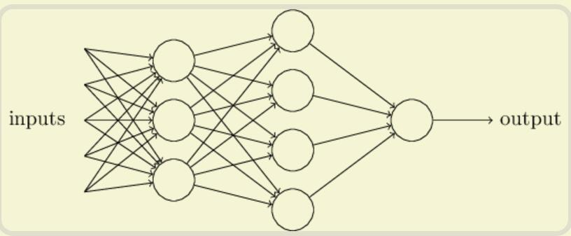
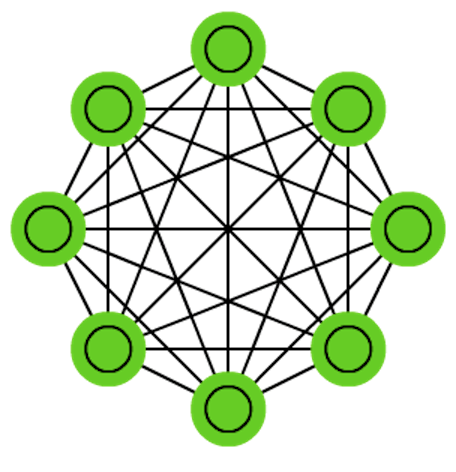
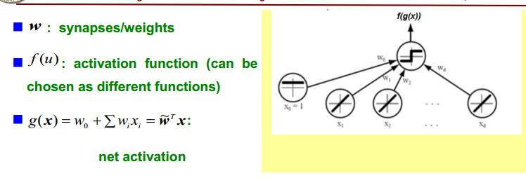

## 神经网络

人的神经网络如上图，外部刺激通过神经末梢，转化为电信号，转导到神经细胞（又叫神经元）。无数神经元构成神经中枢。神经中枢结合各种信号，做出判断，输出电信号。人体也由无数个这样的神经细胞构成。

既然思考的基础是神经元，如果能够"人造神经元"（artificial neuron），就能组成人工神经网络，模拟思考。上个世纪六十年代，提出了最早的"人造神经元"模型，叫做"**感知器**"（perceptron），直到今天还在用。

上图的圆圈就代表一个感知器。它接受多个输入（x1，x2，x3...），产生一个输出（output），好比神经末梢感受各种外部环境的变化，最后产生电信号。

zwlj:把神经元，也就是中间的圆圈想象成一个函数，给出一定的输入，经过这个函数的转换，给出output值。

### 决策模型
单个的感知器构成了一个简单的决策模型，已经可以拿来用了。真实世界中，实际的决策模型则要复杂得多，是由多个感知器组成的多层网络。

这张图里，信号都是单向的，即下层感知器的输出总是上层感知器的输入。现实中，有可能发生循环传递，即 A 传给 B，B 传给 C，C 又传给 A，这称为"**递归神经网络**"（recurrent neural network）

### 矢量化
为了方便后面的讨论，需要对上面的模型进行一些数学处理。

 - 外部因素 x1、x2、x3 写成矢量 \<x1, x2, x3\>，简写为 x
 - 权重 w1、w2、w3 也写成矢量 (w1, w2, w3)，简写为 w
 - 定义运算 w⋅x = ∑ wx，即 w 和 x 的点运算，等于因素与权重的乘积之和
 - 定义 b 等于负的阈值 b = -threshold

简而言之如上图，一个神经元可能会接收到来自不同地方的输入，那么就可以看作每个输入都是一个参数，最后每个参数由不同的权重。

### 神经网络运作

一个神经网络的搭建，需要满足三个条件。

 - 输入和输出
 - 权重（w）和阈值（b）
 - 多层感知器的结构

 最困难的部分就是确定权重（w）和阈值（b）。目前为止，这两个值都是主观给出的，但现实中很难估计它们的值，必需有一种方法，可以找出答案。

 这种方法就是试错法。**其他参数都不变，w（或b）的微小变动，记作Δw（或Δb）**，然后观察输出有什么变化。不断重复这个过程，直至得到**对应最精确输出的那组w和b**，就是我们要的值。这个过程称为模型的训练。

 因此，神经网络的运作过程如下。

1. 确定输入和输出
2. 找到一种或多种算法，可以从输入得到输出
3. 找到一组已知答案的数据集，用来训练模型，估算w和b
4. 一旦新的数据产生，输入模型，就可以得到结果，同时对w和b进行校正

可以看到，整个过程需要海量计算。所以，神经网络直到最近这几年才有实用价值，而且一般的 CPU 还不行，要使用专门为机器学习定制的 GPU 来计算。
