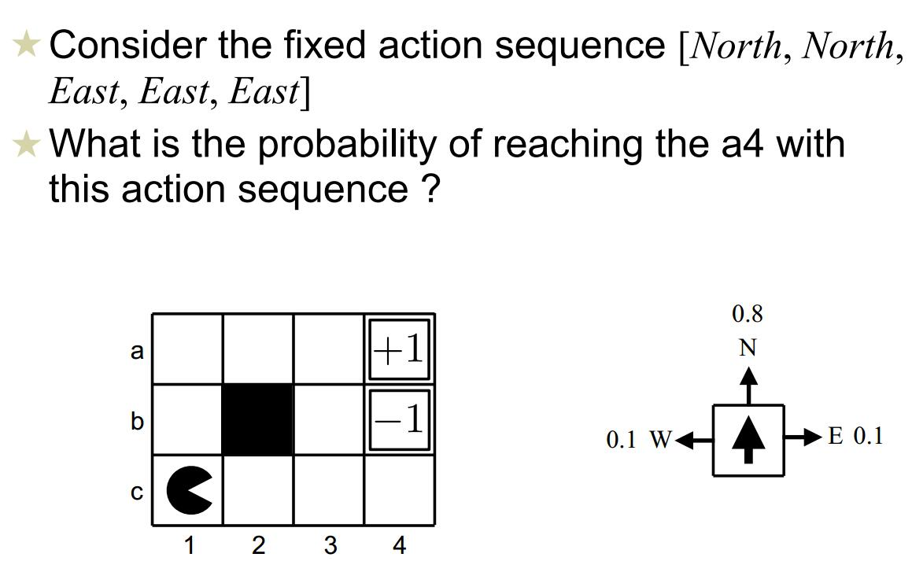
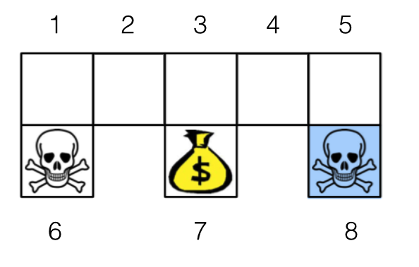
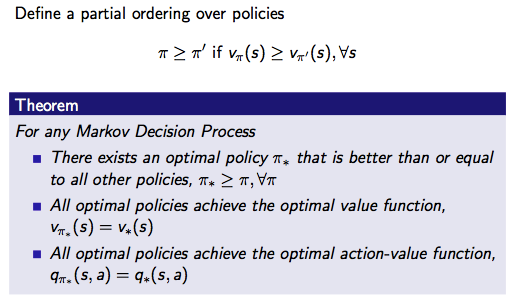
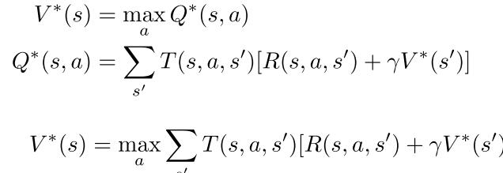
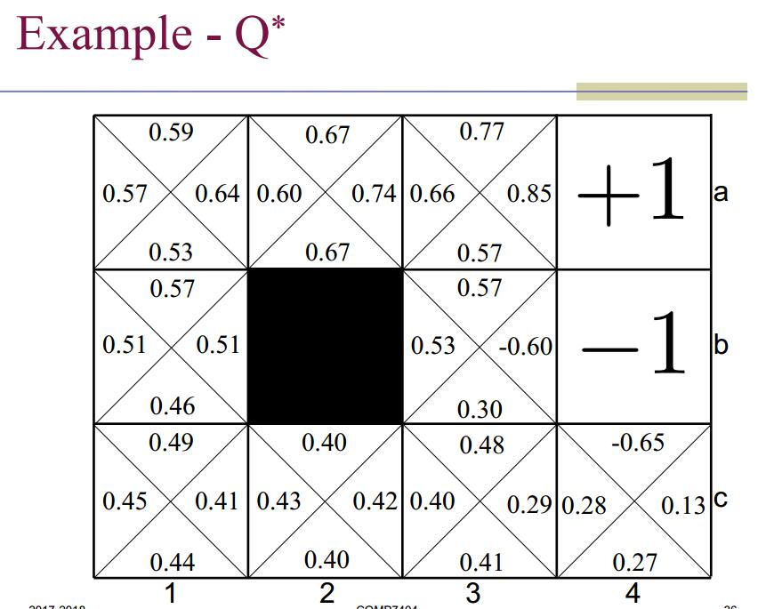
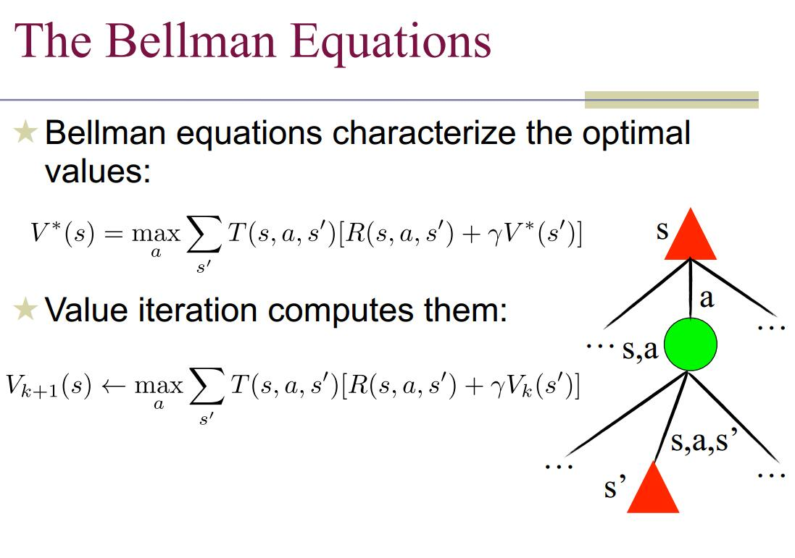
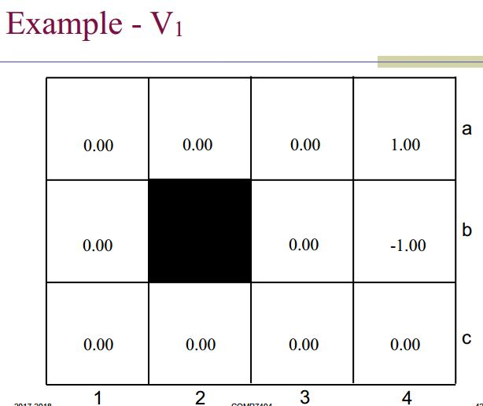
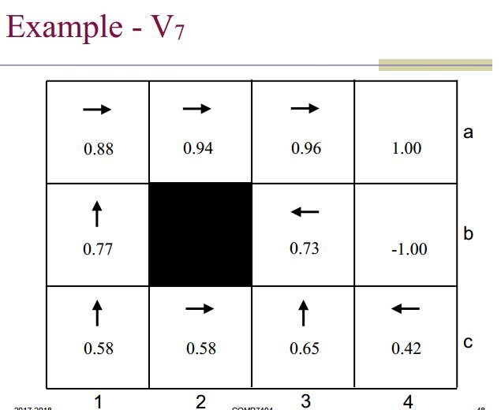

## 马尔可夫决策过程

### 效用值Utility
在对抗搜索笔记(博弈)中,我们有提到概念效用值Utility,其代表的是目标状态我们所获得权益。

如上图即是计算一个期望效用值的公式，p代表n个子状态(子效用值)S的概率。

我们决策很大程度上就是依赖这些各个目标状态的效用值。

### 强化学习
 机器学习一共有三个分支，有监督学习、无监督学习和强化学习。强化学习是系统从环境学习以使得奖励最大的机器学习。强化学习和有监督学习的不同在于教师信号。强化学习的教师信号是动作的奖励，有监督学习的教师信号是正确的动作。

 ### 马尔科夫决策过程 (Markov Decision Processes, MDP)

要说强化学习，就必须说说马尔科夫决策过程 (Markov Decision Processes, MDP)。马尔可夫决策过程是基于马尔可夫过程理论的随机动态系统的决策过程，其分五个部分：

我们假定从当前状态s采取行动a到s\'的概率只取决于s。也就是说(即)这样的决策是符合马尔科夫型的。

即 s’ 是根据 s 和 a 随机生成(**stochastic**)的

如上图的走格子游戏,可以考虑是往预期走的方向就是0.8，否则是0.1.则有

#### 奖励表示

我们可以把这个问题建模成马尔科夫决策过程。图中不同位置为状态，因此 S = {1,…,8}。机器人采取动作是向东南西北四个方向走，因此A={‘n’,’e’,’s’,’w’}。转移概率方面，当机器人碰到墙壁，则会停在原来的位置；当机器人找到金币时获得奖励 1，当碰到海盗则损失 1, 其他情况不奖励也不惩罚。因此除了R(1,south)=-1,R(3,south)=1,R(5,s)=-1.其余都是0.

#### 过程

也就是说，MDP 的动态过程如下：某个智能体(agent)的初始状态为s0，然后从 A 中挑选一个动作a0执行，执行后，agent 按Psa概率随机转移到了下一个s1状态，s1∈ Ps0a0。然后再执行一个动作a1，就转移到了s2，接下来再执行a2…，我们可以用下面的图表示状态转移的过程。

如果回报r是根据状态s和动作a得到的，则MDP还可以表示成下图：

#### 策略和价值
强化学习技术是要学习一个策略 (Policy)。

增强学习往往又具有延迟回报的特点: 如果在第n步输掉了棋，那么只有状态sn和动作an获得了立即回报r(sn,an)=-1，前面的所有状态立即回报均为0。所以对于之前的任意状态s和动作a，立即回报函数r(s,a)无法说明策略的好坏。因而需要定义值函数(**value function，又叫效用函数**)来表明当前状态下策略π的长期影响。

最优策略π\*就是产生最高期望效用值的策略。这可能需要我们计算未来的环境然后计算。

我们不会选择当前奖励 R(s,a) 最大的动作 a。因为这个动作可能导致系统进入死胡同，即系统之后可能会受到很大的处罚。为了避免这种情况，策略要考虑到后续的影响。因此我们最大化递减奖励的期望，用 **递减因子γ(discount factor)**

其中 γ 是马尔科夫决策过程的第五个部分：衰减因子。γ 用于平衡当前奖励和远期奖励的重要性，**也是用来避免计算结果无穷(如果走到目标状态是需要无数步的，没有discount factor的话就会陷入一个死循环永远到不了中止状态)**。

Rk是系统在当前策略下第 k 步之后获得的奖励。这种目标既考虑了当前奖励又考虑了远期奖励，避免了下一个状态是死胡同的问题。

**根据上面的目标，人们提出了价值的概念。一个策略下的一个状态的价值定义：这个状态下，按照这个策略，系统能够获得的递减奖励期望。**

后来人们进一步扩展了价值的概念，将价值扩展到状态-动作对上。一个状态-动作对的价值定义如下所示。

#### 值函数v
刚才就提到了值函数(效用函数)，这个函数用来判断一个策略好还是不好。比如我在一个起始状态s,那根据某一条策略到达目标状态，我们可以用之前的公式进行计算：

s在这个策略下，每一步获取的奖励值，对于未来的某一步都乘以一个递减因子系数。

**那么显然，最优策略的值函数v就是最大的**。

#### 最优策略存在性

策略可以写成是一系列状态的序列，

π\[s1,s2,s3.....\]

我们认为，一个策略π1比π2好，那就是对于这个策略下所有状态的价值，都比对应的另外一个策略好。

但是这里有一个问题啊。对于两个策略，有可能出现：策略 π1 状态 a 的价值大于策略 π2 状态 b 的价值，但策略 π2 状态 c 的价值大于策略 π1 状态 d 的价值。因此我们不确定，是否存在一个策略 π 的所有状态价值大等于其他策略的状态价值。如果不存在这么一个策略，我们的目标是迷茫的。

但是万幸啊，**下面的定理保证了这么一个策略存在。这么一个所有状态价值大等于其他所有的状态价值，我们可以称之为最优策略**。强化学习算法的目标就是找到最优策略。

如下图

每个格子标记的都是每个格子状态为起点的最优值函数，那么这个最优策略显然就是往下一个值函数最高的地方走。

#### 贝尔曼等式
之前也有提到的，Q的值为从状态s执行动作a所获得的立即奖励再加上后续遵循最优策略时的V值，V用γ折算。

很显然有

当然，在某个状态下采取某个具体行动有时是有概率的转移到不同的状态的，那么寻找最优效用值V(策略π),也就是**贝尔曼等式**

最优策略就是选择一个最好的方向，也就是选择一个最好的Q。

zwlj：Q相当于一种中间状态，可以画出树结构来求解MDP问题，S经过某种动作a可以到达Q(S,a),然而Q(S,a)却也有可能到达不同的状态，比如有可能到达s1(p1概率)也有可能到达s2(p2概率)，那么Q就必须计算所有可能路径的期望值，而V(S)就负责从所有可能的动作里，选一个最大的Q(S,a).

如下图就画出了mdp树，三角形表示状态，Q表示采取了某个a行动下的状态转移。

#### 决策的时间限制
在步数是无限的情况下，我们不太可能对以后的每一步都做出效用值计算，所以在计算最佳效用值的时候，可以限制计算是未来的步数。假设下图，往正确的路径走的概率是0.8.

走两步时为什么是0.79呢，这题的γ假定为0.99.且往正确方向走的几率是0.8.则：V(s)=0.2\*0+0.8\*(R(s)+0.99*V(s'))

可知V(s')为1,计算可得0.79,**注意这个0.8的概率不能忘记**。V一直是走的最佳策略。

上图是限制成1步，2步，7步时，每格的最佳效用值。
