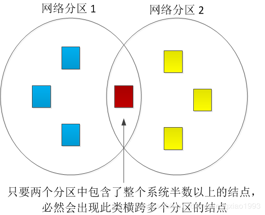

## Paxos详解

二阶段提交协议（Two-Phase Commit）出现的本质原因是， 分布式系统中不同的结点有不同的功能， 不同功能背后对应的数据集不同， 不同功能又需要一定的协同性。

二阶段协议中， 一个比较严重的问题是， 如果遇到结点宕机， **必须等到所有结点恢复以后， 协议才能继续** 。 于是这里就引出了如何提高分布式系统可用性的问题。**两阶段协议主要想解决事务的一致性问题，而paxos致力于解决复本冗余备份，提高分布式系统可用性的问题。**

在二阶段提交里我们知道，一个节点宕机了之后，必须恢复，否则流程将不能继续。所以我们很自然的想法就是将一个节点的数据复制多份，万一部分节点失效，其他备份节点还能继续工作。

简化问题，**任意的服务器节点，本质上都是一个状态机**

- 磁盘， 内存, CPU 缓存中的数据都属于状态
- 通过指令， 状态机的状态发生变化
- 用户可以通过请求触发状态机执行特定的指令，从而进一步触发状态转化

通过复制产生了多个位于不同结点的状态机

- 每一个状态机副本必须接受到顺序相同的指令集
- 如果每一个指令所导致的状态是确定的（非随机）， 副本状态机在执行了相同的指令以后， 最终会达到相同的状态。

那么，如何 **确保副本收到相同顺序的相同指令**呢？首先可以指定一个特殊的副本结点作为**主结点**，将其他的结点作为这个主结点的**备份**。客户统一将请求都发送给当前的主结点，主结点负责：

- 为接受到的客户指令确定唯一排序
- 把具有唯一顺序的指令集发送给它的备份结点
- 响应客户

#### 主节点宕机

主节点宕机了怎么办，那显然需要产生新的主节点。为每一个结点标注一个编号， 当主结点宕机时， 现存结点中编号最小的成为主结点。在主结点宕机后， 剩余结点需要相互通信， 判断哪些结点还存活。

当然，这里又会产生更多的问题：

-  由于通信问题数据丢失，可能产生多个主结点。
- 通信存在时间延迟，产生多个主节点。
- 网络分区（部分结点相互可通信， 另外一部分结点相互可通信），产生多个主节点。

那我们就可以拍脑门想出一个方案，**至少要有超过半数以上的结点同意才能选出新的主结点**

多数结点所在的分区只能有一个， 如果存在两个以上的分区选出了两个主结点， 那么多个分区中， 一定存在重合的结点， 重合的结点可以发现选出了多个主结点

#### 视图变化算法

理解 Paxos 的核心技巧是理解视图的概念

首先明确如下的概念

- 整个系统由多个状态机副本结点组成
- 多个结点(主备节点)构成一个**结点集**
- 每个结点集都存在一个**编号**
- **这个编号代表着结点集的共识， 每一个结点都知道这个值是多少。 可以将这个值理解为整个结果集的一种状态标志**

例子：

- 我们可以定义一个结点集，里面包含 3 个结点（node A, node B ,node C）, nodeA 是主结点
- 进一步定义， 系统初始化后， 3 个结点的共识值为 x
- 进一步定义， 只要某一个结点在过去的 1 分钟内， 没有完整地收到所有其余结点的心跳消息， 那么可以认为这个代表结点集共识的值被打破。 需要寻找新的共识值 y

一个视图（View） 由如下两个元素构成

- 视图编号（View Number）
- 结点集（set of nodes）

`提示：` 请不要将视图的编号理解为结点集中主结点的 ID， **视图的编号代表的是结点集的共识**， 当一个视图明确后， 确定唯一的主结点是非常简单的事情， 例如可以直接定义结点集中， IP 地址最小的结点为主结点。

当一个稳定的视图， 因为 视图编号（View Number） 或 结点集（set of nodes） 的变化而被破坏时 ， 我们就需要一个**视图变化算法**， 帮我们确定， 一个视图“打破”后， 下一个视图应该是什么。

