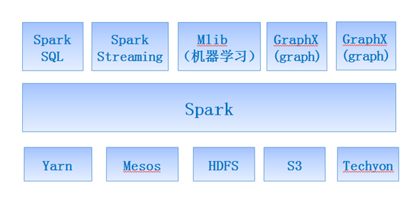
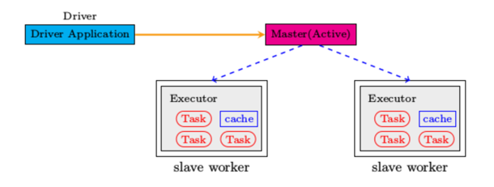

# Spark

Spark 是UC Berkeley AMP lab (加州大学伯克利分校AMP实验室)所开源的类Hadoop MapReduce的通用并行框架, 专门用于大数据量下的迭代式计算.**是为了跟 Hadoop 配合而开发出来的**,不是为了取代 Hadoop, Spark 运算比 Hadoop 的 MapReduce 框架快的原因是因为 Hadoop 在一次 MapReduce 运算之后,会将数据的运算结果从内存写入到磁盘中,第二次 Mapredue 运算时在从磁盘中读取数据,所以其瓶颈在2次运算间的多余 IO 消耗. **Spark 则是将数据一直缓存在内存中,直到计算得到最后的结果,再将结果写入到磁盘,所以多次运算的情况下, Spark 是比较快的. 其优化了迭代式工作负载**

Spark 是在 Scala 语言中实现的，它将 Scala 用作其应用程序框架。与 Hadoop 不同，Spark 和 Scala 能够紧密集成，其中的 Scala 可以像操作本地集合对象一样轻松地操作分布式数据集。

## 生态系统
Spark力图整合机器学习（MLib）、图算法（GraphX）、流式计算（Spark Streaming）和数据仓库（Spark SQL）等领域，通过计算引擎Spark，弹性分布式数据集（RDD），架构出一个新的大数据应用平台。

Spark生态圈以HDFS、S3、Techyon为底层存储引擎，以Yarn、Mesos和Standlone作为资源调度引擎；使用Spark，可以实现MapReduce应用；基于Spark，Spark SQL可以实现即席查询，Spark Streaming可以处理实时应用，MLib可以实现机器学习算法，GraphX可以实现图计算，SparkR可以实现复杂数学计算。

Spark 的主要特点还包括:

1. **提供 Cache 机制来支持需要反复迭代计算或者多次数据共享,减少数据读取的 IO 开销**;

2. 提供了一套支持 DAG 图的分布式并行计算的编程框架,减少多次计算之间中间结果写到 Hdfs 的开销;

3. 使用多线程池模型减少 Task 启动开稍, shuffle 过程中避免不必要的 sort 操作并减少磁盘 IO 操作。(Hadoop 的 Map 和 reduce 之间的 shuffle 需要 sort)

## Spark 系统架构

 - 应用程序(Application): 基于Spark的用户程序，包含了一个Driver Program 和集群中多个的Executor；

 - 驱动(Driver): 运行Application的main()函数并且创建SparkContext;

 - 执行单元(Executor): 是为某Application运行在Worker Node上的一个进程，该进程负责运行Task，并且负责将数据存在内存或者磁盘上，每个Application都有各自独立的Executors;

 - 集群管理程序(Cluster Manager): 在集群上获取资源的外部服务(例如：Local、Standalone、Mesos或Yarn等集群管理系统)；

 - 操作(Operation): 作用于RDD的各种操作分为Transformation和Action.

整个 Spark 集群中,**分为 Master 节点与 worker 节点**,其中 Master 节点上常驻 **Master 守护进程和 Driver 进程**, Master 负责将串行任务变成可并行执行的任务集Tasks, 同时还负责出错问题处理等,而 Worker 节点上常驻 Worker 守护进程, Master 节点与 Worker 节点分工不同, Master 负载管理全部的 Worker 节点,而 Worker 节点负责执行任务.

Driver 的功能是创建 SparkContext, 负责执行用户写的 Application 的 main 函数进程,Application 就是用户写的程序.

Spark 支持不同的运行模式,包括Local, Standalone,Mesoses,Yarn 模式.不同的模式可能会将 Driver 调度到不同的节点上执行.集群管理模式里, local 一般用于本地调试.

　　每个 Worker 上存在一个或多个 Executor 进程,该对象拥有一个线程池,每个线程负责一个 Task 任务的执行.根据 Executor 上 CPU-core 的数量,其每个时间可以并行多个 跟 core 一样数量的 Task4.Task 任务即为具体执行的 Spark 程序的任务.
