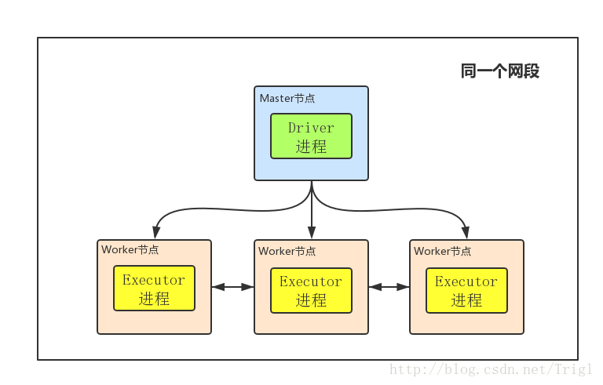

## client mode and cluster mode
在使用spark-submit提交Spark任务时可以选择参数，deploy-mode是针对集群而言的，是**指集群部署的模式**.

**根据Driver主进程放在哪**分为两种方式：client和cluster，默认是client，下面我们就详细研究一下这两种模式的区别

### client mode

Master节点就是你用来提交任务，即执行bin/spark-submit命令所在的那个节点；**Driver进程就是开始执行你Spark程序的那个Main函数**，虽然我这里边画的Driver进程在Master节点上，但注意Driver进程不一定在Master节点上，它可以在任何节点；Worker就是Slave节点，Executor进程必然在Worker节点上，用来进行实际的计算

1. client mode下Driver进程运行在Master节点上，不在Worker节点上，所以相对于参与实际计算的Worker集群而言，Driver就相当于是一个第三方的“client”

2. 正由于Driver进程不在Worker节点上，所以其是独立的，**不会消耗Worker集群的资源**

3. client mode下Master和Worker节点必须处于同一片局域网内，因为Drive要和Executorr通信，例如Drive需要将Jar包通过Netty HTTP分发到Executor，Driver要给Executor分配任务等

4. client mode下没有监督重启机制，Driver进程如果挂了，需要额外的程序重启

### cluster mode

1. **Driver程序在worker集群中某个节点**，而非Master节点，但是这个节点由Master指定

2. Driver程序占据Worker的资源

3. cluster mode下Master可以使用–supervise对Driver进行监控，如果Driver挂了可以自动重启

4. cluster mode下Master节点和Worker节点一般不在同一局域网，因此就无法将Jar包分发到各个Worker，所以cluster mode要求必须提前把Jar包放到各个Worker几点对应的目录下面
