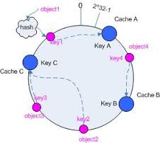
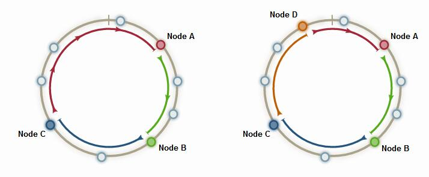
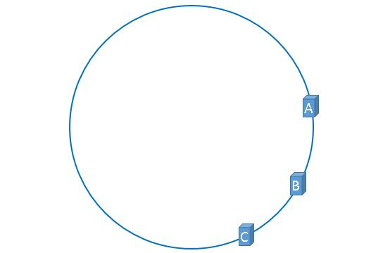
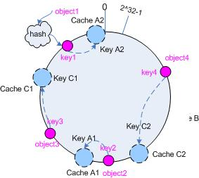

## 一致性hash算法

### 负载均衡与hash算法
分布式系统中（如：web存储），当服务增长到一定规模时，惯常的做法是集群化，引入负载均衡，这样做的好处是：1. 高可用。2. 解耦。从外部看，透明化了集群的内部细节（外部都通过负载均衡服务器通信，然后由负载均衡服务器分发请求）。

假设一个简单的场景：有4个cache服务器（后简称cache）组成的集群，当一个对象object传入集群时，这个对象应该存储在哪一个cache里呢？一种简单的方法是使用映射公式：

`Hash(object) % 4`

这个算法就可以保证任何object都会尽可能随机落在其中一个cache中。一切运行正常。

然后考虑以下情况：

 - 由于流量增大，需要增加一台cache，共5个cache。这时，映射公式就变成Hash(object) % 5。

 - 有一个cache服务器down掉，变成3个cache。这时，映射公式就变成Hash(object) % 3。

可见，无论新增还是减少节点，都会改变映射公式，而由于映射公式改变，几乎所有的object都会被映射到新的cache中，这意味着**一时间所有的缓存全部失效**。 大量的数据请求落在app层甚至是db层上，这对服务器的影响当然是**灾难性**的。

### 一致性Hash
一致性hash的出现就是为了解决这个问题：当节点数量改变时，能够使失效的缓存数量尽可能少。

一致性Hash的基本思想就是分两步走：

1. 把object求hash（这一步和之前相同）；

2. 把cache也求hash，然后把object和cache的hash值放入一个hash空间，通过一定的规则决定每个object落在哪一个cache中。

#### 成环
考虑通常的Hash算法都是将value映射到一个32位的key值，也即是0 ~ 2 ^ 32 - 1次方的数值空间；我们可以将这个空间想象成一个首（0）尾（2 ^ 32 - 1）相接的圆环，如下图所示。

#### 将object映射到环上

比如有4个需要存储的object，先求出它们的hash值，根据hash值映射到环上。如图：

#### 将cache映射到环上
假设有三台cache服务器：cache A，cache B，cache C。用同样的方法求出hash值（可根据机器的IP或名字作为key求hash，只要保证hash值足够分散），映射到同一个环上。如图：

#### 将object按照规则配对cache
这里的规则很简单：让object在环上顺时针转动，遇到的第一个cache即为对应的cache服务器。

根据上面的方法，对object1将被存储到cache A上；object2和object3对应到cache C；object4对应到cache B。

#### 解决问题
新的一致性hash算法成功解决了cache服务器增减时key的失效问题。现在，无论增减cache，**只有部分key失效**。

考虑增加新的缓存服务器的情况：

如图，新增了cache D节点，假设cache D在环上落在C和A之间，那么失效的只有部分落在cache A的key（现在落在cache D了）；也就是部分的红色圆弧，变成橙色圆弧（D）。

而cache B和cache C的key都没有失效。

可见，在新增节点时，这已经是最少失效了。

在移除节点时，情况也是和新增节点类似的。

### 虚拟节点
hash算法的一个考量指标是平衡性。在本例中，我们希望每一个**object落在任意一个cache的机会都尽可能接近**。

从图上很容易直观的看到，对于一个object来说，它落在环上的任何位置的概率都是一样的，那么落在一个cache的概率就**和圆弧的长度成正比**。于是，我们希望**每个cache所占的圆弧长度更接近**。

#### hash环偏斜
实际的映射中，并不能很理想，往往会被映射成如下的模样。效果就大大降低了。

#### 虚拟节点改进

其实，理论上，只要cache足够多，每个cache在圆环上就会足够分散。但是在真实场景里，cache服务器只会有很少，所以，引入了“虚拟节点”（virtual node）的概念：

以仅部署cache A和cache C的情况为例，引入虚拟节点，cache A1, cache A2代表了cache A；cache C1，cache C2代表了cache C。

此时，对象到“虚拟节点”的映射关系为：

objec1->cache A2；objec2->cache A1；objec3->cache C1；objec4->cache C2；

因此对象object1和object2都被映射到了cache A上，而object3和object4映射到了cache C上；平衡性有了很大提高。

虚拟节点技术实则是做了两次matching，如图：

