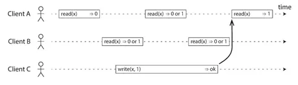
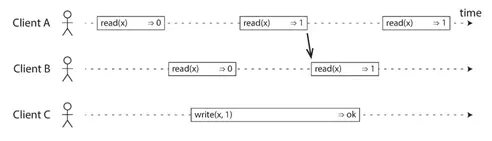
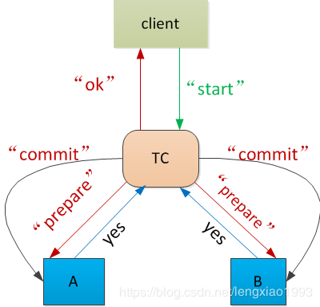
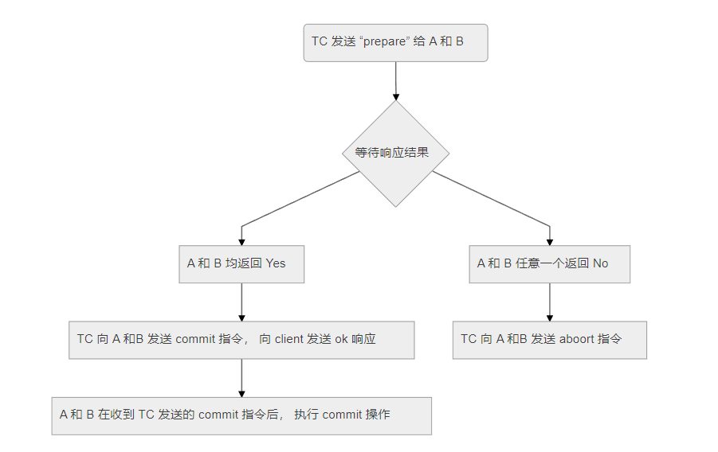
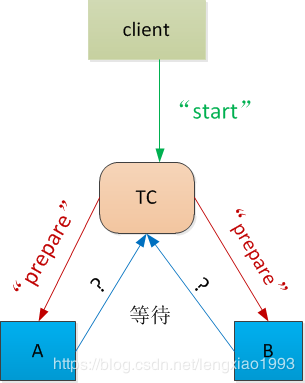
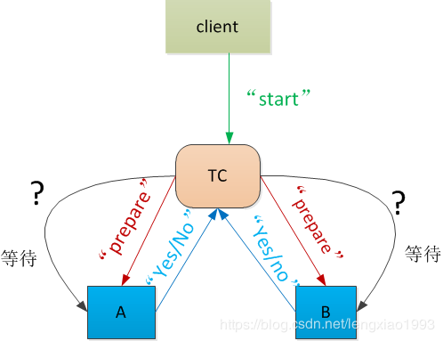

## 一致性问题
分布式系统毫无疑问，存在一个一致性问题。即系统对外如何呈现出一致的状态，比如所有节点都达成失败也是一种一致。

### 一致性要求
规范的说，分布式系统达成一致的过程，应该满足：

 - 可终止性(termination):一致的结果在有限的时间内完成
 - 约同性(agreement) 不同的节点最终完成决策的结果是相同的
 - 合法性(validity) 决策的结果必须是**某个节点提出提案**。

### 一致性详解

**一致性**这个词重载的很厉害，在不同的语境和上下文中，它其实代表着不同的东西：

- 在事务的上下文中，比如ACID里的C，指的就是通常的**一致性（Consistency）**
- 在分布式系统的上下文中，例如CAP里的C，实际指的是**线性一致性（Linearizability）**
- 此外，“一致性哈希”，“最终一致性”这些名词里的“一致性”也有不同的涵义。

在事务的上下文中，**一致性（Consistency）**的概念是：**对数据的一组特定陈述必须始终成立**。即**不变量（invariants）**。具体到分布式事务的上下文中这个不变量是：**所有参与事务的节点状态保持一致**：要么全部成功提交，要么全部失败回滚，不会出现一些节点成功一些节点失败的情况。

​	在分布式系统的上下文中，**线性一致性（Linearizability）**的概念是：**多副本的系统能够对外表现地像只有单个副本一样**（系统保证从任何副本读取到的值都是最新的），**且所有操作都以原子的方式生效**（一旦某个新值被任一客户端读取到，后续任意读取不会再返回旧值）。

​	线性一致性这个词可能有些陌生，但说起它的另一个名字大家就清楚了：**强一致性（strong consistency）**，当然还有一些诨名：**原子一致性（atomic consistency），立即一致性（immediate consistency）**或**外部一致性（external consistency ）**说的都是它。

**为了保证分布式事务的一致性**，分布式事务通常需要一个**协调者（Coordinator）/事务管理器（Transaction Manager）**来决定事务的最终提交状态。但无论2PC还是3PC，都无法应对协调者失效的问题，而且具有扩大故障的趋势。这就牺牲了可靠性、可维护性与可扩展性。为了让分布式事务真正**可用**，就需要在协调者挂点的时候能赶快选举出一个新的协调者来解决分歧，这就需要所有节点对谁是Boss达成**共识（Consensus）**。

**共识**意味着让几个节点就某事达成一致，可以用来确定一些**互不相容**的操作中，哪一个才是赢家。共识问题通常形式化如下：一个或多个节点可以**提议（propose）**某些值，而共识算法**决定**采用其中的某个值。在保证**分布式事务一致性**的场景中，每个节点可以投票提议，并对谁是新的协调者达成共识。

​	共识问题与许多问题等价，两个最典型的问题就是：

- 实现一个具有**线性一致性**的存储系统
- 实现**全序广播**（保证消息不丢失，且消息以相同的顺序传递给每个节点。）

​        Raft算法解决了全序广播问题。**维护多副本日志间的一致性，其实就是让所有节点对同全局操作顺序达成一致，也其实就是让日志系统具有线性一致性。** 因而解决了共识问题。（当然正因为共识问题与实现强一致存储问题等价，Raft的具体实现`etcd` 其实就是一个线性一致的分布式数据库。）

#### 线性一致性

这里再插一下刚才提到的线性一致性：一旦某个新值被任一客户端读取到，后续任意读取不会再返回旧值

上面第一张图表现了分布式系统的不确定性，第二张图则表现了一旦一个客户端读到了新值，后续不再会读到旧值。

### 2PC详解

在分布式协议总结里也有简单提到两阶段提交。这里再细说一下两阶段提交。两阶段提交毫无疑问是为了保障**事务数据的一致性**

好比银行转账，我们希望一方成功的同时，另一方也必须成功。符合**原子性的提交协议**

这如何实现呢，所以想到的第一个简单方案就是：

- A --> B : 你提交我就提交

一旦B挂了没有回复，那这流程就没办法继续了。

所以继续拍脑门想出一个新方案，加入一个**事务协调者（ Transaction Coordinator）**

#### 两种超时情况的考虑

假如事务协调者TC没有收到A和B的OK，那怎么办。这里当然可以取保守的做法，超时直接abort掉，发送abort命令。

还有一种情况是：

这种情况其实没这么简单，由于TC是不要求AB 提交后的回包的，所以这里必须谨慎。以 B 为例进行考虑：

- 如果 B 之前回复的是 “no” , 那此时， B 可以无需等待 TC 回复就放弃 commit 操作， 因为 TC 即使收到了响应， 也会回复 “abort”, 这个行为是统一的
- 如果 B 之前回复了 “Yes”。**B不能单方面执行abort操作或者commit操作**。因为， TC 此时可能已经成功收到了 A， B 返回的 “Yes”, 并且已经向 A 发送了 “Commit”, 然后再向 B 发送 “commit” 前宕机了。如果 B 放弃了 commit 操作， 就会出现 A 执行了 commit, B 未执行 Commit 的情形。
- 针对这个时候的场景，B有两种方案：
  -  方案一： B 一直等待 TC 的 “commit”/ “abort” 指令
  - 方案二（更好）： B 针对这种情形发起一轮**终止协议操作（Termination Protocol）**

#### 超时终止协议

刚才提到如果超时没有收到TC的提交或者丢弃的命令，就要发起超时终止的操作。

B 向 A 发送状态查询请求， 询问 A 是否知道事务已经提交

- 如果 B没有收到 A 的响应， B 无法进行后续操作， 只能继续等待
- 如果 B 收到了 A 的响应， 则分如下几种情况：
  - A 回复说 ， 它已经收到了来自 TC 的 “commit”/ “abort” 指令。此时 B 可以执行 “commit”/ “abort”, 因为TC 发给 B 的指令肯定和 A 一样
  - A回复说， 它还没有向 TC 回复 “yes”/“no”。则B 和 A 都直接执行 abort 操作。不必担心 TC， 因为 TC 尚未收到 A 的回复， 最终会根据 A 和B 的状态回复 client
  - A回复说， 它向 TC 回复了 “no”.此时B 和 A 都直接执行 abort 操作
  - A回复说， 它向 TC 回复了 “yes”。 **此时B 不能进行后续操作**。TC 可能已经收到了 A 和 B 的 “Yes” 响应， 并且决定执行 “commit”, 向 A 和 B 发送了“commit” 指令， 只是没被 A 和 B 收到， 但是 TC 发送 “commit” 之后就会直接向客户端返回了 “ok”。也有可能在等待 A 和 B 的响应过程中超时了， 直接进行了 “abort” 决定， 向 A 和 B 发送了 “abort” 指令， 只是没被 A 和 B 收到， 但是 TC 发送 “abort” 之后就会直接向客户端返回了 “fail”

#### 宕机重启

基本原则： 一旦 TC 决定了 commit , 那么任意一个结点都不允许发生回滚

如何保证在宕机重启后， 依旧能够记得宕机前的状态：

- 在发送任何信息给其他结点前， 一定要先行将自己要回复的内容写入磁盘， 这样可以保证一旦宕机， 可以知道宕机前的状态。
- 对于 TC 而言， 在向 A 和 B 发送 “commit” 指令前， 一定要先行将 “commit” 成功记录到磁盘。
- 对于 A/B 而言， 在向 TC 发送 “yes” 之前， 一定要先行将 “yes” 记录成功记录到磁盘
  

### 共识算法

**一致性描述的是结果状态，共识则是一种手段。** 共识描述了多个节点之间，彼此达成一致结果的过程。

也就是说，共识算法是对某个提案，大家达成意见一致的过程。

理想的系统不存在，不同节点之间存在延迟，还可能故障，甚至可能存在恶意节点伪造信息。

 - **一般地，把出现故障(crash 或 fail-stop,即不响应)但不会伪造信息的情况，称为非拜占庭错误(non-byzantine fault) 或者也可以叫做故障错误(Crash Fault)**

 - **伪造信息恶意响应的情况称为拜占庭错误(Byzantine fault),对应节点为拜占庭节点**

根据解决的错误是故障错误还是拜占庭错误，共识算法可以分为两类：

1. Crash Fault Tolerance(CFT) 类算法
2. Byzantine fault Tolerance(BFT) 类算法

解决非拜占庭错误，有一些经典算法：Paxos,Raft及其变种。性能较好，处理较快，但是容忍不超过一半的节点故障。

对于拜占庭容错，有PBFT(Practical Byzantine fault Tolerance)为代表的确定性算法，还有PoW为代表的概率算法。**对于确定性算法，达成共识就不可逆转**，对于 **概率性算法，共识结果只是临时的，可能被推翻**。 拜占庭容错算法，性能较差，容忍不超过三分之一的节点故障。

#### CAP
见CAP原理笔记

#### ACID原则
参见数据库事务笔记。分布式数据库一样遵循ACID原则。

#### Paxos算法(多状态机的一致性解决方案)
Paxos问题，就是指分布式系统中存在故障，但不存在恶意节点的场景。

Paxos算法1990年被Lamport提出，广泛采用在zookeeper，chubby等分布式系统中。是第一个被广泛应用的共识算法。

无论是二阶段提交还是三阶段提交都无法彻底解决分布式的一致性问题。Google Chubby的作者Mike Burrows说过， `there is only one consensus protocol, and that’s Paxos” – all other approaches are just broken versions of Paxos.` 意即**世上只有一种一致性算法，那就是Paxos**，所有其他一致性算法都是Paxos算法的不完整版。

算法基本原理，将节点逻辑上分为三种角色(同一节点可以担任多个角色):
 - 提案者(proposer)
 - 接受者(acceptor)
 - 学习者(learner)

 提案者提出一个提案，接受者们负责对这个提案投票，学习者不参与投票过程，只参与传播结果。

基本过程就是多个提案者争取到提案的权利(得到大多数接受者的支持)，得到提案权的提案者放松提案给所有人进行确认，得到大部分人确认的提案成为标准答案。

 - 单提案者，多接受者：提案只有一个，只有通过和失败两种状态，极易达成一致。但是一旦提案者故障，系统无法工作，中心化。

 - 多个提案者，单个接受者：共识也很容易达成。接受者只需要接受第一个拿到的提案作为决议即可。单点故障依旧会引起系统无法工作。

 - 多个提案者，多个接受者：一种情况是按时间分片，某一个时间段内只有一个提案者，则退化到单提案者情况。但需要设计一种机制保证提案者按某种特定序列(如根据时间，猜拳)产生。这种设计很难。第二种情况是为提案分配递增id，接受者拿到提案后取id大的(或者根据某种排序原则来取id)。过程涉及到 **两阶段提交**。
