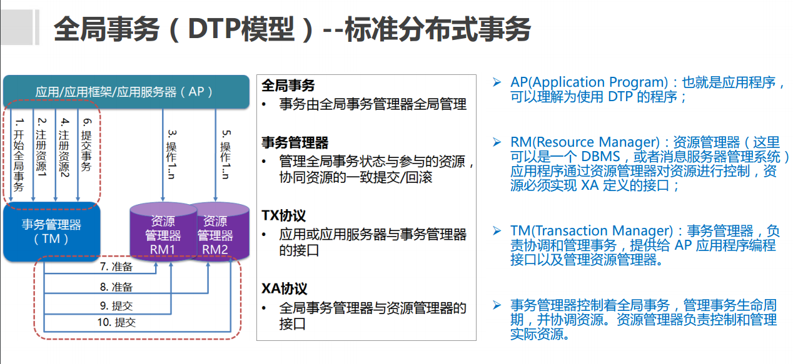

# 分布式事务基础

在分布式系统中，各个节点之间在物理上相互独立，通过网络进行沟通和协调。由于存在事务机制，可以保证每个独立节点上的数据操作可以满足ACID。但是，相互独立的节点之间无法准确的知道其他节点中的事务执行情况。所以从理论上讲，两台机器理论上无法达到一致的状态。如果想让分布式部署的多台机器中的数据保持一致性，那么就要保证在所有节点的数据写操作，要不全部都执行，要么全部的都不执行。

分布式事务的解决方案有如下几种：

- 全局事务(DTP模型)
- 基于可靠消息服务的分布式事务
- TCC
- 最大努力通知

### XA规范&DTP模型

XA是由X/Open组织提出的分布式事务的规范。XA规范主要定义了(全局)事务管理器(TM)和(局 部)资源管理器(RM)之间的接口。主流的关系型 数据库产品都是实现了XA接口的。

XA之所以需要引入事务管理器是因为，在分布 式系统中，从理论上讲两台机器理论上无法达 到一致的状态，需要引入一个单点进行协调。

**zwlj：总而言之就是，XA规范和DTP模型规定了要实现分布式事务，需要三种角色：AP TM和RM**

AP：Application 应用系统 它就是我们开发的业务系统，在我们开发的过程中，可以使用资源管理器提供的事务接口来实现分布式事务。

TM：Transaction Manager 事务管理器

- 分布式事务的实现由事务管理器来完成，它会提供分布式事务的操作接口供我们的业务系统调用。这些接口称为TX接口。
- 事务管理器还管理着所有的资源管理器，通过它们提供的XA接口来同一调度这些资源管理器，以实现分布式事务。
- **DTP只是一套实现分布式事务的规范，并没有定义具体如何实现分布式事务，TM可以采用2PC、3PC、Paxos等协议实现分布式事务**。

RM：Resource Manager 资源管理器

- 能够提供数据服务的对象都可以是资源管理器，比如：数据库、消息中间件、缓存等。大部分场景下，数据库即为分布式事务中的资源管理器。
- 资源管理器能够提供单数据库的事务能力，它们通过XA接口，将本数据库的提交、回滚等能力提供给事务管理器调用，以帮助事务管理器实现分布式的事务管理。
- XA是DTP模型定义的接口，用于向事务管理器提供该资源管理器(该数据库)的提交、回滚等能力。
- **DTP只是一套实现分布式事务的规范，RM具体的实现是由数据库厂商来完成的**。

**zwlj：我们熟知的一些二三阶段提交，PAXOS算法，其实都是围绕着这个模型搞的**

#### 再谈2PC

把2PC协议套进这个模型，无非就是

