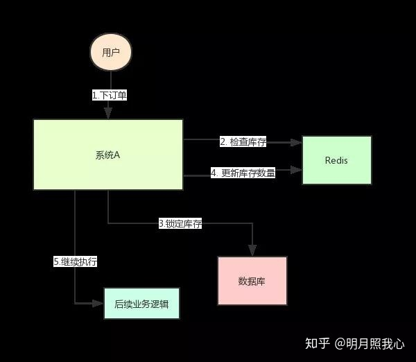

## 分布式锁详解

随着分布式的快速发展，本地的加锁往往不能满足我们的需要，在我们的分布式环境中上面加锁的方法就会失去作用。于是人们为了**在分布式环境中也能实现本地锁的效果**，也是纷纷各出其招

那么我们需要分布式锁具有什么特性呢：

- 可以保证在分布式部署的应用集群中，同一个方法在同一时间只能被一台机器上的一个线程执行。
- 这把锁要是一把可重入锁（避免死锁）
- 这把锁最好是一把阻塞锁（根据业务需求考虑要不要这条）
- 这把锁最好是一把公平锁（根据业务需求考虑要不要这条）
- 有高可用的获取锁和释放锁功能
- 获取锁和释放锁的性能要好

下面说一下分布式锁的一些实现方案。


### 分布式锁案例




系统中有一个用户下订单的接口，但是用户下订单之前一定要去检查一下库存，确保库存足够了才会给用户下单。

假如某个时刻，Redis 里面的某个商品库存为 1。此时两个请求同时到来，其中一个请求执行到上图的第 3 步，更新数据库的库存为 0，但是第 4 步还没有执行。而另外一个请求执行到了第 2 步，发现库存还是 1，就继续执行第 3 步。这样的结果，是导致卖出了 2 个商品，然而其实库存只有 1 个。很明显不对啊！这就是典型的库存超卖问题。

分布式锁的思路是：在整个系统提供一个全局、唯一的获取锁的“东西”，然后每个系统在需要加锁时，都去问这个“东西”拿到一把锁，这样不同的系统拿到的就可以认为是同一把锁。至于这个“东西”，可以是 Redis、Zookeeper，也可以是数据库。


### 基于数据库的分布式锁

利用主键唯一的特性，如果有多个请求同时提交到数据库的话，数据库会保证只有一个操作可以成功，那么我们就可以认为操作成功的那个线程获得了该方法的锁，当方法执行完毕之后，想要释放锁的话，删除这条数据库记录即可。

**这种锁是基于乐观锁来实现的，简而言之就是不停去尝试**

要实现分布式锁，最简单的方式可能就是直接创建一张锁表，然后通过操作该表中的数据来实现了。

当我们要锁住某个方法或资源时，我们就在该表中增加一条记录，想要释放锁的时候就删除这条记录。

```sql
CREATE TABLE `methodLock` (
  `id` int(11) NOT NULL AUTO_INCREMENT COMMENT '主键',
  `method_name` varchar(64) NOT NULL DEFAULT '' COMMENT '锁定的方法名',
  `desc` varchar(1024) NOT NULL DEFAULT '备注信息',
  `update_time` timestamp NOT NULL DEFAULT CURRENT_TIMESTAMP ON UPDATE CURRENT_TIMESTAMP COMMENT '保存数据时间，自动生成',
  PRIMARY KEY (`id`),
  UNIQUE KEY `uidx_method_name` (`method_name `) USING BTREE
) ENGINE=InnoDB DEFAULT CHARSET=utf8 COMMENT='锁定中的方法';

insert into methodLock(method_name,desc) values (‘method_name’,‘desc’)
```

因为我们对`method_name`做了唯一性约束，这里如果有多个请求同时提交到数据库的话，数据库会保证只有一个操作可以成功，那么我们就可以认为操作成功的那个线程获得了该方法的锁

当方法执行完毕之后，想要释放锁的话，需要执行以下Sql:

```sql
delete from methodLock where method_name ='method_name'
```

上面这种简单的实现有以下几个问题：

1. 这把锁强依赖数据库的可用性，数据库是一个单点，一旦数据库挂掉，会导致业务系统不可用。

2. 这把锁没有失效时间，一旦解锁操作失败，就会导致锁记录一直在数据库中，其他线程无法再获得到锁。

3. 这把锁只能是非阻塞的，因为数据的insert操作，一旦插入失败就会直接报错。没有获得锁的线程并不会进入排队队列，要想再次获得锁就要再次触发获得锁操作。

4. 这把锁是非重入的，同一个线程在没有释放锁之前无法再次获得该锁。因为数据中数据已经存在了。


当然，我们也可以有其他方式解决上面的问题。

- 数据库是单点？搞两个数据库，数据之前双向同步。一旦挂掉快速切换到备库上。
- 没有失效时间？只要做一个定时任务，每隔一定时间把数据库中的超时数据清理一遍。
- 非阻塞的？搞一个while循环，直到insert成功再返回成功。
- 非重入的？在数据库表中加个字段，记录当前获得锁的机器的主机信息和线程信息，那么下次再获取锁的时候先查询数据库，如果当前机器的主机信息和线程信息在数据库可以查到的话，直接把锁分配给他就可以了。

### 缓存实现分布式锁

相比较于基于数据库实现分布式锁的方案来说，基于缓存来实现在性能方面会表现的更好一点。而且很多缓存是可以集群部署的，可以解决单点问题。


可以基于 redis 的 setnx()、expire() 方法做分布式锁

setnx 的含义就是 SET if Not Exists，其主要有两个参数 setnx(key, value)。该方法是原子的，如果 key 不存在，则设置当前 key 成功，返回 1；如果当前 key 已经存在，则设置当前 key 失败，返回 0。

1. setnx(lockkey, 1) 如果返回 0，则说明占位失败；如果返回 1，则说明占位成功

2. expire() 命令对 lockkey 设置超时时间，为的是避免死锁问题。

3. 执行完业务代码后，可以通过 delete 命令删除 key。


基于缓存实现的话，依旧存在几个问题：

1. 这把锁没有失效时间，一旦解锁操作失败，就会导致锁记录一直在tair中，其他线程无法再获得到锁。

2. 这把锁只能是非阻塞的，无论成功还是失败都直接返回。

3. 这把锁是非重入的，一个线程获得锁之后，在释放锁之前，无法再次获得该锁，因为使用到的key在缓存中已经存在。无法再执行put操作。


### Zookeeper实现分布式锁

基于zookeeper临时有序节点可以实现的分布式锁。

大致思想即为：每个客户端对某个方法加锁时，在zookeeper上的与该方法对应的指定节点的目录下，生成一个唯一的瞬时有序节点。 判断是否获取锁的方式很简单，只需要判断有序节点中序号最小的一个。 当释放锁的时候，只需将这个瞬时节点删除即可。同时，其可以避免服务宕机导致的锁无法释放，而产生的死锁问题。

来看下Zookeeper能不能解决前面提到的问题。

- 锁无法释放？使用Zookeeper可以有效的解决锁无法释放的问题，因为在创建锁的时候，客户端会在ZK中创建一个临时节点，一旦客户端获取到锁之后突然挂掉（Session连接断开），那么这个临时节点就会自动删除掉。其他客户端就可以再次获得锁。
- 非阻塞锁？使用Zookeeper可以实现阻塞的锁，客户端可以通过在ZK中创建顺序节点，并且在节点上绑定监听器，一旦节点有变化，Zookeeper会通知客户端，客户端可以检查自己创建的节点是不是当前所有节点中序号最小的，如果是，那么自己就获取到锁，便可以执行业务逻辑了。
- 不可重入？使用Zookeeper也可以有效的解决不可重入的问题，客户端在创建节点的时候，把当前客户端的主机信息和线程信息直接写入到节点中，下次想要获取锁的时候和当前最小的节点中的数据比对一下就可以了。如果和自己的信息一样，那么自己直接获取到锁，如果不一样就再创建一个临时的顺序节点，参与排队。
- 单点问题？使用Zookeeper可以有效的解决单点问题，ZK是集群部署的，只要集群中有半数以上的机器存活，就可以对外提供服务。


使用ZK实现的分布式锁好像完全符合了本文开头我们对一个分布式锁的所有期望。但是，其实并不是，Zookeeper实现的分布式锁其实存在一个缺点，那就是性能上可能并没有缓存服务那么高。因为每次在创建锁和释放锁的过程中，都要动态创建、销毁瞬时节点来实现锁功能。ZK中创建和删除节点只能通过Leader服务器来执行，然后将数据同不到所有的Follower机器上。

**其实，使用Zookeeper也有可能带来并发问题，只是并不常见而已。考虑这样的情况，由于网络抖动，客户端可ZK集群的session连接断了，那么zk以为客户端挂了，就会删除临时节点，这时候其他客户端就可以获取到分布式锁了。就可能产生并发问题。这个问题不常见是因为zk有重试机制，一旦zk集群检测不到客户端的心跳，就会重试，Curator客户端支持多种重试策略。多次重试之后还不行的话才会删除临时节点。（所以，选择一个合适的重试策略也比较重要，要在锁的粒度和并发之间找一个平衡。）**


### 三种方案比较

上面几种方式，哪种方式都无法做到完美。就像CAP一样，在复杂性、可靠性、性能等方面无法同时满足，所以，根据不同的应用场景选择最适合自己的才是王道。

#### 从理解的难易程度角度（从低到高）

数据库 > 缓存 > Zookeeper

#### 从实现的复杂性角度（从低到高）

Zookeeper >= 缓存 > 数据库

#### 从性能角度（从高到低）

缓存 > Zookeeper >= 数据库

#### 从可靠性角度（从高到低）

Zookeeper > 缓存 > 数据库