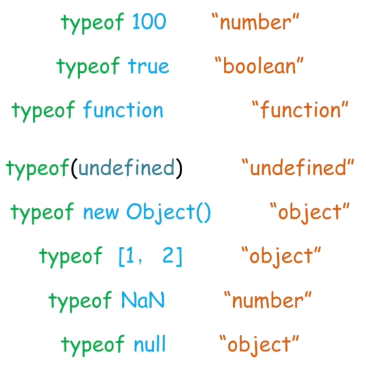
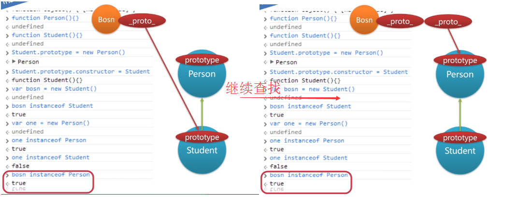

## js基本数据类型
JavaScript中有**5种简单数据类型**（也称为**基本数据类型**）：Undefined、Null、Boolean、Number和String。还有1种复杂数据类型——Object，Object本质上是由一组无序的名值对组成的。


原始类型（基本类型）：按值访问，可以操作保存在变量中实际的值。原始类型汇总中null和undefined比较特殊。

null是空指针，undefined未定义。

引用类型：引用类型的值是保存在内存中的对象。

### 提一下数组
数组不是一个基本类型，而是一个对象，也就是Array。或者定义的时候也可以以诸如"\[3,5,6\]",这样的形式。

观察了一下数组的prototype原型(见js原型继承笔记)。可以知道

``` javascript
Array.prototype;// [] Array其实是个函数对象，有prototype属性

[].prototype // undefined,因为实例数组不是函数，没有prototype方法

[].__proto__ // []

[].__proto__.__proto__ // {}

```

对于上面这些是要搞清楚的，首先Array的原型被链接到一个“\[\]”里，这显得有些奇怪，但是这个"\[\]"其实跟我们定义的空数组“\[\]”有些不同，这个才是真的数组(\_\_proto\_\_被链接到Object对象)，而不应该理解为空数组，他的\_\_proto\_\_属性链接到了Object上。而我们的实例空数组，\_\_proto\_\_属性链接到Array的prototype真数组\[\]上，所以才会显得有点像原型链循环了。


可以看到我们定义的空数组是多了一个length属性的。然后再把proto指向最原始的数组对象(指向Object的数组对象)。


**所以需要注意的就是，Array的原型prototype还是绑定在自己的一个数组实例上，这个实例的__proto__背定义成Object**,所以这也造成了数组实例的父类型还是一个数组，是一个父类型是Object且自带许多数组方法的数组。


### ==(非严格相等)
这是js面试中的一个经常考察的考点。

原则便是，两个不同的类型进行比较，会想办法把他们转到相等的类型，再进行严格相等，也就是‘===’来判断。

另外undefined和null基本被作为不存在的代名词，实体与其判断基本都是false。

下面这个表尤其重要

<table class="standard-table">
 <thead>
  <tr>
   <th scope="row">&nbsp;</th>
   <th colspan="7" style="text-align: center;" scope="col">被比较值 B</th>
  </tr>
 </thead>
 <tbody>
  <tr>
   <th scope="row">&nbsp;</th>
   <td>&nbsp;</td>
   <td style="text-align: center;">Undefined</td>
   <td style="text-align: center;">Null</td>
   <td style="text-align: center;">Number</td>
   <td style="text-align: center;">String</td>
   <td style="text-align: center;">Boolean</td>
   <td style="text-align: center;">Object</td>
  </tr>
  <tr>
   <th colspan="1" rowspan="6" scope="row">被比较值 A</th>
   <td>Undefined</td>
   <td style="text-align: center;"><code>true</code></td>
   <td style="text-align: center;"><code>true</code></td>
   <td style="text-align: center;"><code>false</code></td>
   <td style="text-align: center;"><code>false</code></td>
   <td style="text-align: center;"><code>false</code></td>
   <td style="text-align: center;"><code>IsFalsy(B)</code></td>
  </tr>
  <tr>
   <td>Null</td>
   <td style="text-align: center;"><code>true</code></td>
   <td style="text-align: center;"><code>true</code></td>
   <td style="text-align: center;"><code>false</code></td>
   <td style="text-align: center;"><code>false</code></td>
   <td style="text-align: center;"><code>false</code></td>
   <td style="text-align: center;"><code>IsFalsy(B)</code></td>
  </tr>
  <tr>
   <td>Number</td>
   <td style="text-align: center;"><code>false</code></td>
   <td style="text-align: center;"><code>false</code></td>
   <td style="text-align: center;"><code>A === B</code></td>
   <td style="text-align: center;"><code>A === ToNumber(B)</code></td>
   <td style="text-align: center;"><code>A=== ToNumber(B) </code></td>
   <td style="text-align: center;"><code>A=== ToPrimitive(B)&nbsp;</code></td>
  </tr>
  <tr>
   <td>String</td>
   <td style="text-align: center;"><code>false</code></td>
   <td style="text-align: center;"><code>false</code></td>
   <td style="text-align: center;"><code>ToNumber(A) === B</code></td>
   <td style="text-align: center;"><code>A === B</code></td>
   <td style="text-align: center;"><code>ToNumber(A) === ToNumber(B)</code></td>
   <td style="text-align: center;"><code>ToPrimitive(B) == A</code></td>
  </tr>
  <tr>
   <td>Boolean</td>
   <td style="text-align: center;"><code>false</code></td>
   <td style="text-align: center;"><code>false</code></td>
   <td style="text-align: center;"><code>ToNumber(A) === B</code></td>
   <td style="text-align: center;"><code>ToNumber(A) === ToNumber(B)</code></td>
   <td style="text-align: center;"><code>A === B</code></td>
   <td style="text-align: center;">ToNumber(A) == ToPrimitive(B)</td>
  </tr>
  <tr>
   <td>Object</td>
   <td style="text-align: center;"><font face="Consolas, Liberation Mono, Courier, monospace">false</font></td>
   <td style="text-align: center;"><font face="Consolas, Liberation Mono, Courier, monospace">false</font></td>
   <td style="text-align: center;"><code>ToPrimitive(A) == B</code></td>
   <td style="text-align: center;"><code>ToPrimitive(A) == B</code></td>
   <td style="text-align: center;">ToPrimitive(A) == ToNumber(B)</td>
   <td style="text-align: center;">
    <p><code>A === B</code></p>
   </td>
  </tr>
 </tbody>
</table>

toNumber的意思就是转换为数字，而ToPrimitive就是调用valueOf和toString来转换Object。

上面的表格大概的规律便是，和boolean的不同类型比较，基本把布尔转为数字再进行比较。对象的话也是优先转成基本类型。


有一点也要记住，**全等操作符认为 NaN 与其他任何值都不全等，包括它自己。（等式 (x !== x) 成立的唯一情况是 x 的值为 NaN）**


具体的转换规则，下面会提到，务必牢记。

结合后面提到的隐式转换，这里也提一些面试经常遇到的坑。

#### 坑
基于上面的原则

\[\] == \[\]

上面表达式的值为false，首先要明确，\[\]是一个空数组，并且是一个对象，即便是空数组也是一个对象，而这两个对象是创建在了堆内存中的不一样的对象，空数组的引用。两个引用是不同的，所以返回false。

基于原则，我们还可以知道

\[\] == !\[\]，这个表达式的答案是true。

分析：一目运算符！优先运算，根据对象的引用转为布尔值都是true，可以得到等号右边的值为false。

接下来就是对象和布尔值的非严格比较了，根据上面表格，空数组转为primitive和右边的false转为number。当然false为0，空数组对象则会根据toString被转换为空字串进而被数字化为0.

虽然空数组转化为空字串以后可以被转为0，但是空对象{},则会被转换成{object Object}字串，所以转成number NaN.所以{} == !\[\] 的结果自然是false。

所以对于空数组，空字串，记住这两个特例的toString。
``` javascript
var obj = {};
console.log(obj.toString());//[object Object]

var arr2 = [];
console.log(arr2.toString());//""空字符串
```


### 隐式转换

#### +和-
巧用+和-规则转换类型

把变量转换成数字：num-0;

把变量转换成字符串：num+'';

#### 转为布尔类型
当**数字**在逻辑环境中执行时，会自动转为布尔类型。**0和NaN会自动转为false，其余数字都被认为是true**，代码如下：

``` javascript
// 0和NaN为false，其余均为true
if (-0) {
    console.log('true');
} else {
    console.log('false');    // output: false
}
if (NaN) {
    console.log('true');
} else {
    console.log('false');    // output: false
}
// 其余数字均为true
if (-3) {
    console.log('true');    // output: true
} else {
    console.log('false');
}
```

和数字类似，当**字符串**在逻辑环境中执行时，也会被转为布尔类型。**空字符串会被转为false，其它字符串都会转为true**

undefined和null转为布尔类型(from undefined and null)

**当undefined和null在逻辑环境中执行时，都被认为是false**

当**对象**在逻辑环境中执行时，只要当前引用的对象不为空，都会被认为是true。如果一个对象的引用为null，根据上面的介绍，会被转换为false。虽然使用typeof检测null为"object"，但它并不是严格意义上的对象类型，只是一个**对象空引用的标识**。

另外，我们这里的**逻辑环境不包括比较操作符(==)**，因为它会根据valueOf()和toString()将对象转为其他类型


#### 转为数字类型(to number)
操作数在数字环境中参与运算时，会被转为相对应的数字类型值，其中的转换规则如下：

 - 字符串类型转为数字(from string): **空字符串被转为0，非空字符串中，符合数字规则的会被转换为对应的数字，否则视为NaN**

 - 布尔类型转为数字(from boolean): true被转为1，false被转为0

 - null被转为0，undefined被转为NaN

 - 对象类型转为数字(from object): valueOf()方法先试图被调用，如果调用返回的结果为基础类型，则再将其转为数字，如果返回结果不是基础类型，则会再试图调用toString()方法，最后试图将返回结果转为数字，如果这个返回结果是基础类型，则会得到一个数字或NaN，如果不是基础类型，则会抛出一个异常

当**加号“+”作为二元操作符**时，我们上面也提到过，如果一个操作数为字符串，则加号“+”作为字符串连接符，但如果两个操作数都不是字符串类型，则会作为加法操作符，执行加法操作，这个时候，其他数据类型也会被转为数字类型

**NaN和任何其他数字类型运算时都会返回NaN**

### 包装类型
JavaScript和java一样，有几个基本类型都有相应的包装类型。

基本类型中的number,string和boolean都有对应的包装类型。

把一个基本类型尝试用对象的方式使用它的时候，比如访问length属性，或者增加一些属性的操作时，javascript会把这些基本类型转化为对应的包装类型对象。完成这样一个访问比如a.length返回以后或者a.t设置了以后，这个临时对象会被销毁掉。所以a.t赋值3了以后，再去输出a.t值是undefined。

``` javascript
var a = "string"
alert(a.length) // 6
a.t = 3;

alert(a.t); //undefined
```

str，number和true都有包装类型，所以可以把数字用括号括起来调用toString()方法

### 类型转换
javascript中类型检测方法有很多：

 - typeof
 - instanceof
 - Object.prototype.toString
 - constructor
 - duck type

#### typeof相当常用


**比较特殊的是typeof null返回“object”。**除了基本类型外的几个特例也要记住。

历史原因，规范尝试修改typeof null返回“null”修改完大量网站无法访问，为了兼容，或者说历史原因返回"object"。

typeof对基本类型和函数对象很方便，但是其他类型就没办法了。

判断一个对象是不是数组？用typeof返回“object”。对对象的判断常用instanceof。

typeof返回的是一个string

#### instanceof
基于原型链操作。obj instanceof Object。

左操作数为对象，不是对象就返回false,右操作数必须是**函数对象或者函数构造器**，不是就返回typeError异常。

原理：判断左边的左操作数的对象的原型链(\_\_proto\_\_)上是否有右边这个构造函数的prototype属性。

我们知道任何一个构造函数(函数对象)都有一个prototype对象属性，这个对象属性将用作new出来的对象的原型。



原理就是顺着一个object的\_\_proto\_\_属性一个个往前回溯，跟右边的prototype属性对比

原理代码
``` javascript
function _instanceof(A, B) {
    var O = B.prototype;// 取B的显示原型
    A = A.__proto__;// 取A的隐式原型
    while (true) {
        //Object.prototype.__proto__ === null
        if (A === null)
            return false;
        if (O === A)// 这里重点：当 O 严格等于 A 时，返回 true
            return true;
        A = A.__proto__;
    }
}
```


instanceof在判断对象是不是数组，Data，正则等时很好用。
