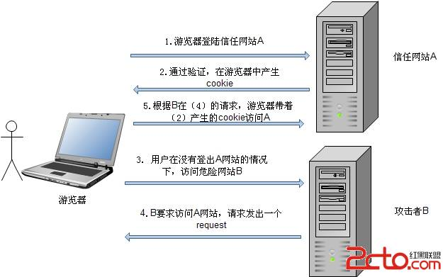

## CSRF
CSRF（Cross-Site Request Forgery），中文名称：跨站请求伪造攻击

攻击者可以盗用你的登陆信息，以你的身份模拟发送各种请求。攻击者只要借助少许的社会工程学的诡计，例如通过 QQ 等聊天软件发送的链接(有些还伪装成短域名，用户无法分辨)，攻击者就能迫使 Web 应用的用户去执行攻击者预设的操作。

例如，当用户登录网络银行去查看其存款余额，在他没有退出时，就点击了一个 QQ 好友发来的链接，那么该用户银行帐户中的资金就有可能被转移到攻击者指定的帐户中。

### 原理

完成 CSRF 攻击必须要有三个条件：

1. 用户已经登录了站点 A，并在本地记录了 cookie
2. 在用户没有登出站点 A 的情况下（也就是 cookie 生效的情况下），访问了恶意攻击者提供的引诱危险站点 B (B 站点要求访问站点A)。
3. 站点 A 没有做任何 CSRF 防御

也许会问：「如果我不满足以上三个条件中的任意一个，就不会受到 CSRF 的攻击」。其实可以这么说的，但你不能保证以下情况不会发生：

 - 你不能保证你登录了一个网站后，不再打开一个 tab 页面并访问另外的网站，特别现在浏览器都是支持多 tab 的。
 - 你不能保证你关闭浏览器了后，你本地的 cookie 立刻过期，你上次的会话已经结束。
 - **上图中所谓的攻击网站 B，可能是一个存在其他漏洞的可信任的经常被人访问的网站。**

### 预防 CSRF
CSRF 的防御可以从服务端和客户端两方面着手，防御效果是从服务端着手效果比较好，现在一般的 CSRF 防御也都在服务端进行。

服务端的预防 CSRF 攻击的方式方法有多种，但思路上都是差不多的，主要从以下两个方面入手：

 - 正确使用 GET，POST 请求和 cookie
 - 在非 GET 请求中增加 token

一般而言，普通的 Web 应用都是以 GET、POST 请求为主，还有一种请求是 cookie 方式。我们一般都是按照如下规则设计应用的请求：

 - GET 请求常用在查看，列举，展示等不需要改变资源属性的时候（数据库 query 查询的时候）
 - POST 请求常用在 From 表单提交，改变一个资源的属性或者做其他一些事情的时候（数据库有 insert、update、delete 的时候）

 当正确的使用了 GET 和 POST 请求之后，剩下的就是 **在非 GET 方式的请求中增加随机数**，这个大概有三种方式来进行：

 - **为每个用户生成一个唯一的 cookie token**，**所有表单都包含同一个伪随机值**，这种方案最简单，因为攻击者不能获得第三方的 cookie(理论上)，所以表单中的数据也就构造失败，但是由于用户的 cookie 很容易由于网站的 XSS 漏洞而被盗取，**所以这个方案必须要在没有 XSS 的情况下才安全**。

 - 每个 POST 请求使用验证码，这个方案算是比较完美的，但是需要用户多次输入验证码，用户体验比较差，所以不适合在业务中大量运用。

 - 渲染表单的时候，为每一个表单包含一个 csrfToken，提交表单的时候，带上 csrfToken，然后在后端做 csrfToken 验证。

CSRF 的防御可以根据应用场景的不同自行选择。CSRF 的防御工作确实会在正常业务逻辑的基础上带来很多额外的开发量，但是这种工作量是值得的，毕竟用户隐私以及财产安全是产品最基础的根本。

### 防护方案
防护方案很多，有一些确实要进行一些tradeoff

#### 检查Referer字段
通过检查HTTP请求的Referer字段是否属于本站域名，**非本站域名的请求进行拒绝**。陷阱：一是要需要处理Referer为空的情况，二是要处理例如qq.com.evil.com 部分匹配的情况。

#### 添加校验token
服务器生成一个伪随机数作为token，附加在表单的隐藏字段下发给用户。当客户端通过表单提交请求时，这个token也一并提交上去以供后台校验，拒绝掉校验不通过的请求。

#### 合理使用框架的CSRF防护功能
一些框架里有开源的CSRF防护功能，如node 的某些中间件。
