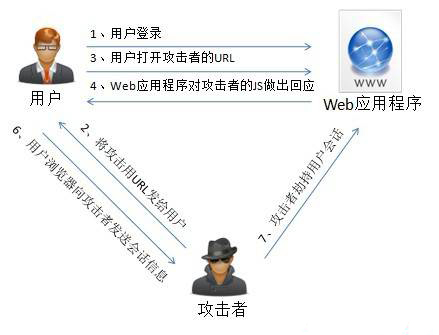

## XSS
XSS (Cross Site Script)，跨站脚本攻击，因为缩写和 CSS (Cascading Style Sheets) 重叠，所以只能叫 XSS。

**如果Web页面在动态展示数据时使用了用户的输入内容，但是未做输入过滤和输出转义，导致黑客可通过参数传入恶意代码，当用户浏览页面时恶意代码会被执行。** 从而可以达到攻击者盗取用户信息或其他侵犯用户安全隐私的目的。


XSS千变万化，不过大致可以分为以下几种：

### 非持久型(反射型)XSS


非持久型 XSS 漏洞，也叫反射型 XSS 漏洞，一般是通过给别人发送带有恶意脚本代码参数的 URL，当 URL 地址被打开时，特有的恶意代码参数被 HTML 解析、执行。

比如Web 页面中包含有以下代码：

``` html
Select your language:
<select>
    <script>
        document.write(''
            + '<option value=1>'
            +     location.href.substring(location.href.indexOf('default=') + 8)
            + '</option>'
        );
        document.write('<option value=2>English</option>');
    </script>
</select>
```

select标签中，带几个option，有个option标签的内容居然是通过url的get方式拿到参数生成的。

既然如此，我在html上传递恶意脚本，就会被执行。

攻击者可以直接通过 URL (类似：`https://xx.com/xx?default=<script>alert(document.cookie)</script>)` 注入可执行的脚本代码。

非持久型 XSS 漏洞攻击有以下几点特征：

 - **即时性**，不经过服务器存储，**直接通过 HTTP 的 GET 和 POST 请求就能完成一次攻击，拿到用户隐私数据**。
 - 攻击者需要 **诱骗点击**
 - 反馈率低，所以较难发现和响应修复
 - **盗取用户敏感保密信息**


为了防止出现非持久型 XSS 漏洞，需要确保这么几件事情：

 - Web 页面渲染的所有内容或者渲染的数据都必须来自于服务端。
 - 尽量不要从 URL，document.referrer，document.forms 等这种 DOM API 中获取数据直接渲染。
 - 尽量不要使用 eval, new Function()，document.write()，document.writeln()，window.setInterval()，window.setTimeout()，innerHTML，document.creteElement() 等可执行字符串的方法。
 - 如果做不到以上几点，也必须对涉及 DOM 渲染的方法传入的字符串参数做 escape 转义。
 - 前端渲染的时候对任何的字段都需要做 escape 转义编码。

#### escape转义
escape 转义的目的是将一些构成 HTML 标签的元素转义，比如 <，>，空格 等，转义成 `&lt;`，`&gt;`，`&nbsp`; 等显示转义字符。有很多开源的工具可以协助我们做 escape 转义。

tencent内部就有对应库。

### 持久型XSS
**持久型 XSS 漏洞，也被称为存储型 XSS 漏洞**，一般存在于 Form 表单提交等交互功能，如发帖留言，提交文本信息等，黑客利用的 XSS 漏洞，将内容经正常功能提交进入数据库持久保存，**当前端页面获得后端从数据库中读出的注入代码时，恰好将其渲染执行**。

**主要注入页面方式和非持久型 XSS 漏洞类似，只不过持久型的不是来源于 URL，refferer，forms 等，而是来源于后端从数据库中读出来的数据**。持久型 XSS 攻击不需要诱骗点击，黑客只需要在提交表单的地方完成注入即可，但是这种 XSS 攻击的成本相对还是很高。

持久型 XSS 有以下几个特点：

 - 持久性，植入在数据库中
 - 危害面广，甚至可以让用户机器变成 DDoS 攻击的肉鸡。
 - 盗取用户敏感私密信息

为了防止持久型 XSS 漏洞，需要前后端共同努力：

 - 后端在入库前应该选择不相信任何前端数据，**将所有的字段统一进行转义处理**。
 - **后端在输出给前端数据统一进行转义处理**。
 - 前端在渲染页面 DOM 的时候应该选择不相信任何后端数据，**任何字段都需要做转义处理。**

**zwlj：总之就是转义转义再转义！**

### 基于字符集的XSS
其实现在很多的浏览器以及各种开源的库都专门针对了 XSS 进行转义处理，尽量默认抵御绝大多数 XSS 攻击，但是还是有很多方式可以绕过转义规则，让人防不胜防。比如「基于字符集的 XSS 攻击」就是绕过这些转义处理的一种攻击方式

比如有些 Web 页面字符集不固定，用户输入非期望字符集的字符，有时会绕过转义过滤规则。

以基于 utf-7 的 XSS 为例

utf-7 是可以将所有的 unicode 通过 7bit 来表示的一种字符集 (但现在已经从 Unicode 规格中移除)。
这个字符集为了通过 7bit 来表示所有的文字, 除去数字和一部分的符号,其它的部分将都以 base64 编码为基础的方式呈现。

``` html
<script>alert("xss")</script>
可以被解释为：
+ADw-script+AD4-alert(+ACI-xss+ACI-)+ADw-/script+AD4-

```

由于浏览器在 meta 没有指定 charset 的时候有自动识别编码的机制，所以这类攻击通常就是 **发生在没有指定或者没来得及指定 meta 标签的 charset 的情况下**。

解决方案：

 - 记住指定 <meta charset="utf-8">
 - XML 中不仅要指定字符集为 utf-8，而且标签要闭合

#### DOM型XSS
实际上，这种类型的XSS就是反射型XSS的一个子例。

由于html页面中，定义了一段JS，根据用户的输入，显示一段html代码，攻击者可以在输入时，插入一段恶意脚本，最终展示时，会执行恶意脚本。
	DOM跨站和以上两个跨站攻击的差别是，DOM跨站是纯页面脚本的输出，只有规范使用Javascript，才可以防御。


``` html
Select your language:
<select>
    <script>
        document.write(''
            + '<option value=1>'
            +     location.href.substring(location.href.indexOf('default=') + 8)
            + '</option>'
        );
        document.write('<option value=2>English</option>');
    </script>
</select>
```

km上已有防护策略，比如使用开源库还有部署CSP
