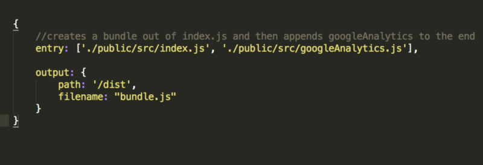
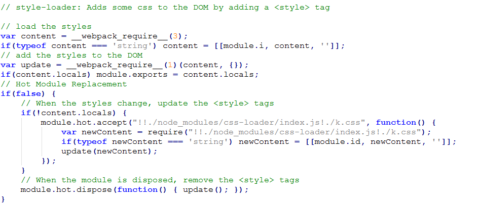

## Webpack
简单来说，Webpack 就是一个针对 JavaScript 代码的**模块打包工具**。但是自发布以来，它演变成了一个针对所有前端代码的管理工具（不管是其本身有意还是社区的意愿）。

`WebPack` 是一个模块打包工具，你可以使用`WebPack`管理你的模块依赖，并编绎输出模块们所需的静态文件。它能够很好地管理、打包Web开发中所用到的`HTML、Javascript、CSS`以及各种静态文件（图片、字体等），让开发过程更加高效。对于不同类型的资源，`webpack`有对应的模块加载器。`webpack`模块打包器会分析模块间的依赖关系，最后 生成了优化且合并后的静态资源。

<a>http://www.html-js.com/article/Study-notes-webpack-tutorial%203113</a>

<a>https://github.com/94dreamer/webpack</a>

<a>http://www.cnblogs.com/vajoy/p/4650467.html</a>

webpack基本配置文件
``` javascript
module.exports = {
  entry: {
    // 文件入口配置
    index: './src/index',
    vendor: [
      'react',
      'react-dom'
    ]
    // 为了优化，切割代码，提取第三方库（实际上，我们将会引入很多第三方库）vendor里的列表，会把依赖库单独抽出来成为一个vendor.js,其余非依赖代码是bundle.js。最后网站分别用script引用即可
  },
  // 页面入口文件配置

  output: {
    // 文件输出配置

    path: path.join(__dirname, 'dist'),
    // 输出目录的配置，模板、样式、脚本、图片等资源的路径配置都相对于它

    publicPath: '',
    // 模板、样式、脚本、图片等资源对应的server上的路径

    filename: 'bundle.js'
    // 命名生成的JS
  },

  plugins: [
    new webpack.optimize.OccurrenceOrderPlugin(),
    // webapck 会给编译好的代码片段一个id用来区分
    // 而这个插件会让webpack在id分配上优化并保持一致性。
    // 具体是的优化是：webpack就能够比对id的使用频率和分布来得出最短的id分配给使用频率高的模块

    new webpack.optimize.UglifyJsPlugin({
      // 压缩代码
      compressor: {
        warnings: false
      }
    }),

    new webpack.DefinePlugin({
      'process.env': {
        'NODE_ENV': JSON.stringify('production')
      }
    }),
    // 很多库的内部，有process.NODE_ENV的判断语句，
    // 改为production。最直观的就是没有所有的debug相关的东西，体积会减少很多


    new webpack.optimize.CommonsChunkPlugin('vendor', 'vendor.js' ),
    // 'vendor' 就是把依赖库(比如react react-router, redux)全部打包到 vendor.js中
    // 'vendor.js' 就是把自己写的相关js打包到bundle.js中
    // 一般依赖库放到前面，所以vendor放第一个

    new HtmlWebpackPlugin({
      title: '产品模式',
      filename:'index.html',
      // 文件名以及文件将要存放的位置

      favicon:'./src/favicon.ico',
      // favicon路径

      template:'./src/template.html',
      // html模板的路径

      inject:'body',
      // js插入的位置，true/'head'  false/'body'

      chunks: ['vendor', 'index' ],
      // 指定引入的chunk，根据entry的key配置，不配置就会引入所有页面的资源

      hash:true,
      // 这样每次客户端页面就会根据这个hash来判断页面是否有必要刷新
      // 在项目后续过程中，经常需要做些改动更新什么的，一但有改动，客户端页面就会自动更新！

      minify:{
        // 压缩HTML文件
        removeComments:true,
        // 移除HTML中的注释

        collapseWhitespace:false
        // 删除空白符与换行符
      }
    })
  ],

  resolve: {
    extensions: ['', '.js', 'jsx']
  },
  // 实际就是自动添加后缀，默认是当成js文件来查找路径
  // 空字符串在此是为了resolve一些在import文件时不带文件扩展名的表达式

  module: {
    loaders: [
      {
        test: /\.js$/,
        loaders: ['babel'],
        exclude: /node_modules/,
        include: __dirname
      }
    ]
  }
}

```


### entry值类型与含义
Entry配置项告诉Webpack应用的根模块或起始点在哪里，它的值可以是字符串、数组或对象。

如果你想添加多个彼此不互相依赖的文件，你可以使用数组格式的值。


这样会生成一个bundle.js,这个js的构成是index.js打包后，最后接入(append)googleAnalytics.js

entry的值如果是对象的话

假设你的应用是多页面的（multi-page application）而不是SPA，有多个html文件（index.html和profile.html）。然后你通过一个对象告诉Webpack为每一个html生成一个bundle文件。

以下的配置将会生成两个js文件：indexEntry.js和profileEntry.js分别会在index.html和profile.html中被引用。

注意entry里的条目只要是模块都可以，比如放个"babel-polyfill"什么的

### module

关于模块的加载相关，我们就定义在module.loaders中。这里通过正则表达式去匹配不同后缀的文件名，然后给它们定义不同的加载器。比如说给less文件定义串联的三个加载器（！用来定义级联关系）：

``` javascript
module: {
     loaders: [
         { test: /\.js?$/, loaders: ['react-hot', 'babel'], exclude: /node_modules/ },
         { test: /\.js$/, exclude: /node_modules/, loader: 'babel-loader'},
         { test: /\.css$/, loader: "style!css" },
         { test: /\.less/, loader: 'style-loader!css-loader!less-loader'}
     ]
 }
```

test 项表示匹配的资源类型， loader 或 loaders 项表示用来加载这种类型的资源的loader

！ 用来定义loader的串联关系，”-loader”是可以省略不写的，多个loader之间用“!”连接起来，但所有的加载器都需要通过 npm 来加载。

给css和less还有图片添加了loader之后，我们不仅可以像在node中那样require js文件了，我们还可以require css、less甚至图片文件：

 1. require('./bootstrap.css');
 2. require('./myapp.less');
 3. var img = document.createElement('img');
 4. img.src = require('./glyph.png');

注意， require() 还支持在资源path前面指定loader，即 require(![loaders list]![source path]) 形式

require("!style!css!less!bootstrap/less/bootstrap.less");
// “bootstrap.less”这个资源会先被"less-loader"处理，
// 其结果又会被"css-loader"处理，接着是"style-loader"
// 可类比pipe操作

**但是需要知道的是，这样require来的文件会内联到 js bundle中。**

假如我引入了k.css与kout.css到js中，查看转换后的源码



可见require css模块以后，js中是动态生成了style标签，并且每一个css都自动生成一个style标签括起来。

### loaders
刚才module里其实已经说得很清楚了，loader就是webpack的一种组件(也是根据npm管理，要先用npm来安装[比如先`npm install less-loader style-loader`])

通过使用不同的loader，webpack有能力调用外部的脚本或工具，实现对不同格式的文件的处理，比如说分析转换scss为css，或者把下一代的JS文件（ES6，ES7)转换为现代浏览器兼容的JS文件，对React的开发而言，合适的Loaders可以把React的中用到的JSX文件转换为JS文件。

Loaders需要单独安装并且需要在webpack.config.js中的modules关键字下进行配置,就跟之前讲解module的时候一样。

### 插件（Plugins）
插件（Plugins）是用来拓展Webpack功能的，它们会在整个构建过程中生效，执行相关的任务。Loaders和Plugins常常被弄混，但是他们其实是完全不同的东西，可以这么来说，loaders是在打包构建过程中用来处理源文件的（JSX，Scss，Less..），一次处理一个，插件并不直接操作单个文件，它直接对整个构建过程其作用。

要使用某个插件，我们需要通过npm安装它，然后要做的就是在webpack配置中的plugins关键字部分添加该插件的一个实例（plugins是一个数组）继续看例子，我们添加了一个实现版权声明的插件。
