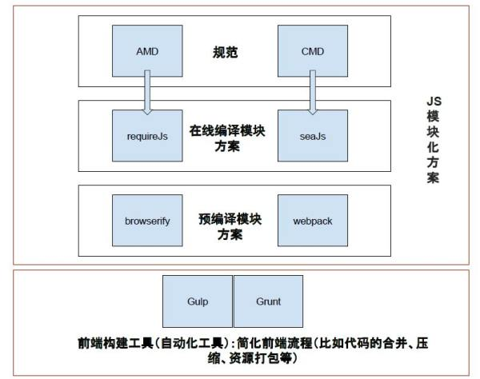

## 谈谈各构件工具之间的关系

阅读前见前端模块化笔记

上一张图解释

Gulp / Grunt 是一种工具，能够优化前端工作流程。比如自动刷新页面、combo、压缩css、js、编译less等等。简单来说，就是使用Gulp/Grunt，然后配置你需要的插件，就可以把以前需要手工做的事情让它帮你做了。

说到 browserify / webpack ，那还要说到 seajs / requirejs 。这四个都是JS模块化的方案。其中seajs / require 是一种类型，browserify / webpack 是另一种类型。

 - seajs / require : 是一种在线"编译" 模块的方案，相当于在页面上加载一个 CMD/AMD 解释器。这样浏览器就认识了 define、exports、module 这些东西。也就实现了模块化。
 - browserify / webpack : 是一个预编译模块的方案，相比于上面 ，这个方案更加智能。没用过browserify，这里以webpack为例。首先，它是预编译的，不需要在浏览器中加载解释器。另外，你在本地直接写JS，不管是 AMD / CMD / ES6 风格的模块化，它都能认识，并且编译成浏览器认识的JS。

这样就知道，Gulp是一个工具，而webpack等等是模块化方案。Gulp也可以配置seajs、requirejs甚至webpack的插件。

### bower 和 npm
npm属于node模块的管理器。而spm和bower是前端模块管理。这两者大的区别有两点：

 - NPM针对node模块，原生支持commonJS，而前端模块除非该管理器自己定了，否则规范是无法统一的。即便规定了commonJS，那么必定会有配套工具打包来实现实际的运转。
 - 处理依赖的方式不同。NPM针对的node模块，它的依赖是树状的。项目中用到的A,B,C三个模块，他们可以分别依赖不同版本的lodash，而互不影响。但是前端模块除非做了很好的模块隔离（如实现了commonJS，并能很好地进行打包，即便如此，前端环境的特殊性也无法忍受相同模块的不同版本并存。比如页面中引入两个版本的jQuery，代码数据传输X2），否则一般的依赖都是扁平的。

**bower在安装流程基本上可以简单认为是将注册的git地址中的特定tag clone一份到你本地的bower_components 目录中。**

bower下载包时会顺带把依赖也下载下来，并且是平行结构。
