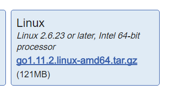

# Fabric搭建和部署
fabric就不多做介绍了，直奔主题，如何部署Fabric网络。

## 安装go
首先就是安装Go语言环境。

去到golang的官网：`https://golang.org/dl/`



得到下载网址，然后wget到linux下：

```
wget https://dl.google.com/go/go1.11.2.linux-amd64.tar.gz

tar -xvf go1.11.2.linux-amd64.tar.gz

// 移动到标准软件安装目录下
sudo mv go /usr/local

export GOPATH=/usr/local/go
export
```

## 安装docker
接下来我们安装docker

我们可以根据官方文档来进行安装：[文档](https://docs.docker.com/install/linux/docker-ce/ubuntu/#prerequisites)

由于命令时常变化，就不贴安装方法了。注意安装docker是要先建立仓库的。

输出docker --version查看版本就知道是否成功了。

## 安装docker compose
参见docker方面笔记

## 拉取fabric源码

```
git clone https://github.com/hyperledger/fabric.git
```

然后由于fabric的部署是依赖docker的，节点的部署当然都需要docker镜像，所以我们要去拉镜像。

## 参考

[区块链开源实现FABRIC快速部署及CLI体验](https://www.taohui.pub/2018/05/22/%E5%8C%BA%E5%9D%97%E9%93%BE%E5%BC%80%E6%BA%90%E5%AE%9E%E7%8E%B0fabric%E5%BF%AB%E9%80%9F%E9%83%A8%E7%BD%B2%E5%8F%8Acli%E4%BD%93%E9%AA%8C/)

[HyperLedger Fabric 1.1 End-2-End 起步示例](https://www.jianshu.com/p/a2692a495a2c)
