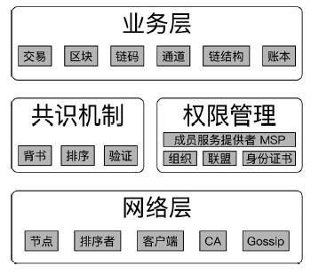
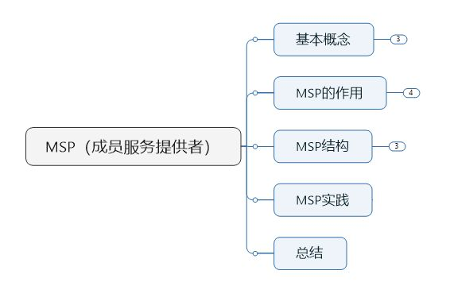
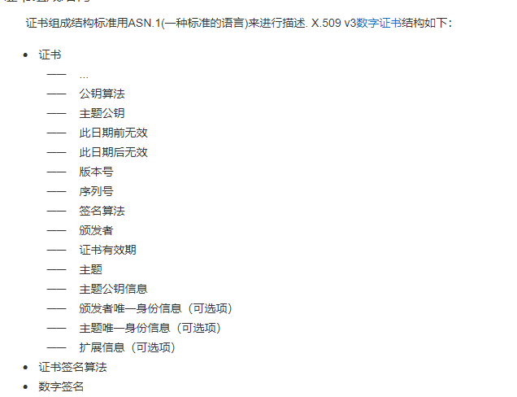
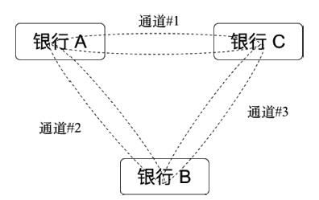
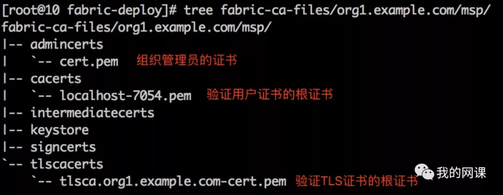
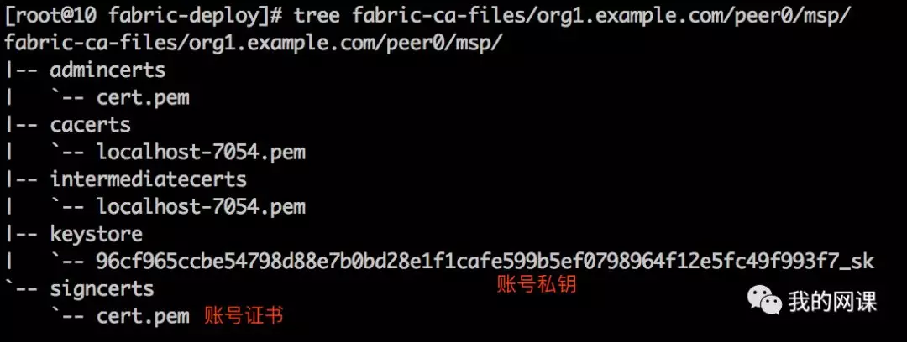

# MSP基础
Fabric的架构中，有MSP这样一个逻辑结构，这个结构主要承担权限管理的作用。



上图是Fabric的大致结构，可以看到权限管理那一部分服务是由MSP来提供的。




MSP是**Membership Service Provider**的缩写，直译为成员关系服务提供者。

有几个相关的术语，必须要先了解清楚。

### CA
CA是PKI系统中通信**双方信任的实体**，被称为**可信第三方（Trusted Third Party，简称TTP）**。作为可信第三方的行为具有非否认性。

CA通过证书证实他人的公钥信息，证书上有CA的签名。用户如果因为信任证书而导致了损失，证书可以作为有效的证据用于追究CA的法律责任。正是因为CA愿意给出承担责任的承诺，所以也被称为可信第三方。

### certificate 证书
证书（certificate）是Fabric中权限管理的基础。目前采用了基于ECDSA算法的非对称加密算法来生成公钥和私钥，证书格式则采用了X.509的标准规范。

所谓的X509规范标准，其实就是一种非常通用的证书格式。一份X.509证书是一些标准字段的集合，这些字段包含有关用户或设备及其相应公钥的信息。X.509标准定义了证书中应该包含哪些信息，并描述了这些信息是如何编码的(即数据格式)

根据百度百科，证书里的内容大致如下图



总之就是，Fabric中采用单独的Fabric CA项目来管理证书的生成。每一个实体、组织都可以拥有自己的身份证书，并且证书也遵循了组织结构，方便基于组织实现灵活的权限管理。

**zwlj：我们都知道证书用来确定某个事物的真实性，需要CA的(数字)签名来背书。那么追溯到源头，则无可背书，因此则有了自己签发的根证书，有了根证书就可以自己说明自己是一个合法的节点，也就是根CA需要一个自己签发的证书证明自己。**

### 成员&组织
成员Member是拥有网络唯一根证书的合法独立实体，在fabric网络里就相当于提供服务的节点s(可能还不止一个)。一个组织中的成员可以根据网络中流量的要求，提供不同数量的节点服务来满足网络中的访问量。

组织（organization）代表**一组拥有共同信任的根证书**（可以为根CA证书或中间CA证书）的成员。简而言之就是一组来源于同一个组织的节点。



如上图所示，三家银行一共三个组织，两两加入到同一个通道中彼此进行相关数据交互，而无需担心被其他人看到。

### Consortium 联盟
联盟由若干组织构成的集合，是联盟链场景所独有的结构形式。联盟一般用于多个组织相互合作的场景，例如某联盟中指定需要所有参与方同时对交易背书，才允许在网络中进行执行。


**联盟中的组织成员会使用同一个排序服务**，并且遵循相同的通道创建策略（Channel-CreationPolicy）。

### MSP成员关系服务提供者
成员服务提供者（MSP）是一个提供抽象化成员操作框架的组件。

MSP将颁发与校验证书，以及用户认证背后的所有密码学机制与协议都抽象了出来。

为了处理网络成员身份和身份，成员服务提供者(MSP)管理用户id，并对网络中的所有参与者进行身份验证。一个Fabric区块链网络可以由一个或多个MSPs控制。这提供了成员操作的模块化，以及跨不同成员标准和体系结构的互操作性。

对于每个MSP实例，MSP标识符都必须独一无二

### 成员服务Member Service
成员是最基本的元素，它对应的是我们Fabric网络中的Peer节点或者Order节点或者Fabric-CA。

总结为一句话，成员关系服务提供者，给成员提供成员服务。这种服务是基于PKI的MSP实现的

## MSP的实现
其实说了这么多，体现在Fabric网络里，MSP其实就是一组目录和一组文件。也就是一个包含了根证书，证书，和私钥的目录。

组织organization的MSP目录中，包含的是组织管理员的证书、用来验证用户证书有效性的根证书、和验证TLS通信使用的证书的根证书。


下图中，就是组织org1.example.com的msp目录，里面只有三个证书：



组织的msp目录中包含的全部是可以公开的证书，没有私钥。组织的msp目录，是要被写入到system chain中的。

用户要想接入到Fabric网络中，必须向拥有根证书私钥的机构，申请一个证书。通过这个限制，保证Fabric网络中的参与者的身份都是真实的（参与者的证书被盗用除外）。

**除了组织的msp目录之外，还有组件的msp目录和用户的msp目录**。组件的msp目录和用户的msp目录**其实是一回事**，只不过组件msp的使用者是Fabric网络中的peer和orderer程序，而用户msp目录的使用者是Fabric网络之外的个人或者客户端。

换言之，访问Fabric网络的个人或者客户端，要有一个账号；组成Fabric的网络的每个Peer和Orderer也要有一个账号。MSP中存放的就是每个账号的私钥和证书。



admincerts目录，这个目录里存放的是某个账号的证书。

在Fabric中有一些操作是可以设置为只有管理员才能执行的，譬如部署合约。怎样判断当前发起操作的是不是管理员呢？答案就是，检查当前用户的证书与admincerts中的证书是否一致。注意，组织msp中的admincerts是被写入到system chain中的。

Msp目录可以用Fabric提供的cryptogen命令生成，但是用cryptogen命令生成是非常不灵活的，生产环境中，应当使用Fabric提供的另一个组件FabricCA。

注意FabricCA不属于Fabric网络，它是网络之外的一个用来签署证书的服务。借助FabricCA，还可以实现账号的分级，简单说就是一个组织的管理员，可以自由地创建属于该组织的子账号。（这是刚需）

### MSP目录的进一步理解
从MSP生成目录结构来分析，其实MSP确实是分成了三块，channel MSP(也就是之前说的组织MSP),本地MSP(Local MSP)也就是代表peer或者order的节点MSP，还有用户MSP(也属于local MSP)

在我们根据crypto bin文件产生出一系列MSP目录以后，结构详解如下：

```
org1.example.com/
├── ca     # 存放组织Org1的根证书和对应的私钥文件，默认采用EC算法，证书为自签名。组织内的实体将基于该根证书作为证书根。
│   ├── ca.org1.example.com-cert.pem
│   └── dfb841b77804d726eea25231ae5e89a31901ca0538688a6d764731148f0bdc5b_sk
├── msp    # 存放代表该组织的身份信息。
│   ├── admincerts         # 组织管理员的身份验证证书，被根证书签名。
│   │   └── Admin@org1.example.com-cert.pem
│   ├── cacerts # 组织的根证书，同ca目录下文件。
│   │   └── ca.org1.example.com-cert.pem
│   └── tlscacerts          # 用于TLS的CA证书，自签名。
│       └── tlsca.org1.example.com-cert.pem
├── peers   # 存放属于该组织的所有Peer节点
│   ├── peer0.org1.example.com    # 第一个peer的信息，包括其msp证书和tls证书两类。
│   │   ├── msp # msp相关证书   
│   │   │   ├── admincerts  # 组织管理员的身份验证证书。Peer将基于这些证书来认证交易签署者是否为管理员身份。
│   │   │   │   └── Admin@org1.example.com-cert.pem
│   │   │   ├── cacerts     # 存放组织的根证书
│   │   │   │   └── ca.org1.example.com-cert.pem
│   │   │   ├── keystore    # 本节点的身份私钥，用来签名
│   │   │   │   └── 59be216646c0fb18c015c58d27bf40c3845907849b1f0671562041b8fd6e0da2_sk
│   │   │   ├── signcerts   # 验证本节点签名的证书，被组织根证书签名 
│   │   │   │   └── peer0.org1.example.com-cert.pem
│   │   │   └── tlscacerts  # TLS连接用到身份证书，即组织TLS证书
│   │   │       └── tlsca.org1.example.com-cert.pem
│   │   └── tls # tls相关证书
│   │       ├── ca.crt      # 组织的根证书
│   │       ├── server.crt  # 验证本节点签名的证书，被组织根证书签名
│   │       └── server.key  # 本节点的身份私钥，用来签名
│   └── peer1.org1.example.com    # 第二个peer的信息，结构类似。（此处省略。）
│       ├── msp
│       │   ├── admincerts
│       │   │   └── Admin@org1.example.com-cert.pem
│       │   ├── cacerts
│       │   │   └── ca.org1.example.com-cert.pem
│       │   ├── keystore
│       │   │   └── 82aa3f8f9178b0a83a14fdb1a4e1f944e63b72de8df1baeea36dddf1fe110800_sk
│       │   ├── signcerts
│       │   │   └── peer1.org1.example.com-cert.pem
│       │   └── tlscacerts
│       │       └── tlsca.org1.example.com-cert.pem
│       └── tls
│           ├── ca.crt
│           ├── server.crt
│           └── server.key
├── tlsca    # 存放tls相关的证书和私钥。
│   ├── 00e4666e5f56804274aadb07e2192db2f005a05f2f8fcfd8a1433bdb8ee6e3cf_sk
│   └── tlsca.org1.example.com-cert.pem
└── users    # 存放属于该组织的用户的实体
    ├── Admin@org1.example.com    # 管理员用户的信息，其中包括msp证书和tls证书两类。
    │   ├── msp # msp相关证书
    │   │   ├── admincerts     # 组织根证书作为管理员身份验证证书 
    │   │   │   └── Admin@org1.example.com-cert.pem
    │   │   ├── cacerts        # 存放组织的根证书
    │   │   │   └── ca.org1.example.com-cert.pem
    │   │   ├── keystore       # 本用户的身份私钥，用来签名
    │   │   │   └── fa719a7d19e7b04baebbe4fa3c659a91961a084f5e7b1020670be6adc6713aa7_sk
    │   │   ├── signcerts      # 管理员用户的身份验证证书，被组织根证书签名。要被某个Peer认可，则必须放到该Peer的msp/admincerts目录下
    │   │   │   └── Admin@org1.example.com-cert.pem
    │   │   └── tlscacerts     # TLS连接用的身份证书，即组织TLS证书
    │   │       └── tlsca.org1.example.com-cert.pem
    │   └── tls # 存放tls相关的证书和私钥。
    │       ├── ca.crt       # 组织的根证书
    │       ├── server.crt   # 管理员的用户身份验证证书，被组织根证书签名
    │       └── server.key   # 管理员用户的身份私钥，被组织根证书签名。
    └── User1@org1.example.com    # 第一个用户的信息，包括msp证书和tls证书两类
        ├── msp # msp证书相关信息
        │   ├── admincerts   # 组织根证书作为管理者身份验证证书。
        │   │   └── User1@org1.example.com-cert.pem
        │   ├── cacerts      # 存放组织的根证书
        │   │   └── ca.org1.example.com-cert.pem
        │   ├── keystore     # 本用户的身份私钥，用来签名
        │   │   └── 97f2b74ee080b9bf417a4060bfb737ce08bf33d0287cb3eef9b5be9707e3c3ed_sk
        │   ├── signcerts    # 验证本用户签名的身份证书，被组织根证书签名
        │   │   └── User1@org1.example.com-cert.pem
        │   └── tlscacerts   # TLS连接用的身份证书，被组织根证书签名。
        │       └── tlsca.org1.example.com-cert.pem
        └── tls # 组织的根证书
            ├── ca.crt       # 组织的根证书
            ├── server.crt   # 验证用户签名的身份证书，被根组织证书签名
            └── server.key   # 用户的身份私钥用来签名。
```


上面目录详解了各个目录的作用，注意的是，里面有很多文件是重复的，所以不同的目录可能摆放了同一个文件。比如代表组织管理员的Admin证书，就出现在多个地方。

大概的证书签署(非TLS)流向就是 ca根证书->管理员证书->节点证书或者用户证书

组织的MSP是要写进区块链中的。只有组织的管理员才有修改channel的配置，所以要修改channel必须要有管理员私钥。


### 配置
配置分两种。

一种是组件的配置文件，也就是orderer的配置文件orderer.yaml以及peer的配置文件core.yaml。一种是system chain中的配置区块。

一个系统无论多庞大、多么复杂，扒到底，永远都是“命令+配置”。peer的配置文件是core.yaml，orderer的配置文件是orderer.yaml。

前面提到过，部署Fabric时使用的创世块（在orderer.yaml中指定的文件），是system chain的第一个区块。**这个区块通常是用configtxgen命令生成的。**

configtxgen除了可以生成创世块，还能将二进制的创世块转换成json格式。


## 参考

[9-HyperLedger-Fabric原理-MSP详解（一）-MSP基础](https://zhuanlan.zhihu.com/p/35683522)

[超级账本HyperLedger：Fabric掰开揉碎，一文解惑](https://mp.weixin.qq.com/s/dcTCI7k_tyAqGKbLmzYR_A)