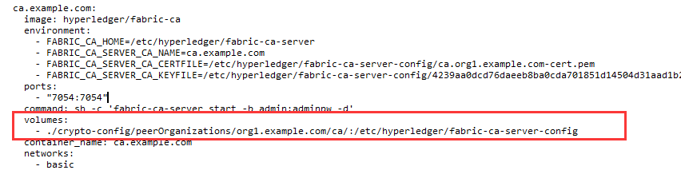
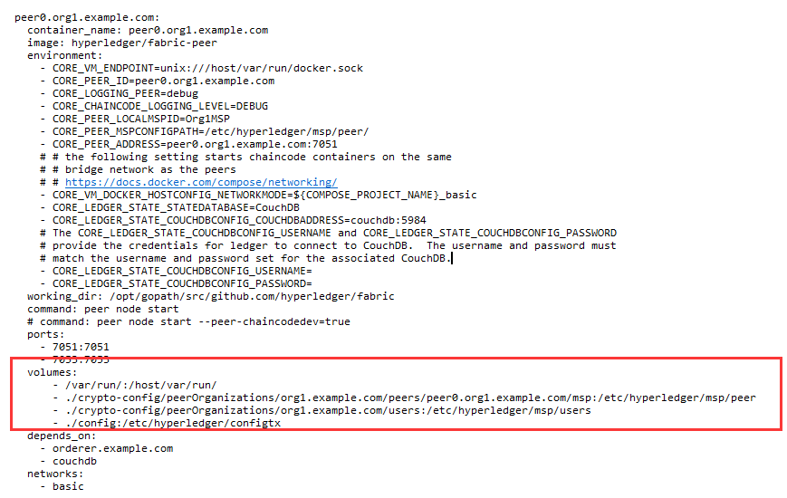

## 初探chaincode官方示例
在fabric官方实例的笔记中，我们大致对fabric的网络启动有了一个大致的感觉。

现在我们来看看官方给出的fabric应用示例


首先，还是first-network这个项目，我们进入这个项目，然后去fabcar目录。这个fabcar项目本身是一个js项目，我们先要`npm install`做初始化工作。

然后直接运行脚本 `./startFabric.sh`,来启动测试网络：

这个测试网络会启动peer节点，ordering节点，fabric-ca节点，和cli节点。


列出相关的docker进程，我们也可以看到被启动的节点。除此之外，我们也还看到了一个chaincode容器，也就是那个dev开头的docker容器，那个是被实例化之后的链码。

上述操作，一般由组织或者peer的管理员来完成，脚本使用cli容器来执行命令。

### application交互

客户端使用APIs来调用智能合约(即“链码”)。这些智能合约在网络中，并通过名称和版本进行标识。例如，标示为dev-peer0.org1.example.com-fabcar-1.0的容器，其名称是fabcar，版本号是1.0，运行peer是dev-peer0.org1.example.com

### 查询账本
查询是指如何从账本中读取数据。您可以查询单个或者多个键的值，如果账本是以类似于JSON这样的数据存储格式写入的，则可以执行更复杂的搜索（如查找包含某些关键字的所有资产）。

### 看log
初始化网络以后，我们可以看节点的日志,要注意单独开一个terminal：

```
docker logs -f ca.example.com
```

### 初始化application
在fabcar示例项目中，这本身就是一个js的客户端项目。

之前我们已经启动了fabric网络，并自动部署好了一份智能合约。接下来我们就按步骤，调用一下这个客户端look一下。

```
node enrollAdmin.js
```

这个命令是请求ca节点，注册一个身份。执行完上述命令后，项目内会多出一个hfc-key-store文件夹：


进去里面看到的是一些公钥和私钥，这些材料会在之后被用作认证。也就是说，上面的脚本帮助我们在ca服务器上注册了一个管理员的角色，之后我们其他普通角色都可以通过这个管理员角色作为代理中间人来进行一些操作。

接下来我们就注册一个新的User，调用registerUser.js脚本

```
node registerUser.js
```

执行完这个命令后，我们会发现hfc-key-store又多了点东西，多了user相关的公私钥材料。

做完上述准备以后，我们就可以通过角色身份来向超级账本请求数据了,run query.js就行。程序里请求时也是福袋了identity的，可以看到代码里有一句`fabric_client.getUserContext('user1', true);`

运行命令：

```
node query.js
```


可以看到十辆车的json数据被返回回来了。

代码运行的细节我们就可以通过阅读app代码来了解了，观察query.js的内容，可以看到代码首先进行了一些初始化操作，初始化出一个fabric-client对象。然后这个client对象初始化并装载一个store对象，然后装载一个crypto对象(从hfc目录取材料)。接下来就是返回一个user身份对象，之后的请求都是基于这个user身份对象来执行的。

从构造的请求中，我们可以看出程序调用了智能合约的queryAllCars方法。

接下来我们就可以去智能合约代码看看相关的调用了，合约代码给出了两个版本，node版本和go版本，都可以看看。观察代码可以知道，逻辑就是从世界状态(World State 就是账本中保存的键值对集合)取出一个一个的car对象，解析之后返回json串。

### 更新账本
下图给出了智能合约更新账本的流程：


更新会先被提议，背书，然后返回。再之后会交给order，然后order会通知写到所有peer的账本当中。

项目中的invoke.js脚本就能帮助我们做到这一件事。我们编辑这个代码，并且修改一下代码块：


执行这个js之后我们就可以看到返回结果：


之后我们可以query看结果。看到CAR10就知道添加成功了。

### 有关enroll admin和register user的zwlj
初看官方示例的时候，对于为什么要在真正调用之前运行enroll admin和register user很不解。

后来经过一些分析，初步有了一些自己的想法。

首先就是，我们回顾一下CA的作用，fabric ca就是一个权威服务器，他可以为我们的身份做背书。类比一下https的套路(可以看看相关笔记)，我们就知道，我们的浏览器其实一般都内置了一些权威机构的根证书，这样我们在验证一个网站的证书是否合法的时候，只要看看这些证书的上层证书是不是在我们的根证书里就可以了。

同理，我们fabric网络的各个节点中，都会内置一份根证书的，而这份根证书就是fabric ca的证书。回忆一下，我们在官方给出的samples中，都是通过二进制文件来生成根证书，以及相关组织的证书的。然后组建模拟网络的时候，docker compose配置文件里都有映射证书的位置：






单机的docker环境下我们可以通过映射一套文件去偷懒，但是生产环境，机器很多的情况下，这样就不好了。所以我们都是在建立一个fabric-ca集群，
然后生产处fabric-ca的根证书，然后这份更证书最后再想办法同步到其他order和peer节点去。

回到之前enroll admin这个问题上来，听过实际操作检验，每次对fabric网络进行调用的时候，确实是需要一个身份来进行操作的。这个身份还分为两层，一层是admin，管理一般的user用户身份。admin的身份是根据之前的根证书来进行背书的。所以我们客户端在可以调用fabric网络之前，必须先要已经有一个身份，这就是enroll admin和registerUser所做的事情。前者请求CA Server获取一个admin身份，后者利用这个admin身份进一步register一个User。