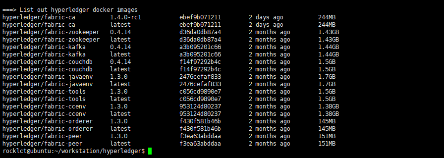
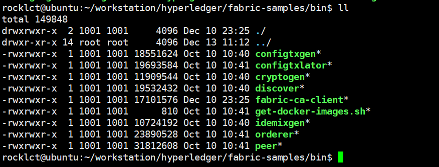
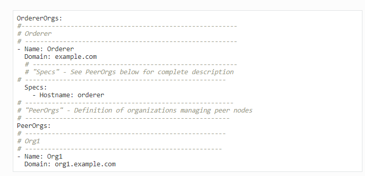
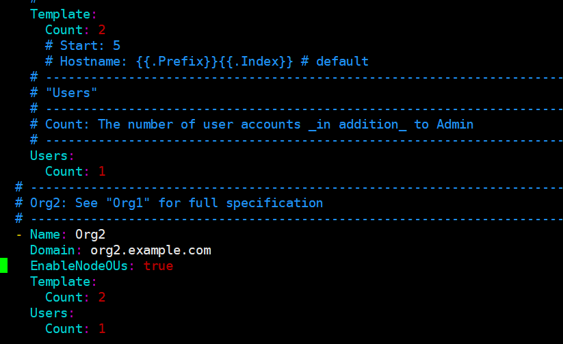
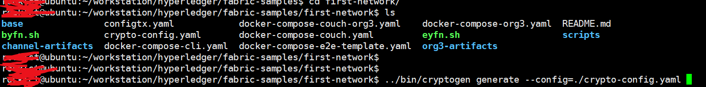
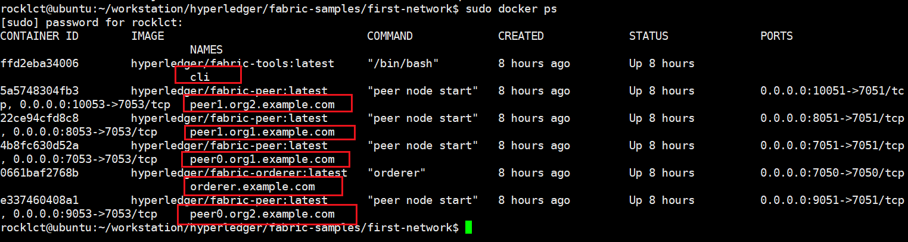
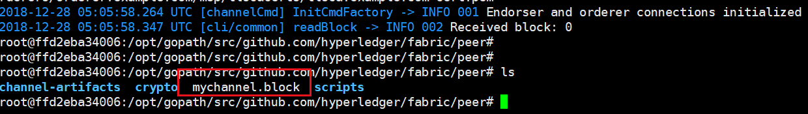

# 跑通fabric官方实例
以fabric 1.3为例，我们尝试去跑通官方给出的fabric 例子。

## 执行拉取脚本
执行官方给出的这个命令


```
curl -sSL http://bit.ly/2ysbOFE | sudo bash -s 1.3.0
```



执行这个命令可厉害了，会先去拉取官方的fabric examples项目，然后接着会拉取部署fabric所需要的docker镜像。如上图，其实就是：

```
===> List out hyperledger docker images
hyperledger/fabric-ca          1.4.0-rc1           ebef9b071211        2 days ago          244MB
hyperledger/fabric-ca          latest              ebef9b071211        2 days ago          244MB
hyperledger/fabric-zookeeper   0.4.14              d36da0db87a4        2 months ago        1.43GB
hyperledger/fabric-zookeeper   latest              d36da0db87a4        2 months ago        1.43GB
hyperledger/fabric-kafka       0.4.14              a3b095201c66        2 months ago        1.44GB
hyperledger/fabric-kafka       latest              a3b095201c66        2 months ago        1.44GB
hyperledger/fabric-couchdb     0.4.14              f14f97292b4c        2 months ago        1.5GB
hyperledger/fabric-couchdb     latest              f14f97292b4c        2 months ago        1.5GB
hyperledger/fabric-javaenv     1.3.0               2476cefaf833        2 months ago        1.7GB
hyperledger/fabric-javaenv     latest              2476cefaf833        2 months ago        1.7GB
hyperledger/fabric-tools       1.3.0               c056cd9890e7        2 months ago        1.5GB
hyperledger/fabric-tools       latest              c056cd9890e7        2 months ago        1.5GB
hyperledger/fabric-ccenv       1.3.0               953124d80237        2 months ago        1.38GB
hyperledger/fabric-ccenv       latest              953124d80237        2 months ago        1.38GB
hyperledger/fabric-orderer     1.3.0               f430f581b46b        2 months ago        145MB
hyperledger/fabric-orderer     latest              f430f581b46b        2 months ago        145MB
hyperledger/fabric-peer        1.3.0               f3ea63abddaa        2 months ago        151MB
hyperledger/fabric-peer        latest              f3ea63abddaa        2 months ago        151MB
```

上面下载下来的镜像列表，我们用 `docker image ls`也能看到，一行代表一个instance，我们会发现每个image id都会有两个instance实例。

执行完命令后我们进入example目录，bin文件夹下，我们可以看到命令帮我们下载了很多需要用到的二进制程序，这些二进制程序其实都是platform-specific的。



### run the network
我们进到fabric sample的first network文件夹。

这个文件夹下已经有一个启动脚本`byfn.sh`，可以快速部署4个peer节点分属两个不同的org，并且还会启动一个容器服务，用以部署chaincode和加入peer到channel。

跟着文档走的话，很快就能启动一个网络。只需要执行

```
./byfn.sh -m generate
```

然后不断地按yes，即可。但是我们还是要慢慢缕清楚整个fabric网络启动的过程。

从脚本启动后输出的日志来看，启动网络主要有这么几个过程：

1. cryptogen加密生成(生成证书)
2. 创建引导排序服务
3. 创建channel通道，设置交易配置
4. 启动Org1的节点
5. 启动Org2的节点


接下来我们会在步骤上分析fabric网络的部署

## fabric网络部署

### 加密生成器crptogen
在MSP基础笔记中初步了解MSP概念之后，我们知道节点都需要证书来证明自己的身份。

我们将使用cryptogen工具为我们生成各种网络实体的加密材料（x509证书）。这些证书是身份的代表，它们允许在我们的网络实体进行交流和交易时进行签名/验证身份验证。

zwlj：也就是说，我们将使用这个工具，为各个节点创建一个证书。

要使用这个证书，我们首先需要写一个**crypto-config.yaml**配置文件，大致内容如下：



除了上面配置之外，还有count变量：



接下来我们要在了解一下交易生成器这个工具

### 配置交易生成器
这个二进制工具**configtxgen**也是帮助我们生成一些初始配置用的，比如创世区块的配置，channel的配置，peer的配置。

这个生成器对应的配置文件是**configtx.yaml**

### 手动生成配置(启动网络预操作)
在之前的案例里，我们运行了byfn.sh来集成我们这些操作。

#### 运行cryptogen
之前有介绍这个工具是用来产生证书的，假如我们在配置文件的目录下，手动执行工具，则有：



命令要打sudo，可以看到命令行输出了两个名字：

```
org1.example.com
org2.example.com
```

接着在项目文件夹下，我们就可以看到生成的配置文件夹crypto-config,里面会有分别的order配置文件夹和org对应的文件夹。这些就是相关的证书文件

接下来我们就要使用配置交易生成器来产生一些配置：

#### 运行configtxgen
注意这里运行configtxgen都默认使用了配置文件configtx.yaml

第一步是，设置全局变量，产生orderer创世区块。

```
export FABRIC_CFG_PATH=$PWD
../bin/configtxgen -profile TwoOrgsOrdererGenesis -outputBlock ./channel-artifacts/genesis.block
```

以上算是比较简单的一个创建，可以看出会把创世区块放到channel-artifacts目录下。

第二步，我们需要创建channel transaction配置。请确保替换$CHANNEL_NAME或者将CHANNEL_NAME设置为整个说明中可以使用的环境变量：

```
export CHANNEL_NAME=mychannel

# this file contains the definitions for our sample channel
../bin/configtxgen -profile TwoOrgsChannel -outputCreateChannelTx ./channel-artifacts/channel.tx -channelID $CHANNEL_NAME
```

执行完上述信息后会发现channel-artifacts里会生成一个channel.tx的文件。

在fabric基础的笔记里，我们提到了fabric有一个system chain，里面写入了节点相关的配置，比如锚节点(相当于节点leader)的信息。

第三步，接下来，我们将在正在构建的通道上定义Org1的anchor peer。请再次确认$CHANNEL_NAME已被替换或者为以下命令设置了环境变量：

```
../bin/configtxgen -profile TwoOrgsChannel -outputAnchorPeersUpdate ./channel-artifacts/Org1MSPanchors.tx -channelID $CHANNEL_NAME -asOrg Org1MSP
```

敲下上述命令，channel artifacts文件夹里又会生成一个`Org1MSPanchors.tx`文件。

同理我们可以得到Org2的配置：

```
../bin/configtxgen -profile TwoOrgsChannel -outputAnchorPeersUpdate ./channel-artifacts/Org2MSPanchors.tx -channelID $CHANNEL_NAME -asOrg Org2MSP
```

#### 启动网络
我们将利用docker-compose脚本来启动我们的区块链网络。docker-compose文件利用我们之前下载的镜像，并用以前生成的genesis.block来引导orderer。

完成上述的configtxgen步骤之后，准备工作便大致完成了，现在我们可以开始利用docker compose启动网络。我们要指定compose要用的配置文件：

```
docker-compose -f docker-compose-cli.yaml up -d
```

注意：如果要实时查看你的区块链网络的日志，请不要提供-d标志。如果你需要日志流，你需要打开第二个终端来执行CLI命令。


启动了这个docker指令后，容器已经在运行了。我们可以通过`sudo docker ps`指令来观看



可以看到启动了6个docker容器，一个叫cli，2个org1节点，2个org2节点，1个order节点。

并且从配置文件中，我们看到了docker使用了volume，可以理解为是一种映射，容器中文件的读写都会对应读写到宿主机器的某个目录下。


#### 环境变量的设置
假如我们相对其中一个节点，比如peer0.org1.example.com发出命令操作，我们就必须先设置几个环境变量。当然，一下环境变量不是在我们linux环境设置，而是设置到docker容器环境里。

对于此项目，环境变量其实已经默认写入docker-compose-base.yaml配置文件当中。

```
# Environment variables for PEER0

CORE_PEER_MSPCONFIGPATH=/opt/gopath/src/github.com/hyperledger/fabric/peer/crypto/peerOrganizations/org1.example.com/users/Admin@org1.example.com/msp
CORE_PEER_ADDRESS=peer0.org1.example.com:7051
CORE_PEER_LOCALMSPID="Org1MSP"
CORE_PEER_TLS_ROOTCERT_FILE=/opt/gopath/src/github.com/hyperledger/fabric/peer/crypto/peerOrganizations/org1.example.com/peers/peer0.org1.example.com/tls/ca.crt
```

#### 创建&加入信道(通过CLI容器)
之前跑容器的时候，我们知道有个容器叫cli，顾名思义我们应该是要通过这个容器来进行交互。

用以下命令进入容器：

```
docker exec -it cli bash
```

如果成功，你将看到下列信息：

```
root@0d78bb69300d:/opt/gopath/src/github.com/hyperledger/fabric/peer#
```

观察这个目录下的文件，可以知道这些文件都会被Volume到我们的host机器上。

接下来我们就能通过CLI程序做一些事了，比如我们通知order节点去加载channel的配置。我们之前不是用工具生成了一个channel.tx文件吗，那个就是交易的初始配置，我们可以通知order生成。

但是同时也要注意，我们通过cli来操作时，是有一个默认主体的，这个主体通过环境变量来切换。比如我们默认主体其实是peer0.org1.example.com，**这样我们之后用peer命令的时候，peer就是对应着那个(环境变量的)节点**。

```
export CHANNEL_NAME=mychannel

# the channel.tx file is mounted in the channel-artifacts directory within your CLI container
# as a result, we pass the full path for the file
# we also pass the path for the orderer ca-cert in order to verify the TLS handshake
# be sure to export or replace the $CHANNEL_NAME variable appropriately

peer channel create -o orderer.example.com:7050 -c $CHANNEL_NAME -f ./channel-artifacts/channel.tx --tls --cafile /opt/gopath/src/github.com/hyperledger/fabric/peer/crypto/ordererOrganizations/example.com/orderers/orderer.example.com/msp/tlscacerts/tlsca.example.com-cert.pem
```



敲下命令之后我们就得到反馈，order返回了一个mychannel.block，mychannel是我们刚才定义的channel名，返回的就是这个channel的一个创世区块。

我们将利用这个创世区块加入信道：

```
peer channel join -b <channel-ID.block>
```

得到结果


接下来也是重点了，我们刚才的命令只是操作了其中一个节点。假如我们想切换节点来操作，就要改变环境变量，然后再重复上面的操作(**改变peer命令操作的对象**)：

```
# Environment variables for PEER0

export CORE_PEER_MSPCONFIGPATH=/opt/gopath/src/github.com/hyperledger/fabric/peer/crypto/peerOrganizations/org1.example.com/users/Admin@org1.example.com/msp
export CORE_PEER_ADDRESS=peer0.org1.example.com:7051
export CORE_PEER_LOCALMSPID="Org1MSP"
export CORE_PEER_TLS_ROOTCERT_FILE=/opt/gopath/src/github.com/hyperledger/fabric/peer/crypto/peerOrganizations/org1.example.com/peers/peer0.org1.example.com/tls/ca.crt
```

**为了后续的方便操作，我们加入org2的peer0入channel，使用下面命令,下面命令没有export改变默认节点，而是直接在命令里赋值了**

```
CORE_PEER_MSPCONFIGPATH=/opt/gopath/src/github.com/hyperledger/fabric/peer/crypto/peerOrganizations/org2.example.com/users/Admin@org2.example.com/msp CORE_PEER_ADDRESS=peer0.org2.example.com:7051 CORE_PEER_LOCALMSPID="Org2MSP" CORE_PEER_TLS_ROOTCERT_FILE=/opt/gopath/src/github.com/hyperledger/fabric/peer/crypto/peerOrganizations/org2.example.com/peers/peer0.org2.example.com/tls/ca.crt peer channel join -b mychannel.block
```

### 更新锚节点(Anchor peer)
使用下面两个命令updete channel，去定义org1和org2的锚节点：

```
peer channel update -o orderer.example.com:7050 -c $CHANNEL_NAME -f ./channel-artifacts/Org1MSPanchors.tx --tls --cafile /opt/gopath/src/github.com/hyperledger/fabric/peer/crypto/ordererOrganizations/example.com/orderers/orderer.example.com/msp/tlscacerts/tlsca.example.com-cert.pem
```


接下来更新org2 由于要指定变量，所以命令长一点：

```
CORE_PEER_MSPCONFIGPATH=/opt/gopath/src/github.com/hyperledger/fabric/peer/crypto/peerOrganizations/org2.example.com/users/Admin@org2.example.com/msp CORE_PEER_ADDRESS=peer0.org2.example.com:7051 CORE_PEER_LOCALMSPID="Org2MSP" CORE_PEER_TLS_ROOTCERT_FILE=/opt/gopath/src/github.com/hyperledger/fabric/peer/crypto/peerOrganizations/org2.example.com/peers/peer0.org2.example.com/tls/ca.crt peer channel update -o orderer.example.com:7050 -c $CHANNEL_NAME -f ./channel-artifacts/Org2MSPanchors.tx --tls --cafile /opt/gopath/src/github.com/hyperledger/fabric/peer/crypto/ordererOrganizations/example.com/orderers/orderer.example.com/msp/tlscacerts/tlsca.example.com-cert.pem
```


### 执行chaincode
我们启动fabric节点，当然就是为了要执行chaincode啊，也就是在区块链上测试dapp环境。

我们执行下面命令：

```
# this installs the Go chaincode
peer chaincode install -n mycc -v 1.0 -p github.com/chaincode/chaincode_example02/go/
```

这个命令将chaincode代码安装到对应的节点文件系统中。


就做上面的操作还不够，回顾一下我们之前其实是把两个节点加入了channel，一个是org1的peer0，还有一个是org2的peer0，所以我们现在要在org2的peer0上也安装这个chaincode：

```
CORE_PEER_MSPCONFIGPATH=/opt/gopath/src/github.com/hyperledger/fabric/peer/crypto/peerOrganizations/org2.example.com/users/Admin@org2.example.com/msp CORE_PEER_ADDRESS=peer0.org2.example.com:7051 CORE_PEER_LOCALMSPID="Org2MSP" CORE_PEER_TLS_ROOTCERT_FILE=/opt/gopath/src/github.com/hyperledger/fabric/peer/crypto/peerOrganizations/org2.example.com/peers/peer0.org2.example.com/tls/ca.crt peer chaincode install -n mycc -v 1.0 -p github.com/chaincode/chaincode_example02/go/
```


接着，我们需要在channel上初始化这个chaincode。在输入命令的时候我们要用-p参数指定一个**背书策略**。

```
# be sure to replace the $CHANNEL_NAME environment variable if you have not exported it
# if you did not install your chaincode with a name of mycc, then modify that argument as well

peer chaincode instantiate -o orderer.example.com:7050 --tls --cafile /opt/gopath/src/github.com/hyperledger/fabric/peer/crypto/ordererOrganizations/example.com/orderers/orderer.example.com/msp/tlscacerts/tlsca.example.com-cert.pem -C $CHANNEL_NAME -n mycc -v 1.0 -c '{"Args":["init","a", "100", "b","200"]}' -P "AND ('Org1MSP.peer','Org2MSP.peer')"
```

注意 `-P "AND ('Org1MSP.peer','Org2MSP.peer')"`指定了背书策略，要求org1和org2都要有一个节点进行背书。

初始化成功以后，我们就可以开始一些测试性质的操作了：

比如查询：

```
peer chaincode query -C $CHANNEL_NAME -n mycc -c '{"Args":["query","a"]}'
```

调用：

```
peer chaincode invoke -o orderer.example.com:7050 --tls true --cafile /opt/gopath/src/github.com/hyperledger/fabric/peer/crypto/ordererOrganizations/example.com/orderers/orderer.example.com/msp/tlscacerts/tlsca.example.com-cert.pem -C $CHANNEL_NAME -n mycc --peerAddresses peer0.org1.example.com:7051 --tlsRootCertFiles /opt/gopath/src/github.com/hyperledger/fabric/peer/crypto/peerOrganizations/org1.example.com/peers/peer0.org1.example.com/tls/ca.crt --peerAddresses peer0.org2.example.com:7051 --tlsRootCertFiles /opt/gopath/src/github.com/hyperledger/fabric/peer/crypto/peerOrganizations/org2.example.com/peers/peer0.org2.example.com/tls/ca.crt -c '{"Args":["invoke","a","b","10"]}'
```

### 幕后
以上的所有操作，其实byfn.sh脚本文件都帮我们一键完成了。复杂的操作都帮我们封装了起来。

而上述的流程，无非就是通过configtx程序生成一个初始的交易配置channel.tx。然后用这个配置通知order让它生成一个创世区块，然后各个节点通过这个创世区块来假如channel。中途还会涉及到msp的指定，等

## 参考
[官方实例文档](https://hyperledger-fabric.readthedocs.io/en/release-1.3/install.html)
