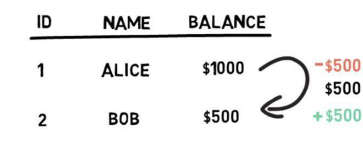

## 闪电贷

**闪电贷可以让我们在无需抵押品的情况下从指定的智能合约池中借入任何可用的资产金额**。

闪电贷是 DeFi 中有用的一个构件（building block），因为它可以用于套利、交换抵押品和自我清算等。

闪电贷款虽然最初是由 Marble 协议引入的，但由 **Aave** 和 **dYdX** 普及。（注：dYdX 是全球首个去中心化数字货币衍生品交易平台）

那么，闪电贷有什么好处呢？

闪贷必须在同一区块链交易中进行借贷和快速偿还。

### 交易

一个交易代表了一组必须以「原子方式」执行的操作，原子方式指的是要么所有的步骤都被执行，要么交易被回滚，一个步骤都不会被执行。

原子化交易，不同的步骤是同一个交易的一部分，它们是不可分割的，要么全有，要么全无。

ps：也就是所谓的事务性

### 以太坊交易

交易被分组并包含在 Ethereum 区块中。我们可以很方便地在任意的区块链浏览器（**例如 Etherscan**）上看到包含在特定区块中的所有交易。

一个 Ethereum 交易可以包含多个步骤，例如，在 **Compound** 上提供 ETH 并借出 DAI，在 **Curve** 上将借出的 DAI 的一半换成 USDC，在 **Uniswap** 上为 DAI/USDC 池提供流动性，所有这些都在一个 Ethereum 交易中完成。当然，如果其中任何一个步骤导致错误，整个交易将被回滚，所有步骤都不会发生。需要注意的是，即使合约执行失败，我们还是要付 gas 费的。

### 闪电贷详解

执行闪电贷最重要的是找到一个闪电贷提供商。Aave 或 dYdX 等项目开发了智能合约，允许 DeFi 用户从指定的池子中借到不同的币，前提条件是在同一个**以太坊**交易内偿还。

使用闪贷通常有固定的成本。例如，Aave 合约要求借款人归还初始金额+0.09% 的借款金额。0.09% 这笔费用将会分给存款人和集成商，前者给出了可供借贷的资金，后者为使用 Aave 的闪电贷 API 提供便利。这笔费用的一部分也会被换成 AAVE 代币。

一旦从借贷池中借到金额，它就可以用于其他套利操作，只要在不同步骤所处的区块链末端快速偿还贷款。

由于贷款必须在一次交易内偿还，所以不存在借款人不偿还借款的风险。唯一的风险就是一直存在的智能合约和平台风险。

闪电贷越来越受欢迎，有的用户在 Aave 上的借款金额高达 14M DAI。

#### 使用案例

闪电贷最常见的使用案例有 3 种。

#### 套利

**套利：**闪电贷可以放大成功套利的利润。

让我们想象一下，Uniswap 和 Curve 之间的 DAI/USDC 池存在价格差异。你可以在 Curve 上用 1 个 DAI 换取 1 个 USDC，但在 Uniswap 上您只需要 0.99 个 DAI 就可以买到 1 个 USDC。现在你可以尝试执行以下套利：

1.  通过闪电贷向 Aave 借 100,000 DAI。
2.  在 Uniswap 上将 100,000 DAI 换成 USDC，收到 101,010 USDC。
3.  在 Curve 上将 101,010 USDC 换成 101,010 DAI
4.  偿还初始 100,000 DAI + 0.09% 的费用 =100,090 美元
5.  利润 920 DAI

是不是看起来很好的样子？但我们必须考虑到以下几个因素：

1. **网络费用**--多步骤的套利交易可能成本不菲，在计算利润时，一定要将交易费用考虑在内。
2. **价格滑点**-- 一定要计算你在执行订单时将会遇到多少价格滑点（提示：这取决于交易额的大小和流动性池的流动性
3. **Frontrunning**-- 很有可能别人会发现同样的机会，并且会设法抢先你一步行动。最重要的是，监控 mempool 的机器人可以发现你的盈利套利机会，并以更高的 gas 费发送相同的交易把你的盈利机会「偷走」。

#### 更换抵押品

闪电贷的另一个用例是**更换抵押品**

假设你用 ETH 作为抵押品从 Compound 借了 DAI。你可以通过以下方式将抵押品从 ETH 换成例如 BAT：

1. 发起一笔闪电贷借出 DAI
2. 用借来的 DAI 偿还 Compound 中的贷款
3. 提取你的 ETH
4. 在 Uniswap 上将你的 ETH 换成 BAT
5. 提供 BAT 作为 Compound 的抵押品
6. 以你的 BAT 抵押品借出 DAI
7. 用借来的 DAI+费用偿还步骤 1 的闪电贷

通过这样一轮操作，额外付出借款金额的 0.09% 就能成功把你的抵押品从 ETH 换成了 BAT

#### 自我清算

还有一个应用例子是**自我清算**

想象一下下面的场景：你在 Compound 上有一笔以 ETH 作为抵押借出 DAI 的贷款。ETH 价格不断下跌，已经接近清算水平。你也没有或不想存入更多的 ETH 来降低你的清算水平，你也没有偿还贷款所需的 DAI。现在，与其让 MakerDAO 合约清算你的抵押品并向你收取清算费，不如采取以下步骤：

1. 发起闪电贷，借出一笔 DAI，金额是你在 Compound 上的欠债
2. 偿还 Compound 上的 DAI 贷款，提取 ETH
3. 将足够的 ETH 换成 DAI，以偿还步骤 1 的闪电贷+费用
4. 拿住你剩下的 ETH

这就是闪电贷最常见的 3 个用例，闪电贷的概念还比较新，未来还有很多应用例子有待发掘。