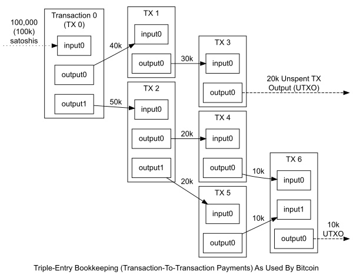

## 以太坊基础
以太坊区块链底层也是一个类似比特币网络的P2P 网络平台，智能合约运行在网络中的以太坊虚拟机里。网络自身是公开可接人的，任何人都可以接入并参与网络中数据的维护，提供运行以太坊虚拟机的资源。

### 智能合约的例子：智能赞助
假如：

1. 一个慈善机构搞募捐，称为受益者thebenefactor
2. 一个赞助实施方为这个慈善机构募捐，称为实施者therunner
3. 想要提供赞助的用户，称为赞助者thesponsor
4. 一个以太坊区块链的挖矿节点，验证交易，称为矿工theminer

我们的称为智能赞助(smartSponsor)的合约(contract)是:

1. 实施者therunner通过一个募捐活动为慈善机构募捐
2. 构建合约时，实施者therunner命名接受募捐的受益者thebenefactor
3. 实施者therunner然后邀请用户提供赞助，用户调用智能合约的函数(function), 这个函数的功能是从赞助者thesponsor的账号转移以太到合约(contract)中，**这些以太沉淀在合约中，直到有回调发生**
4. 在合约的整个生命周期，各方都可以看到谁是受益者thebenefactor，募到了多少以太，从谁哪儿募到(当然赞助者thesponsor可以匿名)

合约定了以后，两种现象必有其一：

1. 募捐照计划实施，实施者指示合约把全部募捐转移给受益者
2. 因为某种原因募捐实施不了，实施者指示合约把赞助者承诺的募捐退还

### 以太坊区块链层协议

#### 账户 ，而非UTXO
比特币及其许多衍生品，都将用户的余额信息存储在UTXO结构中，系统的整个状态由一系列的“有效的输出”组成（可以将这些“有效的输出”想象成钱币）。每个UTXO都有拥有者和自身的价值属性。一笔交易在消费若干个UTXO同时也会生成若干个新的UTXO。(详见精通比特币的笔记)

因此，比特币系统中，用户的“余额”是该用户的私钥能够有效签名的所有UTXO的总和。下图展示了比特币系统中交易输入输出过程：

但是，以太坊抛弃了UTXO的方案，转而使用更简单的方法：采用状态(state)的概念存储一系列账户，**每个账户都有自己的余额，以及以太坊特有的数据（代码或内部存储器）**。

如果交易发起方的账户余额足够支付交易费用，则交易有效，那么发起方账户会扣除相应金额，而接受账户则计入该金额。**某些情况下，接受账户内有需要执行的代码，则交易会触发该代码的执行**，那么账户的内部存储器可能就会发生变化，甚至可能会创建额外的信息发送给其他账户，从而导致新的交易发生。

zwlj:是不是就可以理解为，代码作为一个变量存储在一个交易中，当某个交易发生时，顺带触发这个代码，执行一些合约程序。

##### 非UTXO的优点
1. 节省大量空间。UTXO可能有多个，但是余额只用保留一个。
2. 简单。以太坊编码更简单，而且易于理解。
3. 轻客户端
