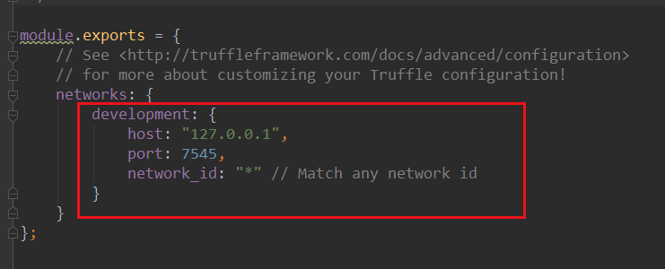

## 以太坊dapp开发基础

部署合约最重要的工具有如下几种：

 - Truffle：是以太坊的开发环境、测试框架和资产通道。换句话说，它可以帮助你开发、发布和测试智能合约等等。你可以阅读有关 Truffle 套件的文档，了解更多信息。

 - Ganache：以前叫作 TestRPC，它在 TestRPC 和 Truffle 的集成后被重新命名为 Ganache。Ganache 的工作很简单：**创建一个虚拟的以太坊区块链**，并生成一些我们将在开发过程中用到的虚拟账号。

 - Mist：Mist 是一个分布式网络 apps 的浏览器，相当于是只针对 Dapps 的 Chrome 或 Firefox。目前来说，它仍然是不安全的，所以你还不能在不受信任的 dapp 中使用它。

 - 以太坊钱包：它是 Mist 的一个版本，但只启动一个 dapp ——以太坊钱包。Mist 和以太坊钱包只是 UI（用户界面）前端，我们还需要一个将我们连接到以太坊区块链的核心程序（它可以是一个真正的以太坊区块链，也可以是一个测试版的）。

- Geth：Geth 是把你连接到区块链的核心应用程序，它也可以启动一个新的区块链（在我们这个示例中，我们将创建一个本地测试网区块链），创建合约，挖掘以太币等。

#### Truffle
Truffle是针对基于以太坊的Solidity语言的一套开发框架。本身基于Javascript。

Truffle对客户端做了深度集成。开发，测试，部署一行命令都可以搞定。不用再记那么多环境地址，繁重的配置更改，及记住诸多的命令。

zwlj：也就是基于solidity和以太坊多了一层封装，让你更方便的进行开发了。

### 开始
话不多说，我们从Truffle开始，试着上手dapp的开发。

我们现用npm全局安装truffle和ganache

```
npm install -g truffle
npm install -g ganache-cli
```

这两步比较快就能完成，接下来我们创建一个truffle项目：

```
truffle init
```


可以看到会产生如上目录

我们在contracts文件夹中添加solidity代码文件，我们添加一个Wrestling.sol代码。

约100行的代码如下：

```
pragma solidity ^0.4.18;

    /**
    * Example script for the Ethereum development walkthrough
    */

contract Wrestling {
    /**
    * Our wrestlers
    */
	address public wrestler1;
	address public wrestler2;

	bool public wrestler1Played;
	bool public wrestler2Played;

	uint private wrestler1Deposit;
	uint private wrestler2Deposit;

	bool public gameFinished;
    address public theWinner;
    uint gains;

    /**
    * The logs that will be emitted in every step of the contract's life cycle
    */
	event WrestlingStartsEvent(address wrestler1, address wrestler2);
	event EndOfRoundEvent(uint wrestler1Deposit, uint wrestler2Deposit);
	event EndOfWrestlingEvent(address winner, uint gains);

    /**
    * The contract constructor
    */
	constructor() public {
		wrestler1 = msg.sender;
	}

    /**
    * A second wrestler can register as an opponent
    */
	function registerAsAnOpponent() public {
        require(wrestler2 == address(0));

        wrestler2 = msg.sender;

        emit WrestlingStartsEvent(wrestler1, wrestler2);
    }

    /**
    * Every round a player can put a sum of ether, if one of the player put in twice or
    * more the money (in total) than the other did, the first wins
    */
    function wrestle() public payable {
    	require(!gameFinished && (msg.sender == wrestler1 || msg.sender == wrestler2));

    	if(msg.sender == wrestler1) {
    		require(wrestler1Played == false);
    		wrestler1Played = true;
    		wrestler1Deposit = wrestler1Deposit + msg.value;
    	} else {
    		require(wrestler2Played == false);
    		wrestler2Played = true;
    		wrestler2Deposit = wrestler2Deposit + msg.value;
    	}
    	if(wrestler1Played && wrestler2Played) {
    		if(wrestler1Deposit >= wrestler2Deposit * 2) {
    			endOfGame(wrestler1);
    		} else if (wrestler2Deposit >= wrestler1Deposit * 2) {
    			endOfGame(wrestler2);
    		} else {
                endOfRound();
    		}
    	}
    }

    function endOfRound() internal {
    	wrestler1Played = false;
    	wrestler2Played = false;

    	emit EndOfRoundEvent(wrestler1Deposit, wrestler2Deposit);
    }

    function endOfGame(address winner) internal {
        gameFinished = true;
        theWinner = winner;

        gains = wrestler1Deposit + wrestler2Deposit;
        emit EndOfWrestlingEvent(winner, gains);
    }

    /**
    * The withdraw function, following the withdraw pattern shown and explained here:
    * http://solidity.readthedocs.io/en/develop/common-patterns.html#withdrawal-from-contracts
    */
    function withdraw() public {
        require(gameFinished && theWinner == msg.sender);

        uint amount = gains;

        gains = 0;
        msg.sender.transfer(amount);
    }
}
```

耐心理解一下这段代码：这个代码描写了一个wrestling游戏。大致就是两个斗钱多，双方各拿出一笔钱，如果一方是另一方的两倍以上，就是那个人赢了。

根据solidity的语法，合约对象里先是定义了一堆公有的变量(可以公共读取)。wresteler1(这个变量代表合约创建者其实)，wresteler2是挑战者。在构造函数里，合约首先把wrestler1这个变量设置为合约创建者的address，从msg这个全局变量里获得。构造函数只会在创建这个合约的时候才会被调用。

wrestler2通过register函数注册，注意register函数里的require函数。一旦有人已经注册成为了wrestler2，则回滚操作。address初始化的时候是0，如果address不为0了，说明已经被人注册了。register最后还触发了strart event事件，**这里的事件只是方便我们最后追踪用的，我们可以在客户端监听这些事件**。

最后就不难理解核心的wrestle函数了，这是游戏的核心。函数后加了payable，说明这个函数调用时允许发送一定数量的eth金额。调用这个函数以后会先判断游戏是否结束，以及是否游戏参与人进行的调用。最后判断是否两个人都注入了金额，最后判断大小，进入endofgame判定。

withdraw则是取钱函数，只有胜利者才能成功触发。

我们把上面这段代码放到Contract目录下


#### 部署
接下来，打开 “migrations” 文件夹并创建一个名为 “2_deploy_contracts.js” 的新文件。Migrations 只是帮助我们将合约部署到区块链的脚本。

将下面的代码粘贴到里面，然后保存。

```
const Wrestling = artifacts.require("./Wrestling.sol")

module.exports = function(deployer) {
    deployer.deploy(Wrestling);
};
```

第1行是用来导入 “Wrestling.sol” 文件的（从 “contracts” 文件夹导出），第4行则将它部署到区块链中。

现在，回到根目录，你会看到两个文件，“truffle.js”和“truffle-config.js”。如果你在Windows上操作，那就删除 “truffle.js”；如果你在另一个系统上操作，删除其中一个或者同时保留它们，都不要紧。这样做的原因是，在 Windows 上有一个命名问题，当我们想要执行 Truffle 命令时，它会打开 “truffle.js” 配置文件而不是读取里面的数据。

我是在 Windows上写的这篇教程，所以我把 “truffle.js” 文件删掉了。然后我会把这段代码放入 truffconfig.js 中:

基本上是说，当使用开发网络时，使用端口7545，连接到127.0.0.1（localhost）的主机。

### 测试合约

在第一部分，我们会使用Ganache。之前的介绍里也有说，它创建了一个虚拟的eth网络。

启动一个新的命令行，并输入以下命令：

```
ganache-cli -p 7545
```

它所做的，就是告诉ganache-cli从端口7545启动。

Ganache会为我们生成测试账户，默认情况下，每个账户都有未锁定的100个以太币并，所以我们可以自由地从那里发送以太币。


创建好虚拟网络之后，我们新起一个命令行，执行下面命令：

```
truffle compile
truffle migrate --network development
```


Compile 将把我们的 Solidity 代码编译成字节码（以太坊虚拟机 (EVM) 能理解的代码），在我们的例子中，Ganache 模拟了 EVM。

Migrate（迁移） 会把代码部署到区块链，我们之前在 “truffle-config.js” 文件中设置了 “development” 网络，我们可以在那里找到区块链。



现在，如果一切都按照预期进行，你应该会在终端上看到：


注意，这里显示了实例化的 Wrestling 合约的地址。

zwlj：由此可知ganache启动的时候，加载了migrations下的文件，migration中export了几个中间件，中间件接受deployer，然后deployer部署contracts里的内容。

在 ganache-cli 运行的命令行界面上，你可以看到正在执行的交易：


注意，它显示了实例化的 Wrestling 合约的地址。

现在输入以下命令启动 Truffle 控制台，这会帮助我们与ganache的区块链进行交互。

```
truffle console --network development
```

输入上面命令之后我们就进入控制台了，我们可以尝试做如下交互：

```
account0 = web3.eth.accounts[0]
account1 = web3.eth.accounts[1]
```

它会把第一个帐户的地址分配给变量 account0，第二个帐户分配给变量 account1。Web3 是一个 JavaScript API，它将 RPC 调用包装起来以方便我们与区块链进行交互。 zwlj:这里指的第一个和第二个账户，其实指的是ganache建立时模拟的一系列账户。


然后我们输入：

```
Wrestling.deployed().then(inst => { WrestlingInstance = inst })
```

它为 truffle 部署到变量 “WrestlingInstance” 的合约实例分配了一个引用。zwlj:emmmm,简单来说就是拿到了Wrestling合约实例的引用。

执行下一行：

```
WrestlingInstance.wrestler1.call()
```


wrestler1显示的是account1，因为合约创建的时候，默认是使用虚拟网络生成的第一个地址作为创建者，这个wrestler1在合约中就是创建者。

然后我们把第二个账户account1注册为一个对手：

```
WrestlingInstance.registerAsAnOpponent({from: account1})
```

在这里，“from” 指令会告诉函数应该从哪一个账户触发交易。

在执行这一行之后，它应该会返回类似的内容：


注意，该项交易使用了Gas，并且触发了 “WrestlingStartsEvent” 事件。


现在，玩家们可以开始角力了

```
WrestlingInstance.wrestle({from: account0, value: web3.toWei(2, "ether")})
WrestlingInstance.wrestle({from: account1, value: web3.toWei(3, "ether")})
// End of the first round
WrestlingInstance.wrestle({from: account0, value: web3.toWei(5, "ether")})
WrestlingInstance.wrestle({from: account1, value: web3.toWei(20, "ether")})
// End of the wrestling
```

“value” 指令用来在交易时发送以太币。“web3.toWei(5, “ether”)” 意味着发送5个以太币，这个值会被转换成 Wei。Wei 是以太币的基本单位（最低面额）。

在执行最后一行时，account1 会是大赢家，因为我们总共投入了 23 个以太币，比我们在 account0 投入的两倍还要多。

Truffle和Ganache的基本功能到此就结束了。

### geth使用
我们已经使用了 Ganache 来进行开发，现在我们想要试一试更接近真实运行环境的东西


### 参考

[教程 | 以太坊开发演练，Part-2：Truffle，Ganache，Geth 和 Mist](https://ethfans.org/posts/ethereum-development-walkthrough-part-2)
