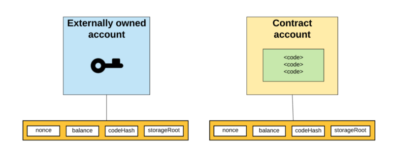
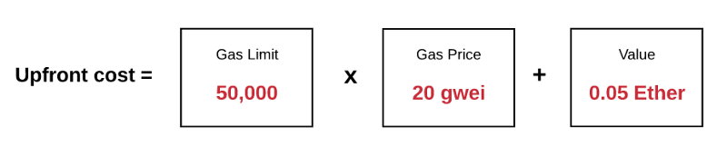
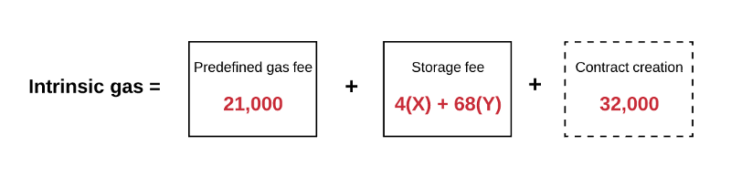
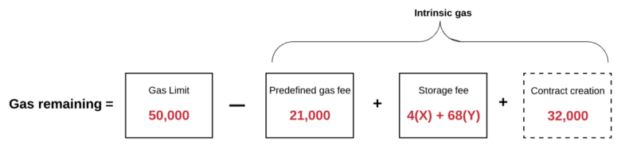
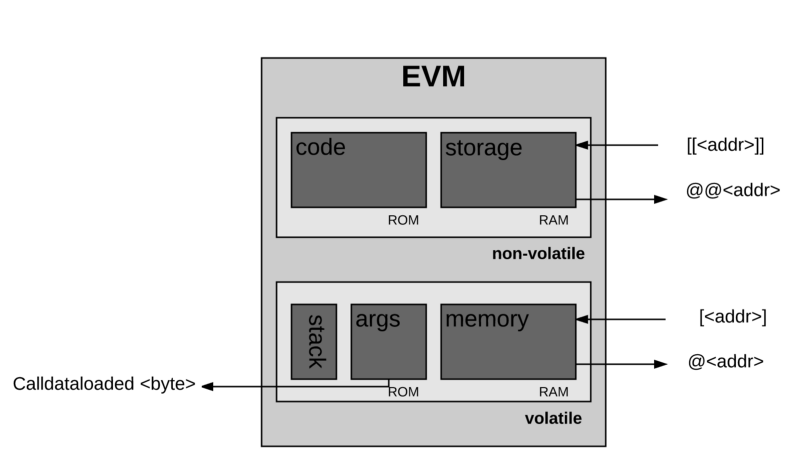

## 以太坊概念基础
现行法律的本质是一种合约。它是由（生活于某一社群的）人和他们的领导者之间所缔结的，一种关于彼此该如何行动的共识。个体之间也存在着一些合约，这些合约可以理解为一种私法，相应的，这种私法仅对合约的参与者生效。

我们已经知道了法律就是一种合约，然而，一直以来，现行的法律体系都存在着两个巨大的问题：
 1. 合约或法律是由充满歧义的语句定义的
 2. 强制执行合约或法律的代价非常大。

以太坊，**通过数字货币和编程语言的结合**，解决了现行法律体系的这两大问题。

以太坊采用区块链的原理，又增加了在区块链上创建智能合约：智能合约是一种应用，它能保存价值，存储数据，封装代码，执行计算任务。类似比特币，以太坊也含有货币，称为以太(ether)。以太是计算机节点挖出来的，由节点验证交易，交易存储在分布共识的区块链中。以太可以在账户(公钥)之间以及智能合约之间转移。

在对比特币的机制有一定了解的基础上，我们来看看以太坊的设计原则。

### 区块链层协议
本节对以太坊中区块链层协议的改变进行了描述，包括区块和交易是如何工作的、数据如何序列化及存储、账户背后的机制。

#### 使用账户而非UTXO
比特币及其许多衍生品，都将用户的余额信息存储在UTXO结构中，系统的整个状态由一系列的“有效的输出”组成（可以将这些“有效的输出”想象成钱币）。每个UTXO都有拥有者和自身的价值属性。一笔交易在消费若干个UTXO同时也会生成若干个新的UTXO。

“有效的输出”中有效需满足下面几点约束：

1. 每个被引用的输入必须有效，且未被使用过；
2. 交易的签名必须与每笔输入的所有者签名匹配；
3. 输入的总值必须等于或大于输出的总值。

但是，**以太坊抛弃了UTXO的方案**，转而使用更简单的方法：**采用状态(state)的概念存储一系列账户**，每个账户都有自己的余额，以及以太坊特有的数据（代码或内部存储器）。如果交易发起方的账户余额足够支付交易费用，则交易有效，那么发起方账户会扣除相应金额，而接受账户则计入该金额。

某些情况下，接受账户内有需要执行的代码，则交易会触发该代码的执行，那么账户的内部存储器可能就会发生变化，甚至可能会创建额外的信息发送给其他账户，从而导致新的交易发生。

##### UTXO vs 账户

UTXO有以下优点：

1. **较高程度的隐私保护**，如果用户每次交易都使用一个新的地址，那么账户之间的相互关联就很困难。这样做适用于对安全性要求高的货币系统，但对任何dapp应用来说就不合适了。因为dapp通常需要跟踪用户复杂的绑定状态，而dapp的状态并不能像货币系统中的状态那样简单地划分。

2. **潜在地可扩展性**，UTXO在理论上可扩展性更好。因为我们只能依靠那些金融货币拥有者来维护能够证明货币所有权的默克尔树，即使所有的人(包括数据的拥有者)都遗忘了某一数据，真正受损也只有数据的拥有者，其他人不受影响。

账户的优点：

1. **节省大量空间**，不需要存储太多的UTXO，只需要存储一个账户地址。

2. **可替代性更高**，在UTXO结构中，“有效输出”的源码实现中没有区块链层的概念，所以不管是在技术还是法律上，通过建立一个红名单/黑名单，并依据的这些“有效输出”的来源区分它们并不是很实际。

3. **简单**，以太坊编码更简单、更易于理解

4. **轻客户端**，轻客户端可以随时通过沿指定方向扫描状态树来访问与账户相关的所有数据。在UTXO方式中，引用随着每个交易的变化而变化，这对于长时间运行并使用了上文提到的UTXO根状态传播机制的dapp应用来说，无疑是繁重的。

#### 以太坊账户
以太币（Ether）是以太坊内部的主要加密燃料，用于支付交易费用。一般而言，**以太坊有两种类型的账户：外部所有的账户**（由私钥控制的）和合约账户（由合约代码控制）。外部所有的账户没有代码，人们可以通过创建和签名一笔交易从一个外部账户发送消息。每当合约账户收到一条消息，合约内部的代码就会被激活，允许它对内部存储进行读取和写入，和发送其它消息或者创建合约。

就是简单理解为，就是两种账户：

一种外部账户，就是普通账户。一种是合约账户，合约账户允许外部账户向其发消息，从外部拥有账户到合约账户的消息会激活合约账户的代码，允许它执行各种动作。（比如转移代币，写入内部存储，挖出一个新代币，执行一些运算，创建一个新的合约等等）。

**合约账户不可以自己发起一个交易。相反，合约账户只有在接收到一个交易之后(从一个外部拥有账户或另一个合约账户接)，为了响应此交易而触发一个交易。**

以太坊的账户包含四个部分，**不论账户类型是什么，都存在这四个组成部分**：

 - 随机数nonce：如果账户是一个外部拥有账户，nonce代表从此账户地址发送的交易序号。如果账户是一个合约账户，nonce代表此账户创建的合约序号

 - 余额balance： 此地址拥有Wei的数量。1Ether=10^18Wei

 - storageRoot： Merkle Patricia树的根节点Hash值。Merkle树会将此账户存储内容的Hash值进行编码，默认是空值

 - codeHash：此账户EVM（以太坊虚拟机）代码的hash值。对于合约账户，就是被Hash的代码并作为codeHash保存。对于外部拥有账户，codeHash域是一个空字符串的Hash值

 

#### 消息和交易
以太坊的消息在某种程度上类似于比特币的交易，但是两者之间存在三点重要的不同

1. 以太坊的消息可以由 **外部实体或者合约** 创建，然而比特币的交易只能从外部创建。
2. 以太坊消息可以选择包含数据
3. 如果以太坊消息的接受者是合约账户，可以选择进行回应，这意味着以太坊消息也包含函数概念。

### 状态与Merkle树
以太坊全局需要维护账户以及对应的账户状态。这跟比特币不同，比特币需要维护的，是全局每个交易，及对应的交易状态。而以太坊的链，直接要保存账户状态信息。

我们在密码学基础笔记里已经提到过Merkle树

一系列的中间的节点，这些节点是两个子节点的Hash值。而 **叶子节点里存储的，就是账户状态**。bitcoin里，Merkle树维护的是交易状态，而这里是直接维护账号状态。叶子节点对应的都是每个账户，包括每个账户的balance, nonce, codeHash和storageRoot（storageRoot自己就是一颗树）。

同样的树结构也用来存储交易和收据。更具体的说，**每个区块Block都有一个头(header)，保存了三个不同Merkle trie结构的根节点的Hash**，包括：

1. 状态树
2. 交易树
3. 收据树

可见Block Header里，下面有三棵树的根节点hash。

#### 全节点与轻节点

在Merkle tries中存储所有信息的高效性在以太坊中的“轻客户端”和“轻节点”相当的有用。

广泛的说，有两种节点类型：全节点和轻节点。

**全节点通过下载整条链来进行同步**，从创世纪块到当前块，执行其中包含的所有交易。通常，矿工会存储全节点，因为他们在挖矿过程中需要全节点。也有可能下载一个全节点而不用执行所有的交易。无论如何，一个全节点包含了整个链。

比起下载和存储整个链以及执行其中所有的交易，**轻节点仅仅下载链的头**，从创世纪块到当前块的头，不执行任何的交易或检索任何相关联的状态。由于轻节点可以访问块的头，而头中包含了3个tries的Hash，所有轻节点依然可以很容易生成和接收关于交易、事件、余额等可验证的答案。

这个可以行的通是因为在Merkle树中hash值是向上传播的—如果一个恶意用户试图用一个假交易来交换Merkle树底的交易，这个会改变它上面节点的hash值，而它上面节点的值的改变也会导致上上一个节点Hash值的改变，以此类推，一直到树的根节点。

zwlj：如果拜占庭节点恶意修改区块数据，必然会产生一个hash不一样的区块头，这时正常节点接收到这个异常链，就会从异常节点处开启一个分叉。

### Gas和费用
在以太坊中一个比较重要的概念就是费用(fees)，由以太坊网络上的交易而产生的每一次计算，都会产生费用—没有免费的午餐。这个费用是以称之为”gas”的来支付。

gas就是用来衡量在一个具体计算中要求的费用单位。gas price就是你愿意在每个gas上花费Ether的数量，以“gwei”进行衡量。“Wei”是Ether的最小单位，1Ether表示10^18Wei. 1gwei是1,000,000,000 Wei。

对每个交易，**发送者设置gas limit和gas price**。gas limit和gas price就代表着发送者愿意为执行交易支付的Wei的最大值。

例如，假设发送者设置gas limit为50,000，gas price为20gwei。这就表示发送者愿意最多支付50,000*20gwei = 1,000,000,000,000,000 Wei = 0.001 Ether来执行此交易。

记住gas limit代表用户愿意花费在gas上的钱的最大值。如果在他们的账户余额中有足够的Ether来支付这个最大值费用，那么就没问题。在交易结束时任何未使用的gas都会被返回给发送者，以原始费率兑换。

在发送者没有提供足够的gas来执行交易，那么交易执行就会出现“gas不足”然后被认为是无效的。在这种情况下，交易处理就会被终止以及所有已改变的状态将会被恢复，最后我们就又回到了交易之前的状态—完完全全的之前状态就像这笔交易从来没有发生。因为机器在耗尽gas之前还是为计算做出了努力， 所以理论上，将不会有任何的gas被返回给发送者。

这些gas的钱到底去了哪里？发送者在gas上花费的所有钱都发送给了“受益人”地址，通常情况下就是矿工的地址。因为矿工为了计算和验证交易做出了努力，所以矿工接收gas的费用作为奖励。

通常，发送者愿意支付更高的gas price，矿工从这笔交易总就能获得更多的价值。因此，矿工也就更加愿意选择这笔交易。这样的话，矿工可以自由的选择一笔交易自己愿意验证或忽略。为了引导发送者应该设置gas price为多少，矿工可以选择建议一个最小的gas值他们愿意执行一个交易。

#### 存储费用
gas不仅仅是用来支付计算这一步的费用，而且也用来支付存储的费用。存储的总费用与所使用的32位字节的最小倍数成比例。

存储费用有一些比较细微的方面。比如，由于增加了的存储增加了所有节点上的以太坊状态数据库的大小，所以激励保持数据存储量小。为了这个原因，如果一个交易的执行有一步是清除一个存储实体，那么为执行这个操作的费用就会被放弃，并且由于释放存储空间的退款就会被返回给发送者。

#### 费用的意义
计算的操作在以太坊虚拟机上是非常昂贵的。因此，以太坊智能合约最好是用来执行最简单的任务，比如运行一个简单的业务逻辑或者验证签名和其他密码对象，而不是用于复杂的操作，比如文件存储，电子邮件，或机器学习，这些会给网络造成压力。施加费用防止用户使网络超负荷。

以太坊是一个图灵完备语言（短而言之，图灵机器就是一个可以模拟任何电脑算法的机器。对于图灵机器不太熟悉的人可以看看这个 和这个 ）。这就允许有循环，并使以太坊受到停机问题 的影响，这个问题让你无法确定程序是否无限制的运行。如果没有费用的话，恶意的执行者通过执行一个包含无限循环的交易就可以很容易的让网络瘫痪而不会产生任何反响。因此，费用保护网络不受蓄意攻击。

你也许会想，“为什么我们还需要为存储付费？”其实就像计算一样，以太坊网络上的存储是整个网络都必须要负担的成本。

### 交易和消息
以太坊是一个基于交易的状态机。换句话说，在两个不同账户之间发生的交易会让以太坊全局状态从一个状态转换成另一个状态。

最基本的概念，一个交易就是被外部账户生成的加密签名的一段指令，序列化，然后提交给区块链。

有两种类型的交易：消息通信和合约创建(也就是交易产生一个新的以太坊合约)。

不管什么类型的交易，都包含：

1. nonce：发送者发送交易数的计数
2. gasPrice：发送者愿意支付执行交易所需的每个gas的Wei数量
3. gasLimit：发送者愿意为执行交易支付gas数量的最大值。这个数量被设置之后在任何计算完成之前就会被提前扣掉
4. to：接收者的地址。在合约创建交易中，合约账户的地址还没有存在，所以值先空着
5. value：从发送者转移到接收者的Wei数量。在合约创建交易中，value作为新建合约账户的开始余额
6. v,r,s：用于产生标识交易发生着的签名
7. init（只有在合约创建交易中存在）：用来初始化新合约账户的EVM代码片段。init值会执行一次，然后就会被丢弃。当init第一次执行的时候，它返回一个账户代码体，也就是永久与合约账户关联的一段代码。
8. data（可选域，只有在消息通信中存在）：消息通话中的输入数据(也就是参数)。例如，如果智能合约就是一个域名注册服务，那么调用合约可能就会期待输入域例如域名和IP地址

我们之前其实有提到交易—消息通信和合约创建交易两者都总是被外部拥有账户触发并提交到区块链的。换种思维思考就是，交易是外部世界和以太坊内部状态的桥梁。

当一个合约发送一个内部交易给另一个合约，接受合约账户的相关联的代码就会被执行。

一个重要需要注意的事情是内部交易或者消息不包含gasLimit。因为gas limit是由原始交易的外部创建者决定的（也就是外部拥有账户）。外部拥有账户设置的gas limit必须要高到足够将交易完成，包括由于此交易而长生的任何”子执行”，例如合约到合约的消息。如果，在一个交易或者信息链中，其中一个消息执行使gas已不足，那么这个消息的执行会被还原，包括任何被此执行触发的子消息。不过，父执行没必要被还原。

### 区块
在以太坊中，一个区块包含：

1. 区块头
2. 关于包含在此区块中交易集的信息
3. 与当前块的ommers相关的一系列其他区块头

#### Ommers
“ommer”到底是什么？

由于以太坊的构造，它的区块生产时间（大概15秒左右）比其他的区块链例如Bitcoin（大概10分钟左右）要快很多。这使得交易的处理更快。但是，更短的区块生产时间的一个缺点就是：更多的竞争区块会被矿工发现。这些竞争区块同样也被称为“孤区块”（也就是被挖出来但是不会被添加到主链上的区块）。

一个ommer是一个块，其父区块等于当前块的父区块的父区块。**用树来说的话，就是当前节点父节点的兄弟节点，就是一个当前区块的ommer**

 Ommers的目的就是为了帮助奖励矿工纳入这些孤区块。矿工包含的ommers必须是有效的，也就是ommers必须在父区块的第6个子区块之内(深度6)或更小范围内。在第6个子区块之后，陈旧的孤区块将不会再被引用（因为包含老旧的交易会使事情变得复杂一点）。

Ommer区块会收到比全区块少一点的奖励。不管怎样，依然存在激励来让矿工们纳入孤区块并能从中获得一些报酬。

### 区块头
讲到区块头，又要涉及到刚才发过那张老图了。

header包括什么字段，上面也都描述清楚了。

 - parentHash：父区块头的Hash值（这也是使得区块变成区块链的原因）
 - ommerHash：当前区块ommers列表的Hash值
 - beneficiary：接收挖此区块费用的账户地址
 - stateRoot：状态树根节点的Hash值（回忆一下我们之前所说的保存在头中的状态树以及它使得轻客户端认证任何关于状态的事情都变得非常简单）
 - transactionsRoot：包含此区块所有交易的Merkle树的根节点Hash值
 - receiptsRoot：包含此区块所有交易收据的Merkle树的根节点Hash值
 - logsBloom：由日志信息组成的一个Bloom过滤器 (一种数据结构)
 - difficulty： 此区块的难度级别
 - number：当前区块的计数（创世纪块的区块序号为0，对于每个后续区块，区块序号都增加1）
 - gasLimit：每个区块的当前gas limit
 - gasUsed： 此区块中交易所用的总gas量
 - timestamp：此区块成立时的unix的时间戳
 - extraData：与此区块相关的附加数据
 - mixHash：一个Hash值，当与nonce组合时，证明此区块已经执行了足够的计算
 - nonce：一个Hash值，当与mixHash组合时，证明此区块已经执行了足够的计算

注意区块头里有前面提到的三个Merkle树树根

#### 日志
以太坊允许日志可以跟踪各种交易和消息。合约可以通过定义想要记录的“事件”来明确地生成日志。

日志条目包含：

1. 记录器的帐户地址，
2. 一系列代表这次交易所进行的各种事件的话题
3. 任何与这些事件相关的数据。

日志存储在boom过滤器中，以高效的方式存储无尽的日志数据。

#### 收据
自于被包含在交易收据中的日志信息存储在头中。正如您在商店买东西时收到收据一样，以太坊会为每笔交易生成收据。就像你所期望的那样，每个收据都包含有关交易的某些信息。

### 交易执行
为了使得每次交易的状态都被同步到全局，交易必须都要符合最基础的一系列要求

 - 交易必须是正确格式化的RLP。”RLP”代表Recursive Length Prefix，它是一种数据格式，用来编码二进制数据嵌套数组。以太坊就是使用RLP格式序列化对象。
 - 有效的交易签名。
 - 有效的交易序号。回忆一下账户中的nonce就是从此账户发送出去交易的计数。如果有效，那么交易序号一定等于发送账户中的nonce。
 - 发送账户余额必须有足够的Ether来支付”前期”gas费用。前期gas费用的计算比较简单：首先，交易的gas limit乘以交易的gas价格得到最大的gas费用。然后，这个最大gas费用被加到从发送方传送给接收方的总值。
 - 交易的gas limit 一定要等于或者大于交易使用的intrinsic gas，intrinsic gas包括：
   1. 执行交易预订费用为21,000gas
   2. 随交易发送的数据的gas费用（每字节数据或代码为0的费用为4gas，每个非零字节的数据或代码费用为68gas）
   3. 如果交易是合约创建交易，还需要额外的32,000gas

每个gas花费的具体gwei数由gas price来设定。以下是前期费用的计算还有

如何交易符合上面所说的所有要求，那么我们进行下面步骤：

第一步，我们从发送者的余额中扣除执行的前期费用，并为当前交易将发送者账户中的nonce增加1。此时，我们可以计算剩余的gas，将交易的总gas减去使用的intrinsic gas。

第二步，开始执行交易。在交易执行的整个过程中，以太坊保持跟踪“子状态”。子状态是记录在交易中生成的信息的一种方式，当交易完成时会立即需要这些信息。具体来说，它包含：

1. 自毁集：在交易完成之后会被丢弃的账户集（如果存在的话）
2. 日志系列：虚拟机的代码执行的归档和可检索的检查点
3. 退款余额：交易完成之后需要退还给发送账户的总额。回忆一下我们之前提到的以太坊中的存储需要付费，发送者要是清理了内存就会有退款。以太坊使用退款计数进行跟踪退款余额。退款计数从0开始并且每当合约删除了一些存储中的东西都会进行增加。

第三步，交易所需的各种计算开始被处理。
当交易所需的步骤全部处理完成，并假设没有无效状态，通过确定退还给发送者的未使用的gas量，最终的状态也被确定。除了未使用的gas，发送者还会得到上面所说的“退款余额”中退还的一些津贴。

一旦发送者得到退款之后：

1. gas的Ether就会矿工
2. 交易使用的gas会被添加到区块的gas计数中（计数一直记录当前区块中所有交易使用的gas总量，这对于验证区块时是非常有用的）
3. 所有在自毁集中的账户（如果存在的话）都会被删除

最后，我们就有了一个新的状态以及交易创建的一系列日志。现在我们已经介绍了交易执行的基本知识，让我们再看看合约创建交易和消息通信的一些区别。

#### 合约创建
回忆一下在以太坊中，有两种账户类型：合约账户和外部拥有账户。当我们说一个交易是“合约创建”，是指交易的目的是创建一个新的合约账户。

为了创建一个新的合约账户，我们使用一个特殊的公式来声明新账户的地址。然后我们使用下面的方法来初始化一个账户：

1. 设置nonce为0
2. 如果发送者通过交易发送了一定量的Ether作为value，那么设置账户的余额为value
3. 将存储设置为0
4. 设置合约的codeHash为一个空字符串的Hash值

### 以太坊虚拟机EVM
我们来看看交易究竟是如何在虚拟机(VM)中执行的。

协议实际操作交易处理的部分是以太坊自己的虚拟机，称之为以太坊虚拟机(EVM)。

像之前定义的那样，EVM是图灵完备虚拟机器。EVM存在而典型图灵完备机器不存在的唯一限制就是EVM本质上是被gas束缚。因此，可以完成的计算总量本质上是被提供的gas总量限制的。

如上图，EVM具有基于堆栈的架构。堆栈机器 就是使用后进先出来保存临时值的计算机。

EVM中每个堆栈项的大小为256位，堆栈有一个最大的大小，为1024位。

EVM有内存，项目按照可寻址字节数组来存储。内存是易失性的，也就是数据是不持久的。

EVM也有一个存储器。不像内存，存储器是非易失性的，并作为系统状态的一部分进行维护。EVM分开保存程序代码，在虚拟ROM 中只能通过特殊指令来访问。这样的话，EVM就与典型的冯·诺依曼架构 不同，此架构将程序的代码存储在内存或存储器中。

EVM同样有属于它自己的语言：“EVM字节码”，当一个程序员比如你或我写一个在以太坊上运行的智能合约时，我们通常都是用高级语言例如Solidity来编写代码。然后我们可以将它编译成EVM可以理解的EVM字节码。

#### 执行
在执行特定的计算之前，处理器会确定下面所说的信息是有效和是否可获取：

 - 系统状态
 - 用于计算的剩余gas
 - 拥有执行代码的账户地址
 - 原始触发此次执行的交易发送者的地址
 - 触发代码执行的账户地址（可能与原始发送者不同）
 - 触发此次执行的交易gas价格
 - 此次执行的输入数据
 - Value(单位为Wei)作为当前执行的一部分传递给该账户
 - 待执行的机器码
 - 当前区块的区块头
 - 当前消息通信或合约创建堆栈的深度

执行刚开始时，内存和堆栈都是空的，程序计数器为0。

`
1
PC: 0 STACK: [] MEM: [], STORAGE: {}
`

然后EVM开始递归的执行交易，为每个循环计算系统状态和机器状态。系统状态也就是以太坊的全局状态(global state)。机器状态包含：

1. 可获取的gas
2. 程序计数器
3. 内存的内容
4. 内存中字的活跃数
5. 堆栈的内容

每个循环，剩余的gas都会被减少相应的量，程序计数器也会增加。 在每个循环的结束，都有三种可能性：

1. 机器到达异常状态（例如 gas不足，无效指令，堆栈项不足，堆栈项会溢出1024，无效的JUMP/JUMPI目的地等等）因此停止，并丢弃任何的更改
2. 进入后续处理下一个循环
3. 机器到达了受控停止（到达执行过程的终点）

假设执行没有遇到异常状态，达到一个“可控的”或正常的停止，机器就会产生一个合成状态，执行之后的剩余gas、产生的子状态、以及组合输出。

#### 关于EVM的一些zwlj
前面所讲的EVM都是过于细节和抽象的理解，可以再简单概括一下EVM的作用：

前面的文章提到了，区块头里会有一个状态树根保存账户状态，还会有一个交易树根，保存交易。

**在矿工收集足够消息，准备加密生成一个Block时，必须启动一个运行时环境，也就是EVM**，来运行智能账户收到消息时对应的代码。这个环境包含了一些内置变量，比如当前Block的Number，消息来源的地址等，还会提供一些API，一个stack供智能合约执行时使用。

**通过EVM运行代码后，智能账户的状态发生了变化，然后矿工将这些状态同正常账户里的资金变化一起，加密生成新的block，链接到全网账单上**。因此一个交易只会在一个Block里出现，并且要得到大多数算力的确认才能挂载，所以可以保证这些code执行的唯一性和正确性。

### 块完成的总体过程
当我们说“完成”，取决于此块是新的还是已存在的，可以指两个不同的事情。如果是个新块，就是指挖这个块所需的处理。如果是已存在的块，就是指验证此块的处理。不论哪种情况，一个块的“完成”都有4个要求：

1. 验证（或者，如果是挖矿的话，就是确定）ommers 在区块头中的每个ommer都必须是有效的头并且必须在当前块的6代之内

2. 验证（或者，如果是挖矿的话，就是确定）交易 区块中的gasUsed数量必须与区块中所列交易使用的累积gas量相等。（回忆一下，当执行一个交易的时候，我们会跟踪区块的gas计数器，也就跟踪了区块中所有交易使用的gas总数量）

3. 申请奖励（只有挖矿时） 受益人的地址会因为挖矿而获得5Ether（在以太坊EIP-649 提案中，5ETH很快将会被减少为3ETH）。另外，对于每个ommer，当前块的受益人会获得额外的1/32当前块奖励金的奖励。最近，每个ommer区块的受益人能够得到一定量的奖励（有个特殊公式可以进行计算）。

4. 校验（或者，如果是挖矿的话，就是计算一个有效的）状态和nonce 确保所有的交易和改变的结果状态都被应用了，然后在区块奖励被应用于最终交易结果状态之后 **定义一个新块为状态**。通过检查最终状态与存储在头中的状态树来进行验证。

### 参考
[干货 | 以太坊设计原理](https://ethfans.org/posts/510)

[以太坊学习](https://www.jianshu.com/p/220130b39e22)

[以太坊白皮书](https://ethfans.org/wikis/%E4%BB%A5%E5%A4%AA%E5%9D%8A%E7%99%BD%E7%9A%AE%E4%B9%A6)

[详解以太坊的工作原理](https://www.8btc.com/article/142319)
