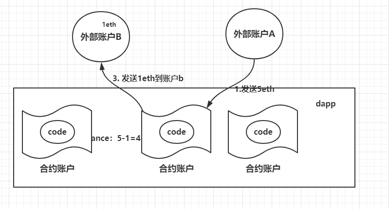

## 以太坊智能合约
在以太坊的概念基础笔记中，账户的部分已经提到了，有内部账户，和外部账户的概念。


合约账户存储着一系列的代码，也可以说，就是脚本。实质上这个合约账户，也就可以被称之为是智能合约smart contract了。

在以太坊，智能合约是可以处理资金的脚本。就是这么简单。**合约账户一旦被创建，里面的code就不能被改变**，如果我们需要修改code的逻辑，我们只能创建一个新的合约账户。

我们给矿工支付一种叫作 “Gas” 的东西，它是 **运行一份合约的成本**。当你发布一份智能合约，或者执行一份智能合约，或者把钱转到另一个账户，你就要支付一些被转换成Gas的以太币。

客户端可以与这个合约地址进行交互，可以发送ether，调用函数，查询当前的状态等。

### 智能合约形象理解

通过下面的一些例子可以形象的理解以太坊的智能合约，说智能合约其实就是以太坊的合约账户而已。这个合约账户里面当然是包含着一些代码逻辑的。

如下图，外部账户A发消息给合约账户，合约账户此时会触发code逻辑，把收到金额的五分之一打给B，这样合约账户就会发送1eth给B。


上图就简单明了的展示了智能合约的执行过程。我们在构建智能合约的时候，合约账户不一定非得要一个实数值，**balance甚至可以不起任何作用，比如就设定为0**.只用合约账户进行一些简单计算，和oop逻辑都是可以的。



一系列相关逻辑的智能合约的集合，就可以说是构成一个dapp了。

### dapp
一个分布式App是指，服务端运行于以太坊网络上一个或多个智能合约。

一个分布式的App不用将所有状态都存储在区块链上，或者在链上进行所有计算（译者注：比如图形渲染），这样就太花gas了。所以一个分布式App把需要大家共同信任的状态存在区块链上就好了。许多的分布式应用使用后面提到的技术，如IPFS和Gelem，在链下进行分布式存储和计算。虽然没在以太坊上，但仍使用的是区块链技术。

#### 客户端

大多数的分布式应用都通过一些用户友好的前端提供服务，因为不是所有人都愿意通过命令行，通过自己手动组装哈希串和操作指令码进行交易。

一个DApp与传统的开发中的，客户端或前端是类似，区别仅在于它们与以太坊的区块链进行交互（也可以同时与其它服务交互）。这些客户端往往用JS编写，因为当前还暂时没有完成全部的向NodeJS的转换。

### solidity
要学习以太坊的dapp开发，我们首先要学习一下solidity的一些语法。

### IDE Remix
要使用一门编程语言，当然就离不开编辑器。

所以这里要提到一个网络在在线solidity编辑器Remix

网址为：http://remix.ethereum.org

可以在上面直接编写solidity代码，很方便。

#### pragma
pragma 指令会告诉编译器我们正在使用的 Solidity 版本，以及我们的合约名称，比如我们下面代码就定义了一个Wrestling为名的智能合约。

``` solidity
pragma solidity ^0.4.18;

contract Wrestling {
    // our code will go here
}
```

我们接下来的code，包括变量定义等，都会歇菜contract定义的类当中。

#### address
地址变量的定义类型为address

```
address public wrestler1;
address public wrestler2;
```

#### 简单示例

```
pragma solidity ^0.4.0;

contract SimpleStorage {
    uint storedData;

    function set(uint x) public {
        storedData = x;
    }

    function get() public view returns (uint) {
        return storedData;
    }
}
```

上面代码很简单，就是定义了使用过的solidity版本，然后定义了一个变量，还有对应的get，set函数。

更多内容转记到solidity学习笔记当中。


### 参考
[以太坊开发入门，完整入门篇（小白可以看看，高手看看自己有没有遗漏的）](http://me.tryblockchain.org/getting-up-to-speed-on-ethereum.html)

[solidity官方文档](https://solidity-cn.readthedocs.io/zh/develop/introduction-to-smart-contracts.html)
