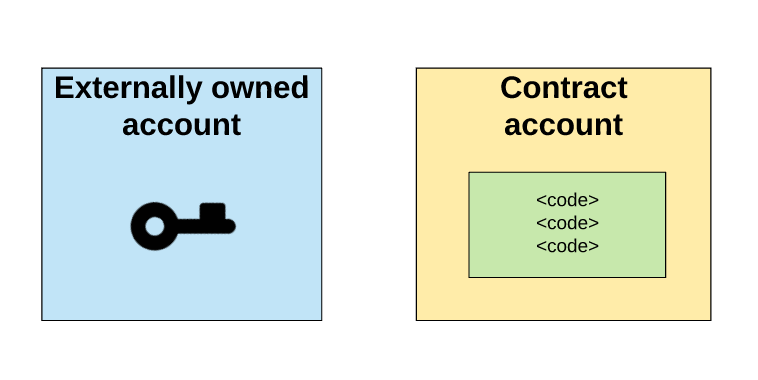

## 以太坊智能合约
在以太坊的概念基础笔记中，账户的部分已经提到了，有内部账户，和外部账户的概念。

合约账户存储着一系列的代码，也可以说，就是脚本。实质上这个合约账户，也就可以被称之为是智能合约smart contract了。

在以太坊，智能合约是可以处理资金的脚本。就是这么简单。**合约账户一旦被创建，里面的code就不能被改变**，如果我们需要修改code的逻辑，我们只能创建一个新的合约账户。

我们给矿工支付一种叫作 “Gas” 的东西，它是 **运行一份合约的成本**。当你发布一份智能合约，或者执行一份智能合约，或者把钱转到另一个账户，你就要支付一些被转换成Gas的以太币。

### 智能合约形象理解

通过下面的一些例子可以形象的理解以太坊的智能合约，说智能合约其实就是以太坊的合约账户而已。这个合约账户里面当然是包含着一些代码逻辑的。

如下图，外部账户A发消息给合约账户，合约账户此时会触发code逻辑，把收到金额的五分之一打给B，这样合约账户就会发送1eth给B。

上图就简单明了的展示了智能合约的执行过程。我们在构建智能合约的时候，合约账户不一定非得要一个实数值，**balance甚至可以不起任何作用，比如就设定为0**.只用合约账户进行一些简单计算，和oop逻辑都是可以的。

一系列相关逻辑的智能合约的集合，就可以说是构成一个dapp了。
