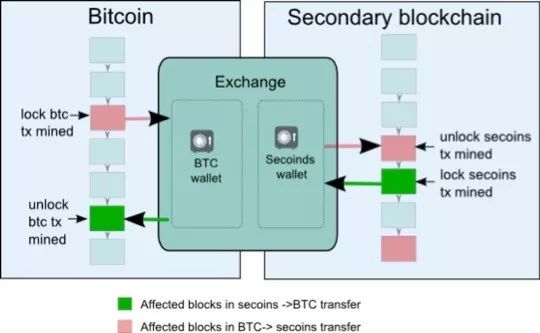
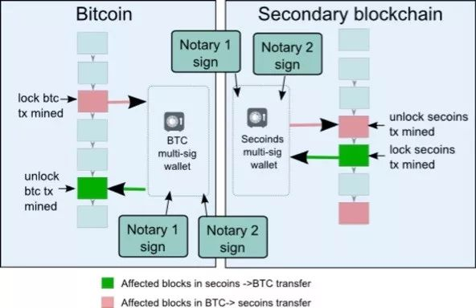
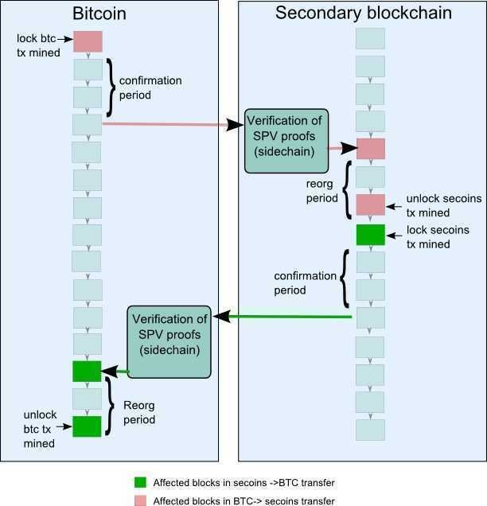
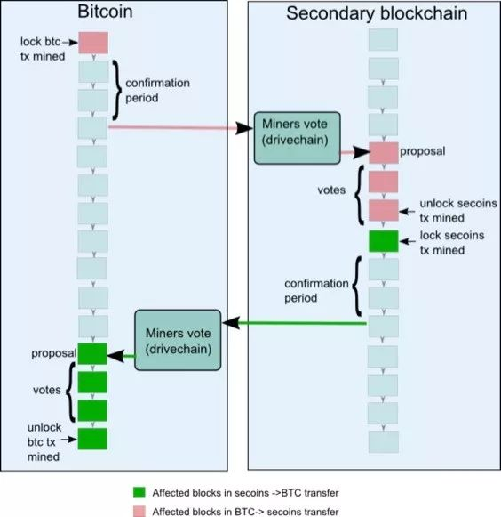

## 侧链技术

传统区块链技术要落地到商业应用，特别是金融应用，仍然存在很多问题需要解决，如交易性能、隐私保护等。解决这些问题的一种做法是重新开发新的区块链，但是这种做法会造成大量重复性工作，并且需要不断的发行新的数字资产。

那么是否存在在 **不影响原有区块链工作的基础上，依托于原有区块链进行技术升级的解决方案**，`侧链` 就是在这种需求背景下被提出的。

### 概念
侧链协议本质上是一种跨区块链解决方案。通过这种解决方案，可以实现数字资产从第一个区块链到第二个区块链的转移，又可以在稍后的时间点从第二个区块链安全返回到第一个区块链。

**其中第一个区块链通常被称为主区块链或者主链，每二个区块链则被称为侧链**。

侧链（sidechains）实质上不是特指某个区块链，而是指遵守侧链协议的所有区块链，该名词是相对与比特币主链来说的。侧链协议是指：可以让比特币安全地从比特币主链转移到其他区块链，又可以从其他区块链安全地返回比特币主链的一种协议。

侧链技术最主要的实现为：双向锚定（Two-way Peg），根据细节不同，还可分为联合锚定(federated peg)，驱动链等。

### 双向锚定
实现双向锚定可以有以下几种实现方式

#### 单一托管模式

最简单的实现主链与侧链双向锚定的方法就是通过将数字资产发送到一个主链单一托管方（类似于交易所），当单一托管方收到相关信息后，就在侧链上激活相应数字资产。这个解决方案的最大问题是 **过于中心化**。图1给出了以比特币为主链的单一托管模式的工作原理示意图：

这种模式就是依赖中心化实现了。

#### 联盟模式
联盟模式是使用公证人联盟来取代单一的保管方，利用公证人联盟的多重签名对侧链的数字资产流动进行确认。在这种模式中，如果要想盗窃主链上冻结的数字资产就需要突破更多的机构，但是侧链安全仍然取决于公证人联盟的诚实度。图2给出了以比特币为主链的联盟模式的工作示意图：

**单一托管模式与联盟模式的最大优点是它们不需要对现有的比特币协议进行任何的改变。**

#### SPV模式

SPV是一种用于证明交易存在的方法，通过少量数据就可以验证某个特定区块中交易是否存在。

在SPV模式中，用户在主链上将数字资产发送到主链的一个特殊的地址，这样做会锁定主链的数字资产，该输出仍然会被锁定在可能的竞争期间内，以确认相应的交易已经完成，随后会创建一个SPV证明并发送到侧链上。此刻，一个对应的带有SPV证明的交易会出现在侧链上，同时验证主链上的数字资产已经被锁住，然后就可以在侧链上打开具有相同价值的另一种数字资产。

这种数字资产的使用和改变在稍后会被送回主链。当这种数字资产返回到主链上时，该过程会进行重复。它们被发送到侧链上锁定的输出中，在一定的等待时间后，就可以创建一个SPV证明，来将其发送回主区块链上，以解锁主链上的数字资产。SPV模式存在的问题是需要对主链进行软分叉。图3给出了以比特币主链的SPV模式的工作流程示意图：

这种双向锚定分四个阶段：

1. 发送锁定交易
比特币持有者操作，发送一个特殊交易，把比特币锁定在区块链上。

2. 等待确认
等待交易被更多区块确认，可防止假冒锁定交易和拒绝服务攻击。

3. 赎回交易
交易确认后，用户在侧链上创建一个交易花掉锁定交易的输出，并提供SPV工作量证明，输出到自己在侧链上的地址中去。SPV为赎回交易所在区块的工作量证明。

4. 等待一个竞争期
竞争期的作用是防止双花。

#### 驱动链模式
驱动链概念是由Bitcoin Hivemind创始人Paul Sztorc提出的。在驱动链中，矿工作为‘算法代理监护人’，对侧链当前的状态进行检测。换句话说，矿工本质上就是资金托管方，驱动链将被锁定数字资产的监管权发放到数字资产矿工手上，并且允许矿工们投票何时解锁数字资产和将解锁的数字资产发送到何处。矿工观察侧链的状态，当他们收到来自侧链的要求时，他们会执行协调协议以确保他们对要求的真实性达成一致。诚实矿工在驱动链中的参与程度越高，整体系统安全性也就越大。如同SPV侧链一样，驱动链也需要对主链进行软分叉。图4给出了以比特币为主链的驱动链模式的工作流程示意图：

#### 混合模式
上述所有的模式都是对称的，而混合模式则是将上述获得双向锚定的方法进行有效的结合的模式。由于主链与侧链在实现机制存在本质的不同,所以对称的双向锚定模型可能是不够完善的。混合模式是在主链和侧链使用不同的解锁方法，例如在侧链上使用SPV模式，而在主链网络上则使用驱动链模式。同样，混合模式也需要对主链进行软分叉。

### 案例
目前，比较著名的侧链包括基于比特币网络的侧链BTC Relay、Rootstock的Liquid，以及非比特币的侧链如Lisk和国内的Asch等。

BTC Relay是由ConsenSys的推出的基于以太坊区块链的智能合约的侧链解决方案。**BTC Relay把以太坊网络与比特币网络以一种安全去中心化的方式连接起来**。BTC Relay通过使用以太坊的智能合约功能允许用户在以太坊区块链上验证比特币交易。以太坊DApp开发者可以从智能合约向BTC Relay进行API调用来验证比特币网络活动。

Liquid是Blockstream的开源侧链项目，使用了比特币双向锚定技术，Liquid目的是实现使得比特币可以在主链和侧链中互转，旨在提高隐私性、降低成本、加速交易所和经纪商之间的价值转移及结算流程。

### 参考

[全面理解区块链侧链技术](https://zhuanlan.zhihu.com/p/42769604)

[区块链中一个重要的链：侧链](https://steemit.com/cn/@monkeyplayfire/62v4en)
