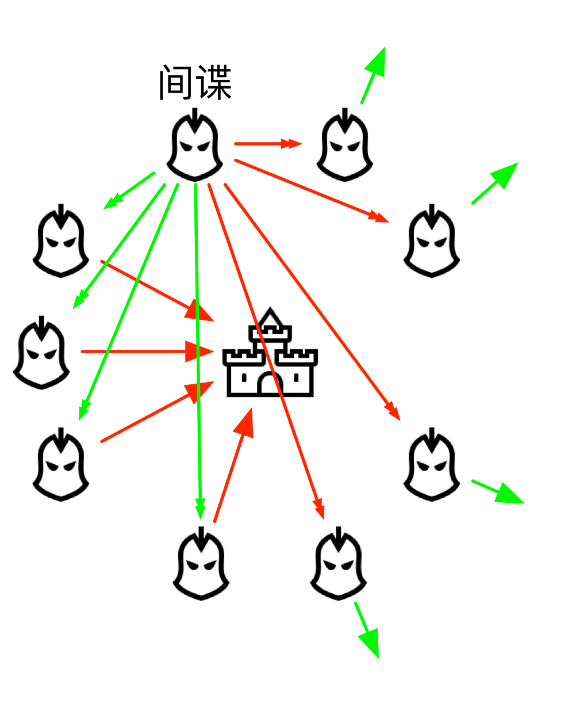
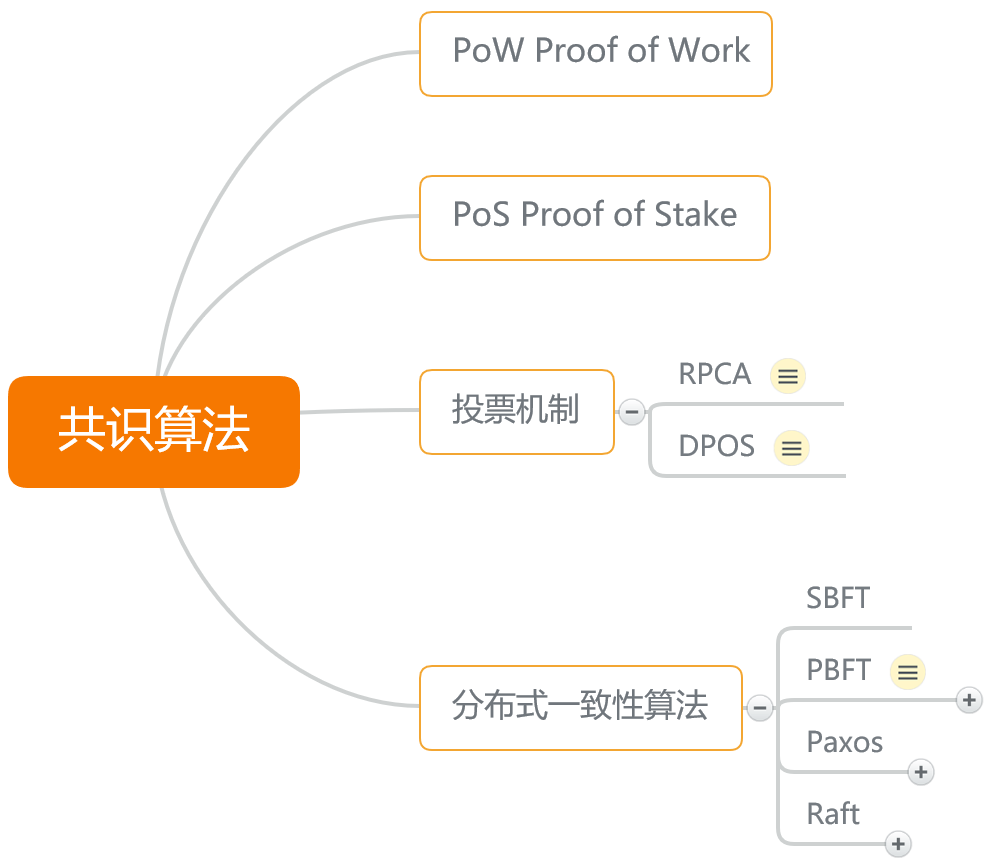

## 拜占庭将军问题与共识算法
拜占庭将军问题不仅仅是区块链技术中的问题，而是分布式系统的重要难题之一。

在分布式系统下的分布式一致性笔记里已经提过，分布式网络中的各个节点，需要对某种状态达成一致。这其实就是拜占庭将军问题：

9个将军带领9支军队，打一场攻城战役。假设每个将军都能独立根据眼前战况做出两种判断：进攻或撤退，要求（或者最终目的是）如何让这9个将军的命令是一致的。也就是说假如每个将军都是一个节点，大家需要共识一个状态：一起进攻还是一起撤退。如何维持这个状态的一致性呢？

一个比较简单的决策策略是，投票，超过半数支持某个决定，那么所有9个将军一定执行这个决定。如上图，5个将军决定进攻，4个将军决定撤退，那么所有将军都会下令：进攻！

这种策略需要每个将军把自己的判断通过一种途径（途中灰色箭头）传递到所有其他将军处。相对的，每个将军只有在收到了所有投票结果后，才会下令。**如上图的例子**，所有将军得到投票：4进攻5撤退，才下令撤退

但是，假如出现了叛徒，这个机制就会出现问题：

如上图所示，会出现两种情况

1. 对自己位置的战场情况进行 **错误广播**（比如他这个地方优势很大，但是投票给撤退）
2. **可以选择靠给不同的将军送去不同的消息破坏整体决定的一致性**（导致左边四个将军选择撤退，右边四个将军选择进攻）
问题总结

**这就是拜占庭问题：所有将军如何才能达成共识去攻打（或撤退）城堡**

这个问题有一个 **一般性结论：如果叛徒的数量大于或等于三分之一 ，那么拜占庭问题不可解，这个三分之一也被称为拜占庭容错，三模冗余是完全无法容错的（也就是说无解，不可能保持一致性）**

### 实用拜占庭容错算法（PBFT）
PBTF是一种传统的解决方案，核心思想是：**对于每一个收到命令的将军，都要去询问其他人，他们收到的命令是什么。也就是说利用不断的信息交换让可行的节点确认哪一个记录选择是正确的，即发现其中的背叛者**

采用PBFT方法，本质上就是利用通信次数换取信用。每个命令的执行都需要节点间两两交互去核验消息，通信代价是非常高的。通常采用PBFT算法，节点间的通信复杂度是节点数的平方级的

#### 白话PBFT

还是用上面的将军的例子来举例：**总共4个将军，有1个是叛徒，每个将军需要在自己的战斗计划中添加一行内容 <什么时间>进攻**

【目标】只需要3个将军达成一致在同一时间进攻，就可以攻占城市，否则进攻者全军覆没。最终目标还是统一一个一致的战斗计划，并按照计划同时实施（在去中心化系统中，即【记录】的一致性）

【方法】对于每一个收到命令的将军，都要去询问其他人，他们收到的命令是什么。在判断不出判断者的情况，执行更多的那个命令

如下图：

其中每个将军头像下方的数字就是收到的攻击事件列表，在该规则下，可以看到能保证，当叛徒数量小于1/3维护系统的一致性，即无论是什么情况，都可以防止不一致的决定被执行（至少也是按兵不动，并且很容易定位叛徒是谁）

注意，在这种仅有4个节点的情况下看似复用信道和传递消息的数量不多。但随着结点的增加，时间复杂度和信道使用量级是节点数的平方。大规模网络基本瘫痪，效率太低

### 区块链共识算法
由于PBFT对大体量节点的支持不好，区块链大都没有使用PBFT共识算法来实现一致性。

下面的思维导图展示了现在基本的区块链共识算法总结：

### 分布式一致性算法
在分布式系统的笔记中，我们也提到过一些分布式一致性算法，比如Paxos，这是理论上的高效算法，但是很难实现。而Raft是由Google牵头开发一个Paxos理论实现版本

### 投票机制
区块链算法中有两个比较有名的【RPCA Ripple共识】【DPOS 股权代理人共识】，在规则和协议上稍有不同，但是核心的Idea还是使用类似人大代表选举的制度来保证新区块的产生不会由同一个人控制，即代表轮流挖矿

NEO使用的是【DBFT】，投票的拜占庭容错算法，算是结合了几个算法的优势和思路，也很有想法！容错能力和PBFT一样，但是效率更高，信道使用冗余更低

### 其他
除此之外，还有一些各种各样的共识算法正在浮现：比如

【PoET Proof of Elapsed Time】消逝时间证明：Intel使用HyperLedger建立的锯齿（Sawtooth）项目使用。在一种收信任的执行环境下保证随机的选择用户来生产区块，间隔时间提前约定。很奇怪的Idea，只适合于联盟链

### 参考
[【区块链】共识算法与如何解决拜占庭将军问题](https://charlesliuyx.github.io/2018/03/03/%E3%80%90%E5%8C%BA%E5%9D%97%E9%93%BE%E3%80%91%E5%A6%82%E4%BD%95%E8%A7%A3%E5%86%B3%E6%8B%9C%E5%8D%A0%E5%BA%AD%E5%B0%86%E5%86%9B%E9%97%AE%E9%A2%98/)
