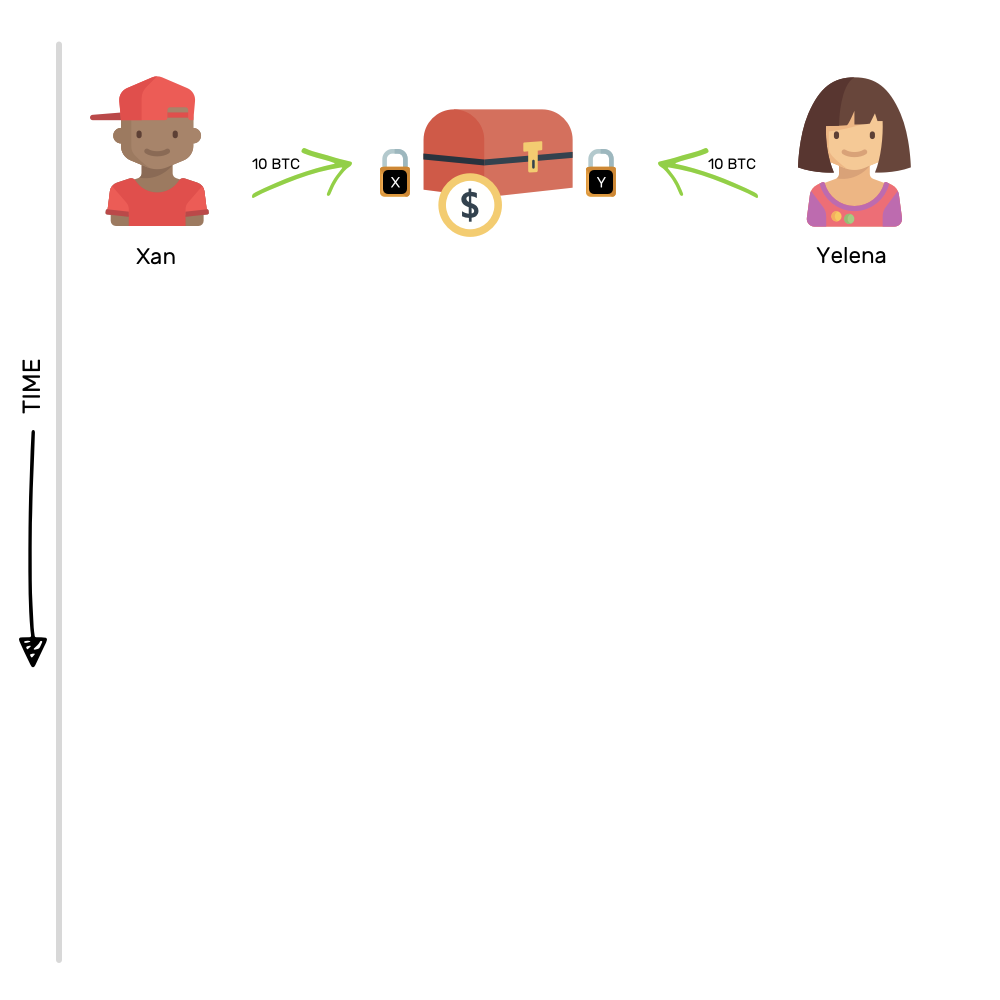
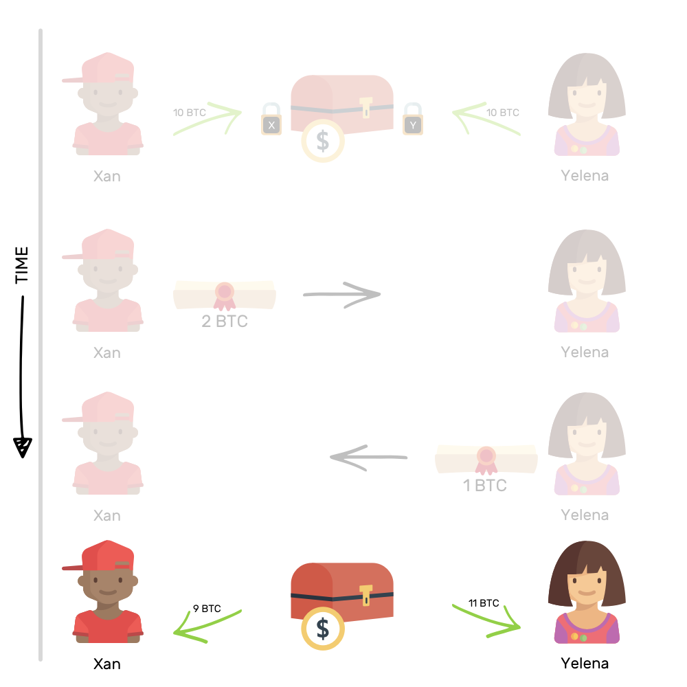
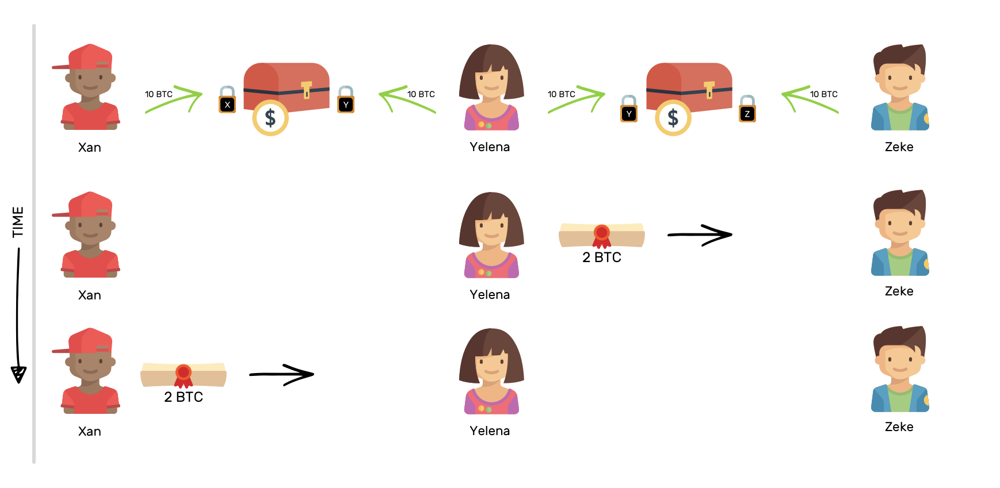

## 闪电网络详解
比特币的交易网络最为人诟病的一点便是交易性能：全网每秒 7 笔左右的交易速度，远低于传统的金融交易系统；同时，等待 6 个块的可信确认将导致约 1 个小时的最终确认时间。

为了提升性能，**社区提出了闪电网络等创新的设计**。

闪电网络的主要思路十分简单——将大量交易放到比特币区块链之外进行，只把关键环节放到链上进行确认。该设计最早于 2015 年 2 月在论文《The Bitcoin Lightning Network: Scalable Off-Chain Instant Payments》中提出。

### 简易原理
众所周知，区块链交易速度很慢，目前区块链的处理能力只有7-30笔/秒（以比特币和以太坊为例），而块内又有大量的交易排队等待处理，那么进行打包记账的矿工，出于自身的利益着想，自然会选择为出价（矿工费）最高的交易优先打包。这样，大批的高频、小额的交易将得不到应有的及时的处理。

**闪电网络背后的想法是, 不是所有的交易都需要记录在区块链上。**

想象一下, 仅你和我交易了好几次。在这种情况下, 我们可以 **绕过记录在区块链上的交易, 并在链下进行**。

简单来说, 它的工作方式是-我们将打开一个付款通道, 并把通道的开放记录在区块链上。现在, 您和我可以通过这个支付通道进行任何次数的交易, 并且可以在任何时间、天数、周数或十年内保持开放状态。**我们唯一一次接触区块链的时间将会是我们想要关闭通道的时候。然后, 我们把这个通道上产生的交易的最终状态写在区块链上**。

使用这种支付渠道的想法, 我们可以创建一个支付通道的网络, 这样就很少需要在区块链交易。试想, 有三个人-Xan, Yelena和Zeke。

如果Xan和Yelena有一个开着的付款通道，Yelena和Zeke也有一个开着的付款通道， 那么Xan可以通过Yelena向Zeke转账。

假设Xan要给Zeke转 2 BTC , 那Yelena将发送 2 BTC 给Zeke, Xan将补偿Yelena 2 BTC。

这就是闪电网络的概念。因为不会经常接触区块链, 交易会以闪电般的速度发生。你可能已经猜到了, 所有的魔术都发生在支付通道。让我们学习魔术的把戏吧。

**zwlj:闪电网络也是一个分布式网络，部署在链外，偶尔会将交易结果同步到链上。平时的高频小额交易则直接在闪电网络中进行**

闪电网络，会开启一个保险柜一样的资金池，让双方存入等量的钱，并把它锁上：

这种在一个共同的盒子里存入等量的钱的行为以 “开放交易” 的形式记录在区块链上, 然后在这两个人之间开了一个付款通道。

把钱锁在这样一个盒子里背后的想法是, 没有人可以单独花盒子里的钱。这个盒子里的钱是用来互相交易的。

想象一下, Xan和Yelena在这个共同的盒子里各自放了 10 BTC。现在, 如果Xan想发送 2 BTC 到Yelena, 他会怎么做呢？

为了做到这一点, 他转移了两个比特币的承诺转让给Yelena。在这个诺言转移后, 如果箱子解锁, 那Xan将能得到 8 BTC， Yelena将能取得到12 BTC。**但是他们不会打开这个盒子, 因为他们想继续在他们之间进行交易。这就是这种安排的妙处。**

总而言之, 支付通道只不过是把一些钱汇集在一起, 然后把池里钱的所有权的承诺以商定的方式转移。关闭通道只意味着打开盒子, 取出里面的钱。开箱行为发生在区块链上，谁能从盒子里取得多少将被永远记录。

当两个或两个以上的支付渠道共同组成一个网络–闪电网络时, 他们真正的力量就被释放了。资金池只是双方之间共有，但是别人的支付通道可以借用，也就是刷最后路径结构不是网状的，而是一个生成树的结构:

x为了和z交易，借用了XY YZ两个通道。

**下面介绍两个闪电网络的术语RSMC,HTLC.前者解决了链下交易的确认问题，后者解决了支付通道的问题。**

### RSMC
Recoverable Sequence Maturity Contract，即“可撤销的顺序成熟度合同”。这个词很绕，其实主要原理很简单，就是上面所说的资金池制度。

把钱存在支付通道里，关闭支付通道时才回写到区块链。

任何一个版本的方案都需要经过双方的签名认证才合法。任何一方在任何时候都可以提出提现，提现时需要提供一个双方都签名过的资金分配方案（意味着肯定是某次交易后的结果，被双方确认过，但未必是最新的结果）。在一定时间内，如果另外一方拿出证明表明这个方案其实之前被作废了（非最新的交易结果），则资金罚没给质疑方；否则按照提出方的结果进行分配。**罚没机制可以确保了没人会故意拿一个旧的交易结果来提现。**

另外，即使双方都确认了某次提现，首先提出提现一方的资金到账时间要晚于对方，这就鼓励大家尽量都在链外完成交易。通过 RSMC，可以实现大量中间交易发生在链外。

#### HTLC
微支付通道是通过 Hashed Timelock Contract 来实现的，中文意思是“哈希的带时钟的合约”。这个其实就是限时转账。理解起来也很简单，通过智能合约，双方约定转账方先冻结一笔钱，并提供一个哈希值，如果在一定时间内有人能提出一个字符串，使得它哈希后的值跟已知值匹配（实际上意味着转账方授权了接收方来提现），则这笔钱转给接收方。

不太恰当的例子，约定一定时间内，有人知道了某个暗语（可以生成匹配的哈希值），就可以拿到这个指定的资金。

推广一步，甲想转账给丙，丙先发给甲一个哈希值。甲可以先跟乙签订一个合同，如果你在一定时间内能告诉我一个暗语，我就给你多少钱。乙于是跑去跟丙签订一个合同，如果你告诉我那个暗语，我就给你多少钱。丙于是告诉乙暗语，拿到乙的钱，乙又从甲拿到钱。最终达到结果是甲转账给丙。这样甲和丙之间似乎构成了一条完整的虚拟的“支付通道”。

HTLC 机制可以扩展到多个人的场景。
### 参考

[5分钟读懂闪电网络](https://steemit.com/blockchain/@danielzhuang/jeydf-5)

[闪电网络](https://yeasy.gitbooks.io/blockchain_guide/content/bitcoin/lightning_network.html)
