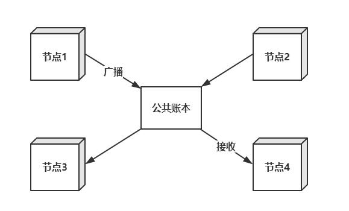
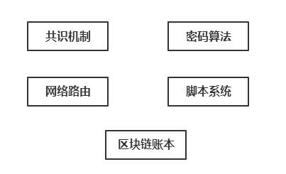
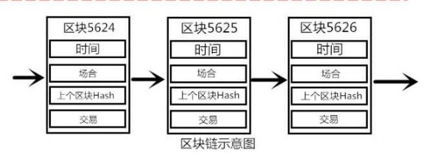

# 区块链
区块链是分布式数据存储、点对点传输、共识机制、加密算法等计算机技术的新型应用模式。所谓共识机制是区块链系统中实现不同节点之间建立信任、获取权益的数学算法

## 简单模型(zwlj)
区块链简单来说就是网络中各个节点维护一个**公共账本**。

每个节点会维护一个各自的账本，而这个账本会保持一致，注意这个账本是逻辑上的抽象概念，**并不是特指一个节点**。上图只是说明，每个节点(用户)都有一份相同的账本。

在这些节点中，有些节点正在广播新数据，有些节点正在接受数据。为了保证数据一致，区块链技术有一套技术栈。

## 技术栈

区块链的技术栈结构如下图

把结构简化以后，就可以知道区块链系统结构由以下组件构成。

以上组件装配一起，就成为了一个区块链网络系统中的节点(也就是用户，或者说客户端)，无数个装配这几个组件的节点组成一个区块链网络系统(**对等网络**).

### 区块链账本
之前说到网络中的每个节点都会维护一个公共的账本，这个账本有一种特有的记录格式。

区块链按照时间间隔，把产生的数据分成一个个数据块，然后再根据现货关系把它们像链表一样连接起来。

如上图，好比我每10分钟产生一个区块，那我就像链表一样将它们链起来。

区块链示意图大致如上，每一个区块中都会有上一个区块的 **区块Hash值**。这有一个好处，就是 **假如中途某块数据被篡改，那么比这个区块新的区块都会被篡改**。因为某个区块一旦改变，哈希值则会改变，接着他所指向的区块会发生连锁反应的哈希值变化。
