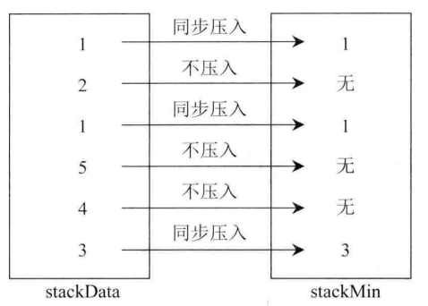
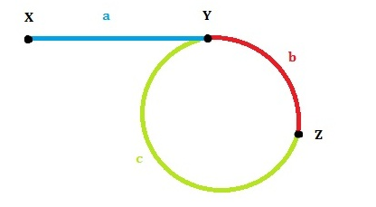

# 剑指offer

## 数组中重复的数字

### 题目描述

在一个长度为 n 的数组里的所有数字都在 0 到 n-1 的范围内。数组中某些数字是重复的，但不知道有几个数字是重复的。也不知道每个数字重复几次。请找出数组中任意一个重复的数字。例如，如果输入长度为 7 的数组 {2, 3, 1, 0, 2, 5, 3}，那么对应的输出是第一个重复的数字 2。

### 思路
注意数字范围是1-n,数组长度也为n。所以可以理解为一个数字一个坑位，发现座位已经有人正确就坐的时候，那说明重复了。这题显然用桶排序可以，最优时间复杂度是O(n)，但是这样空间也是O(n),所以并非最优解。

最优解就是原地交换，当发现交换无法进行下去的时候，说明数字重复。空间O(1).手写代码也要记得边界处理

example代码

``` java
public boolean duplicate(int[] numbers, int length, int[] duplication) {
    if(numbers == null || length <= 0) return false;
    for (int i = 0; i < length; i++) {
        while (numbers[i] != i && numbers[i] != numbers[numbers[i]]) {
            swap(numbers, i, numbers[i]);
        }
        if (numbers[i] != i && numbers[i] == numbers[numbers[i]]) {
            duplication[0] = numbers[i];
            return true;
        }
    }
    return false;
}

private void swap(int[] numbers, int i, int j) {
    int t = numbers[i]; numbers[i] = numbers[j]; numbers[j] = t;
}

```

mycode

``` c++
void mswap(int& a,int& b){
	int temp;
	temp = a;
	a = b;
	b = temp;
}

int isRep(int a[],int n){
	if(n==0 || a == nullptr){
		cout<<"no element";
	}
	for(int i=0;i<n;i++){
		if(a[i]!=i){
			if(a[a[i]] == a[i]) return a[i];
		}
		mswap(a[i],a[a[i]]);
	}

	cout<<"no replication";
	return -1;
}
```

## 二维数组中的查找

### 题目描述
在一个二维数组中，每一行都按照从左到右递增的顺序排序，每一列都按照从上到下递增的顺序排序。请完成一个函数，输入这样的一个二维数组和一个整数，判断数组中是否含有该整数。

``` c++
[
   [ 1,  5,  9],
   [10, 11, 13],
   [12, 13, 15]
]
```

### 解题思路
从右上角开始查找。因为矩阵中的一个数，它左边的数都比它来的小，下边的数都比它来的大。因此，从右上角开始查找，就可以根据 target 和当前元素的大小关系来改变行和列的下标，从而缩小查找区间。

``` java
public boolean Find(int target, int [][] array) {
    if (array == null || array.length == 0 || array[0].length == 0) return false;
    int m = array.length, n = array[0].length;
    int row = 0, col = n - 1;
    while (row < m && col >= 0) {
        if (target == array[row][col]) return true;
        else if (target < array[row][col]) col--;
        else row++;
    }
    return false;
}
```

## 替换空格
请实现一个函数，将一个字符串中的空格替换成“%20”。例如，当字符串为 We Are Happy. 则经过替换之后的字符串为 We%20Are%20Happy。


**事先计算好空格的数量，然后再从后往前移动**

``` java
public String replaceSpace(StringBuffer str) {
    int n = str.length();
    for (int i = 0; i < n; i++) {
        if (str.charAt(i) == ' ') {
            str.append("  "); // 尾部填充两个
        }
    }
    int idxOfOriginal = n - 1;
    int idxOfNew = str.length() - 1;
    while (idxOfOriginal >= 0 && idxOfNew > idxOfOriginal) {
        if (str.charAt(idxOfOriginal) == ' ') {
            str.setCharAt(idxOfNew--, '0');
            str.setCharAt(idxOfNew--, '2');
            str.setCharAt(idxOfNew--, '%');
        } else {
            str.setCharAt(idxOfNew--, str.charAt(idxOfOriginal));
        }
        idxOfOriginal--;
    }
    return str.toString();
}
```

### 从尾到头打印链表
如果允许改动链表，则遍历过程中进行链表反转，如果不允许，则用数组记录，最后反转数组，或用栈操作。

``` java
public ArrayList<Integer> printListFromTailToHead(ListNode listNode) {
    ListNode head = new ListNode(-1); // 头结点
    ListNode cur = listNode;
    while (cur != null) {
        ListNode next = cur.next;
        cur.next = head.next;
        head.next = cur;
        cur = next;
    }
    ArrayList<Integer> ret = new ArrayList<>();
    head = head.next;
    while (head != null) {
        ret.add(head.val);
        head = head.next;
    }
    return ret;
}
```

### 重建二叉树
根据二叉树的前序遍历和中序遍历的结果，重建出该二叉树。

**zwlj:比较经典，需要注意**


中序遍历找到根节点以后，左子树和右子树的长度都可以直接算出来了，如上图前序遍历的部分，所以不需要另外开数组记录方向。直接递归创建节点即是最佳实践。

``` java
public TreeNode reConstructBinaryTree(int[] pre, int[] in) {
    return reConstructBinaryTree(pre, 0, pre.length - 1, in, 0, in.length - 1);
}

private TreeNode reConstructBinaryTree(int[] pre, int preL, int preR, int[] in, int inL, int inR) {
    if (preL == preR) return new TreeNode(pre[preL]);
    if (preL > preR || inL > inR) return null;
    TreeNode root = new TreeNode(pre[preL]);
    int midIdx = inL;
    while (midIdx <= inR && in[midIdx] != root.val) midIdx++;
    int leftTreeSize = midIdx - inL;
    root.left = reConstructBinaryTree(pre, preL + 1, preL + leftTreeSize, in, inL, inL + leftTreeSize - 1);
    root.right = reConstructBinaryTree(pre, preL + leftTreeSize + 1, preR, in, inL + leftTreeSize + 1, inR);
    return root;
}
```

### 树的子结构
输入两棵二叉树A，B，判断B是不是A的子结构。（ps：我们约定空树不是任意一个树的子结构）

思路：递归对比当前的节点是不是B的根节点,如果符合就递归左右子树判段是否相同。注意B可能只是A中间的一段，所以如果发现B走完，A还没走完，说明B是A的子树。


``` c++
class Solution {
public:
    bool HasSubtree(TreeNode* pRoot1, TreeNode* pRoot2)
    {
        if(pRoot2 == NULL) return false;
        if(pRoot1 == NULL) return false;

        if(checkTree(pRoot1,pRoot2)) return true;

        bool leftSub = HasSubtree(pRoot1->left,pRoot2);
        if(leftSub) return true;
        bool rightSub = HasSubtree(pRoot1->right,pRoot2);
        if(rightSub) return true;

        return false;

    }

    bool checkTree(TreeNode* root1, TreeNode* root2){
        if(root2==NULL) return true;
        if(root1==NULL) return false;
        if(root1->val != root2->val) return false;

        return checkTree(root1->left,root2->left)&&checkTree(root1->right,root2->right);

    }

};
```


### 包含min函数的栈
定义栈的数据结构，请在该类型中实现一个能够得到栈最小元素的min函数

思路：要维护两个栈，一个普通的数据栈，一个min栈。普通栈做普通的栈功能用，数据压入时两边同步压栈。

push原则是，如果min栈为空，则压。否则如果新数小于等于min的栈顶，也压。大数则不做处理。最后惊奇的发现，pop数时，只要判断弹出的数是不是等于min栈顶，如果是则同步弹出即可维护。

Min栈很巧妙的维护了一段数里的局部小值，所以当一些大数弹出的时候，min不需操作也不受影响。



``` c++
class Solution {
public:
    stack<int> st,stmin;

    void push(int value) {
        st.push(value);
        if(stmin.empty()){
            stmin.push(value);
        }else{
            int v = stmin.top();
            if(value<=v) stmin.push(value);
        }
    }
    void pop() {
        int v = st.top();
        st.pop();
        if(v == stmin.top()){
            stmin.pop();
        }
    }
    int top() {
        return st.top();
    }
    int min() {
        return stmin.top();
    }
};
```


### 复杂链表的复制
输入一个复杂链表（每个节点中有节点值，以及两个指针，一个指向下一个节点，另一个特殊指针指向任意一个节点），返回结果为复制后复杂链表的head。（注意，输出结果中请不要返回参数中的节点引用，否则判题程序会直接返回空）

思路：要利用哈希，首先遍历一遍原链表，创建新链表（赋值label和next），用map关联对应结点；再遍历一遍，更新新链表的random指针。

``` c++
class Solution {
public:
    RandomListNode* Clone(RandomListNode* pHead)
    {
        if(pHead==NULL) return NULL;
 
        map<RandomListNode*,RandomListNode*> m;
        RandomListNode* pHead1 = pHead;
        RandomListNode* pHead2 = new RandomListNode(pHead1->label);
        RandomListNode* newHead = pHead2;
        m[pHead1] = pHead2;
        while(pHead1){
            if(pHead1->next) pHead2->next = new RandomListNode(pHead1->next->label);
            else pHead2->next = NULL;
            pHead1 = pHead1->next;
            pHead2 = pHead2->next;
            m[pHead1] = pHead2;
        }
 
        pHead1 = pHead;
        pHead2 = newHead;
        while(pHead1){
            pHead2->random = m[pHead1->random];
            pHead1 = pHead1->next;
            pHead2 = pHead2->next;
        }
        return newHead;
    }
};
```

### 链表中环的入口结点



在已知链表存在环的情况下。我们可以设定快慢指针，快指针一次走两步，慢指针一次走一步。假设他们在环的Z点相遇，那么慢指针走了a+b，快指针走了a+b+c+b。

可以得灯饰`2a+2b = a+b+c+b` 解得a=c。

此时我们故意把某个指针放回头结点，然后让一个指针在Z点，一个指针在X点，一步一步走，因为a=c，所以他们的下一个相遇点就在Y点。

``` java
public ListNode EntryNodeOfLoop(ListNode pHead) {
    if (pHead == null) return null;
    ListNode slow = pHead, fast = pHead;
    while (fast != null && fast.next != null) {
        fast = fast.next.next;
        slow = slow.next;
        if (slow == fast) {
            fast = pHead;
            while (slow != fast) {
                slow = slow.next;
                fast = fast.next;
            }
            return slow;
        }
    }
    return null;
}
```

我的c++解(中途加了很多判断来判断是否链表不成环)

``` c++
ListNode* EntryNodeOfLoop(ListNode* pHead)
{
    if(pHead==NULL) return NULL;
    ListNode* fast = pHead;
    ListNode* slow = pHead;
    if(fast->next!=NULL && fast->next->next != NULL) fast = fast->next->next;
    else return NULL;
    if(slow->next!=NULL) slow = slow->next;
    else return NULL;
    while(fast != slow){
        if(fast->next!=NULL && fast->next->next != NULL) fast = fast->next->next;
        else return NULL;
        if(slow->next!=NULL) slow = slow->next;
        else return NULL;
    }
    fast = pHead;
    while(fast!=slow){
        fast = fast->next;
        slow = slow->next;
    }
    return fast;
}
```

### 单链表反转

方法1：用三个指针，一步一步走进行反转。

``` c++
ListNode* ReverseList(ListNode* pHead) {
    if(pHead == NULL) return NULL;
    ListNode* p = pHead;
    ListNode* last = NULL;
    while(p!=NULL){
        ListNode* next = p->next;
        p->next = last;
        last = p;
        p = next;
    }
    return last;
}
```

方法2:   递归(相信我们都熟悉的一点是，对于树的大部分问题，基本可以考虑用递归来解决。但是我们不太熟悉的一点是，对于单链表的一些问题，也可以使用递归。可以认为单链表是一颗永远只有左(右)子树的树，因此可以考虑用递归来解决。或者说，因为单链表本身的结构也有自相似的特点，所以可以考虑用递归来解决)


``` java
public ListNode ReverseList(ListNode head) {
    if (head == null || head.next == null) return head;
    ListNode next = head.next;
    head.next = null;
    ListNode newHead = ReverseList(next);
    next.next = head;
    return newHead;
}
```

### 两个链表的第一个公共结点


算出两条链表的长度的差值d，让长的那个先走d步。然后再让两条链表同步推进，最后相交的时候即为公共节点。

### 数组中出现次数超过一半的数字
可以利用hashmap记录每个数字以及数字出现的次数。时间复杂度为O（n） 但是消耗空间

如果一个数字出现的次数超过数组长度的一半，所以这个数字出现的次数比其他数出现的次数的总和还多。**考虑每次删除两个不同的数**，那么在剩下的数中，出现的次数仍然超过总数的一般，不断重复该过程，排除掉其他的数，最终剩下的数字就是要找的（如果存在）。

zwlj：简而言之，就是使用抵消法，遍历整个数组，维护一个变量值，如果变量值为空，那就取遍历值(计数为1)，不为空则与遍历数对比，相同则计数+1，不同则相互抵消计数-1，计数为0时说明抵消完毕，变量置空取下一个数。


``` java
public int MoreThanHalfNum_Solution(int[] nums) {
    int majority = nums[0];
    for (int i = 1, cnt = 1; i < nums.length; i++) {
        cnt = nums[i] == majority ? cnt + 1 : cnt - 1;
        if (cnt == 0) {
            majority = nums[i];
            cnt = 1;
        }
    }
    int cnt = 0;
    for (int val : nums) if (val == majority) cnt++;
    return cnt > nums.length / 2 ? majority : 0;
}
```

### 最小的 K 个数
快速排序的 partition() 方法,可以利用这个特性找出数组的第 K 个元素，这种找第 K 个元素的算法称为快速选择算法。

找到第 K 个元素之后，就可以再遍历一次数组，所有小于等于该元素的数组元素都是最小的 K 个数。

或者写一个大根堆K也是可以的。

### 和为 S 的两个数字
使用双指针，一个指针指向元素较小的值，一个指针指向元素较大的值。指向较小元素的指针从头向尾遍历，指向较大元素的指针从尾向头遍历。

如果两个指针指向元素的和 sum == target，那么得到要求的结果；如果 sum > target，移动较大的元素，使 sum 变小一些；如果 sum < target，移动较小的元素，使 sum 变大一些。

zwlj：似乎可以证明，两端的数的乘积是要小于中间数字的乘积。

### 翻转单词顺序列
输入："I am a student."

输出："student. a am I"

先旋转每个单词，再旋转整个字符串。

### 树中两个节点的最低公共祖先

#### 二叉查找树
如果是二叉搜索树，二叉搜索树是排序过的，位于左子树的节点都比父节点小，位于右子树的节点都比父节点大。

我们只需要从树的根节点开始和两个输入的节点进行比较。如果当前节点的值比两个节点的值都大，最低公共祖先一定在当前节点的左子树中，下一步比那里当前节点的左子树。反之则反之。

``` java
public TreeNode lowestCommonAncestor(TreeNode root, TreeNode p, TreeNode q) {
    if(root.val > p.val && root.val > q.val) return lowestCommonAncestor(root.left, p, q);
    if(root.val < p.val && root.val < q.val) return lowestCommonAncestor(root.right, p, q);
    return root;
}
```

#### 普通二叉树
假如找p，q两个节点的公共祖先节点。使用递归，我们可以分别递归左子树和右子树，看看能不能找到p或者q，如果两边都能找到p或者q，那么显然当前节点就是最近公共祖先节点了。否则返回找到的左节点或者右节点。

``` java
public TreeNode lowestCommonAncestor(TreeNode root, TreeNode p, TreeNode q) {
    if (root == null || root == p || root == q) return root;
    TreeNode left = lowestCommonAncestor(root.left, p, q);
    TreeNode right = lowestCommonAncestor(root.right, p, q);
    return left == null ? right : right == null ? left : root;
}
```
